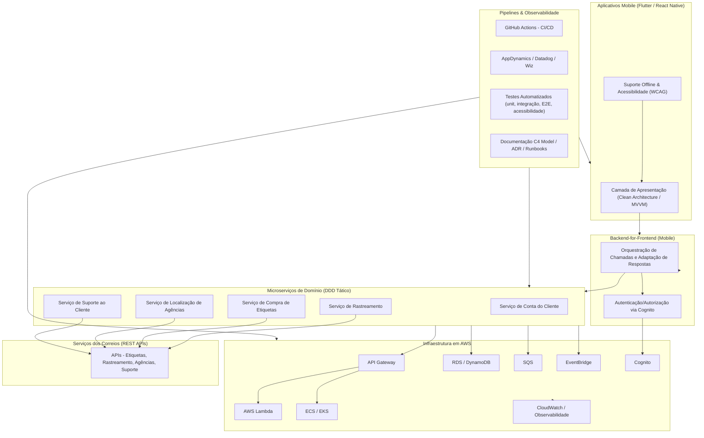

# Arquitetura de Software para Aplicações Mobile Escaláveis e Resilientes: Proposta Técnica para MVP Corporativo Integrado com AWS e Serviços Post Office

---

**Esse diagrama mostra**:

 - Front-end mobile multiplataforma com Clean Architecture/MVVM e suporte offline/acessibilidade.
 - Backend-for-Frontend (BFF) como camada intermediária entre mobile e microserviços, responsável por orquestração, adaptação de respostas e segurança.
 - Microserviços de domínio independentes para cada contexto: conta, etiquetas, rastreamento, agências e suporte.
 - Infraestrutura AWS com serviços como API Gateway, Lambda, ECS/EKS, RDS/DynamoDB, SQS, EventBridge, Cognito e CloudWatch.
 - Integração com APIs dos Correios para funcionalidades logísticas.
 - Stack DevOps para CI/CD, monitoramento, testes automatizados e documentação arquitetural.

## Introdução

O desenvolvimento de aplicações mobile corporativas modernas exige uma abordagem arquitetural que vá além da simples entrega de funcionalidades. É necessário garantir **escalabilidade**, **resiliência**, **portabilidade**, integração eficiente com serviços legados e de nuvem, além de aderência a requisitos de acessibilidade, governança e automação de entrega. Este relatório técnico propõe uma arquitetura de referência para um MVP mobile — compatível com Android e iOS — que contempla funcionalidades como conta do cliente, compra e rastreamento de etiquetas de envio, localização de agências, suporte ao cliente, integração com AWS e serviços dos Correios, suporte offline, acessibilidade conforme WCAG e ABNT NBR 17060, automação de testes e entrega contínua, documentação arquitetural robusta, uso de ferramentas DevOps padrão (GitHub Actions, AppDynamics, Datadog, CloudWatch, Wiz), além de considerar OutSystems e Cloud Foundry, suporte a Flutter e React Native, governança e transição para operação (BAU), e colaboração efetiva com o Product Owner.

---

## Visão Geral da Arquitetura Proposta

A arquitetura proposta adota uma abordagem **modular, orientada a microserviços**, com separação clara entre camadas de apresentação (mobile), Backend-for-Frontend (BFF), serviços de domínio, integrações com sistemas legados e nuvem, e infraestrutura de observabilidade e automação. O objetivo é garantir **alta coesão, baixo acoplamento**, facilidade de manutenção e evolução, além de permitir a coexistência com sistemas legados durante a transição para a nuvem.

A solução é composta pelos seguintes elementos principais:

- **Aplicativos Mobile multiplataforma** (Flutter ou React Native), com arquitetura Clean Architecture/MVVM, suporte offline e acessibilidade.
- **Backend-for-Frontend (BFF)** dedicado para mobile, responsável por orquestrar chamadas, agregar dados e adaptar respostas para as necessidades específicas dos apps.
- **Microserviços de domínio** (conta, etiquetas, rastreamento, agências, suporte), modelados via DDD tático, desacoplados e escaláveis.
- **Camada de integração** com AWS (API Gateway, Lambda, ECS/EKS, RDS, SQS, EventBridge, Cognito) e serviços dos Correios (REST APIs).
- **Infraestrutura de DevOps** com pipelines CI/CD automatizados (GitHub Actions), monitoramento (AppDynamics, Datadog, CloudWatch, Wiz), testes automatizados (unitários, integração, E2E, acessibilidade, performance).
- **Documentação arquitetural** baseada em C4 Model, ADRs e runbooks.
- **Governança e transição para BAU**, com SLAs, runbooks, on-call e colaboração contínua com Product Owner.

Esta arquitetura foi desenhada para atender aos requisitos de escalabilidade, resiliência, portabilidade, integração com sistemas legados e nuvem, além de garantir governança e facilidade de operação contínua.

**Análise Detalhada:**

- **Flutter** destaca-se pela performance próxima ao nativo, consistência visual e previsibilidade de manutenção, sendo ideal para MVPs que exigem controle total sobre a experiência do usuário, interfaces sofisticadas e evolução estável a longo prazo. O engine próprio (Impeller) otimiza o uso da GPU e reduz latência, tornando-o robusto para apps críticos. O suporte multiplataforma (incluindo web e desktop) amplia o potencial de reutilização de código. A curva de aprendizado pode ser um desafio inicial, mas a documentação oficial e o suporte do Google mitigam esse aspecto.

- **React Native** é vantajoso para equipes já experientes em JavaScript/React, permitindo entregas rápidas, integração incremental com sistemas legados e uso de um ecossistema vasto de bibliotecas. A nova arquitetura Bridgeless e o uso do JSI melhoraram a performance, mas ainda há dependência de bridges para integração com componentes nativos, o que pode impactar apps com alta demanda gráfica. A flexibilidade e a facilidade de encontrar desenvolvedores são pontos fortes, especialmente em ambientes corporativos com stack JS consolidado.

**Recomendação:** Para MVPs que priorizam **consistência visual, performance, governança de UX e evolução previsível**, Flutter é a escolha preferencial. Para cenários onde a **integração incremental com sistemas legados, time-to-market acelerado e disponibilidade de talentos JS** são críticos, React Native pode ser mais adequado. Ambos suportam automação de testes, integração com pipelines CI/CD e padrões de acessibilidade.

---

## Padrões Arquiteturais Adotados

### Microserviços

A arquitetura de microserviços é a base para garantir **escalabilidade, resiliência e independência de evolução** dos domínios de negócio. Cada microserviço é responsável por um contexto limitado, modelado via DDD tático, com persistência própria e APIs bem definidas. Os principais benefícios incluem:

- **Escalabilidade independente:** cada serviço pode ser dimensionado conforme a demanda.
- **Resiliência:** falhas em um serviço não afetam o sistema como um todo.
- **Evolução incremental:** permite deploys e atualizações isoladas.
- **Adoção de tecnologias heterogêneas:** cada serviço pode usar a stack mais adequada ao seu domínio.

### Backend-for-Frontend (BFF)

O padrão BFF propõe a criação de um backend dedicado para cada tipo de front-end (mobile, web), otimizando a comunicação, agregando dados de múltiplos microserviços e adaptando respostas para as necessidades específicas do cliente. Vantagens:

- **APIs customizadas:** respostas enxutas e sob medida para o mobile, reduzindo consumo de banda e latência.
- **Desacoplamento:** equipes de front e back podem evoluir de forma independente.
- **Segurança:** o BFF atua como proxy, ocultando detalhes internos e implementando autenticação/autorização.
- **Escalabilidade:** permite escalar o BFF conforme o volume de acessos mobile.

### Clean Architecture / MVVM

No front-end mobile, recomenda-se o uso de Clean Architecture e MVVM (Model-View-ViewModel), promovendo separação de responsabilidades, testabilidade e facilidade de manutenção. O ViewModel gerencia o estado e a lógica de apresentação, desacoplando a UI da lógica de negócio e das integrações com o BFF. Benefícios:

- **Código organizado e testável.**
- **Facilidade de manutenção e evolução.**
- **Gerenciamento eficiente de estado e sincronização offline.**
- **Aderência a padrões de acessibilidade e internacionalização**.

### Padrões de Resiliência

A arquitetura incorpora padrões como **Circuit Breaker, Bulkhead, Retry e Timeout** para garantir resiliência frente a falhas de serviços externos, picos de carga e intermitências de rede. Esses padrões são implementados tanto no BFF quanto nos microserviços, com monitoramento contínuo e métricas de disponibilidade.

---

## Modelagem de Domínios e Microserviços para o MVP

A modelagem dos domínios segue os princípios do DDD tático, identificando **contextos limitados** e agregados para cada funcionalidade do MVP:

- **Conta do Cliente:** gerenciamento de cadastro, autenticação (Cognito), preferências e histórico.
- **Compra de Etiquetas:** criação de pré-postagem, cálculo de preço e prazo, emissão de rótulos, integração com APIs dos Correios.
- **Rastreamento de Encomendas:** consulta de status, eventos e notificações, integração com API Rastro dos Correios.
- **Localização de Agências:** busca de agências por geolocalização, integração com API Agência dos Correios.
- **Suporte ao Cliente:** abertura e acompanhamento de chamados, integração com API Pedido Informação dos Correios.

Cada microserviço possui sua própria base de dados (RDS, DynamoDB), APIs RESTful (ou GraphQL via BFF), e comunica-se de forma assíncrona via SQS/EventBridge para eventos de domínio (ex: atualização de status de encomenda, emissão de etiqueta).

---

## Integração com AWS: Serviços Recomendados

A AWS oferece um portfólio robusto para suportar a arquitetura proposta:

- **API Gateway:** expõe APIs RESTful/GraphQL, gerencia autenticação, throttling, versionamento e roteamento para BFF e microserviços.
- **AWS Lambda:** execução serverless de funções de integração, processamento de eventos, orquestração de fluxos simples.
- **ECS/EKS:** orquestração de contêineres para microserviços, com alta disponibilidade e escalabilidade automática.
- **RDS/DynamoDB:** persistência relacional (RDS) ou NoSQL (DynamoDB) conforme o domínio.
- **SQS:** filas para comunicação assíncrona, desacoplamento e buffering de mensagens.
- **EventBridge:** barramento de eventos para integração entre microserviços, orquestração de fluxos complexos e integração com sistemas legados.
- **Cognito:** autenticação, autorização e gerenciamento de identidade de usuários.
- **CloudWatch:** monitoramento, logs, métricas e alarmes.
- **IAM, Secrets Manager, Parameter Store:** gestão de credenciais, segredos e políticas de acesso.

**Justificativa:** O uso desses serviços permite **reduzir o overhead operacional**, garantir alta disponibilidade, escalabilidade sob demanda, segurança e integração nativa com ferramentas de monitoramento e automação.

---

## Integração com Serviços da Post Office (Correios) e Sistemas Legados

A integração com os Correios é realizada via **APIs RESTful** disponibilizadas no Correios API, que seguem arquitetura orientada a microsserviços e suportam autenticação via token, tráfego seguro (HTTPS) e múltiplos ambientes (homologação e produção). Principais APIs:

- **Agência:** busca de agências por localidade.
- **Preço e Prazo:** cálculo de frete e estimativa de entrega.
- **Rastro:** rastreamento de objetos.
- **Pré-Postagem:** criação de pré-postagens, emissão de rótulos, cancelamento.
- **Pedido Informação:** abertura e acompanhamento de chamados de suporte.

A integração deve ser realizada preferencialmente via BFF, que agrega e adapta as respostas para o mobile, implementando cache, fallback e tratamento de erros. Para coexistência com sistemas legados, recomenda-se o uso de padrões como **Strangler Fig** (migração gradual), adapters e event-driven integration, permitindo que funcionalidades novas sejam implementadas em microserviços enquanto o legado é mantido até a completa transição.

---

## Estratégias de Sincronização e Suporte Offline

O suporte offline é fundamental para garantir uma experiência fluida mesmo em condições de conectividade instável. A arquitetura adota o padrão **offline-first**, onde o app mobile utiliza um banco de dados local (SQLite, Realm, WatermelonDB, Hive) como fonte de verdade, sincronizando com o backend via engine dedicada.

**Componentes e Estratégias:**

- **Local Database:** armazenamento de dados essenciais (conta, etiquetas, rastreamento, agências) no dispositivo.
- **Sync Engine:** gerencia sincronização bidirecional, detecta conflitos, aplica estratégias como Last-Write-Wins (LWW), CRDTs ou resolução manual.
- **Fila de Mutação:** operações realizadas offline são enfileiradas e sincronizadas quando a conexão é restabelecida.
- **Detecção de Conectividade:** monitora status de rede e agenda sincronizações automáticas ou sob demanda.
- **Cache inteligente:** exibe dados imediatamente do cache, atualizando em background quando possível.
- **Resolução de Conflitos:** pode ser automática (LWW, merge) ou assistida pelo usuário (UI de resolução).

**Padrões e Ferramentas:** WorkManager (Android), BackgroundTasks (iOS), WatermelonDB, MMKV, BackgroundFetch, além de estratégias de delta-sync, soft deletes e triggers de sincronização por evento, ciclo de vida do app ou agendamento periódico.

**Justificativa:** O modelo offline-first melhora a performance percebida, resiliência e satisfação do usuário, sendo essencial para apps corporativos que operam em campo ou em áreas de baixa conectividade.

---

## Acessibilidade: WCAG e ABNT NBR 17060

A acessibilidade é tratada como requisito de primeira classe, seguindo as diretrizes da **WCAG 2.1** e da **ABNT NBR 17060:2022**, que estabelecem 54 requisitos distribuídos em percepção, compreensão, controle, interação, mídia e codificação.

**Principais requisitos:**

- **Elementos não textuais:** devem ter texto alternativo descritivo.
- **Contraste:** textos e elementos gráficos com contraste suficiente.
- **Navegação:** cabeçalhos e rótulos claros, navegação sequencial sem bloqueios.
- **Interação:** suporte a toque único, feedback perceptível, controle de áudios e conteúdos em movimento.
- **Mídia:** legendas, transcrições e audiodescrição para vídeos e áudios.
- **Codificação:** estrutura semântica correta, compatibilidade com tecnologias assistivas.
- **Configurações de acessibilidade:** respeito às preferências do usuário no dispositivo.
- **Erros:** indicação clara e oportunidade de correção sem prejuízo.

**Implementação:** Uso de widgets acessíveis, labels, roles, testes automatizados de acessibilidade (axe, Accessibility Scanner, XCTest a11y), revisão manual de telas críticas e validação contínua em pipelines CI/CD.

---

## DevOps e CI/CD para Mobile: GitHub Actions, Automação de Testes, App Center

A automação de entrega é realizada via **GitHub Actions**, com workflows modulares para build, testes, análise estática, assinatura de apps, distribuição para beta testers (Firebase App Distribution, TestFlight, Play Tracks) e publicação nas lojas.

**Pipeline típico:**

1. **Pull Request:** análise estática (lint), testes unitários, verificação de acessibilidade.
2. **Build de Homologação:** geração de artefatos, testes de integração e E2E em device farms (Firebase Test Lab, AWS Device Farm, BrowserStack).
3. **Distribuição Beta:** envio automático para testers via Firebase App Distribution/TestFlight.
4. **Build de Produção:** assinatura digital (keystore, certificados P12, provisioning profiles), validação de compliance (target API, políticas de loja).
5. **Publicação:** deploy automatizado para Google Play/App Store, com gates de aprovação e promoção via ambientes GitHub (dev → beta → prod).
6. **Monitoramento de pipeline:** integração com Datadog CI Visibility, logs correlacionados, alertas de falha e dashboards de performance.

**Ferramentas:** Fastlane para automação de build/signing/distribuição, App Center (em desuso, migrar para alternativas), controle de secrets via GitHub Environments, runners self-hosted para builds iOS, cache de dependências, jobs paralelos e matriz de builds para múltiplos flavors/SDKs.

**Testes Automatizados:**

- **Unitários:** validação de lógica de negócio, cobertura ampla.
- **Integração:** verificação de contratos entre módulos, APIs, bancos de dados.
- **E2E/UI:** simulação de jornadas completas do usuário, validação em dispositivos reais.
- **Acessibilidade:** scanners automáticos e testes manuais.
- **Performance:** profiling de startup, uso de memória, latência de APIs.
- **Segurança:** análise SAST, verificação de dependências, compliance com OWASP MASVS.

**Justificativa:** Pipelines CI/CD robustos garantem entregas rápidas, seguras, auditáveis e com qualidade consistente, reduzindo riscos e acelerando o ciclo de feedback.

---

## Monitoramento e Observabilidade: AppDynamics, Datadog, AWS CloudWatch, Wiz

A observabilidade é implementada em múltiplas camadas:

- **AppDynamics:** APM para monitoramento de performance do app mobile, rastreamento de transações, detecção de gargalos e análise de crashes.
- **Datadog:** monitoramento de pipelines CI/CD (CI Visibility), métricas de infraestrutura, logs, dashboards customizados, alertas inteligentes (anomaly detection), rastreamento distribuído (APM), integração com AWS e Kubernetes.
- **AWS CloudWatch:** coleta de métricas, logs centralizados, alarmes, Container Insights, integração com Fluent Bit/Fluentd para forwarding de logs.
- **Wiz:** monitoramento de segurança, compliance, detecção de vulnerabilidades e riscos em cloud.
- **X-Ray:** rastreamento de requisições entre microserviços, análise de latência e dependências.

**Práticas recomendadas:**

- **Dashboards centralizados:** visão unificada de KPIs, SLIs, SLOs, erros, latência, throughput.
- **Alertas proativos:** thresholds baseados em histórico, escalonamento automático, integração com incident management.
- **Logs estruturados e correlacionados:** uso de correlation IDs, análise de root cause, redução do MTTR.
- **Monitoramento de pipelines:** sucesso/falha de builds, tempo de execução, fila de runners, logs de jobs.
- **Observabilidade de eventos:** rastreamento de eventos de domínio, análise de impacto e propagação de falhas.

---

## Segurança e Conformidade: Autenticação, Autorização, Criptografia, Proteção de Dados

A arquitetura adota práticas de segurança de ponta a ponta:

- **Autenticação e Autorização:** uso de OAuth 2.0/OpenID Connect (Cognito), PKCE para apps mobile, tokens JWT com claims e escopos restritos, refresh tokens rotativos, validação de redirect URIs, proteção contra CSRF e replay attacks.
- **Criptografia:** TLS 1.3 para todas as comunicações, criptografia de dados em trânsito e em repouso (AES-256), uso de Secrets Manager/Parameter Store para gestão de segredos.
- **Armazenamento Seguro:** tokens e dados sensíveis armazenados em Keychain (iOS) ou Keystore (Android), nunca em storage não seguro.
- **Princípios Zero Trust:** segmentação de ambientes, controle granular de permissões (IAM), segregação de ambientes (dev, qa, prod).
- **Auditoria e Compliance:** logs de acesso, trilhas de auditoria, aderência a LGPD/GDPR, conformidade com políticas de loja e regulatórias.
- **Testes de Segurança:** análise estática (SAST), verificação de dependências, pentests periódicos, validação de políticas de segurança em pipelines CI/CD.

---

## Documentação Arquitetural Completa: C4 Model, ADRs, Runbooks

A documentação é estruturada conforme o **C4 Model** (Context, Container, Component, Code), complementada por **Architecture Decision Records (ADRs)** e runbooks operacionais.

**Artefatos principais:**

- **Diagramas C4:** visão de contexto, containers, componentes e fluxos de interação.
- **ADRs:** registro de decisões arquiteturais, contexto, alternativas, justificativas e consequências.
- **Runbooks:** procedimentos operacionais para deploy, rollback, troubleshooting, escalonamento.
- **Templates:** padronização de documentação, requisitos de qualidade, critérios de aceitação.
- **Glossário:** termos técnicos, siglas, contratos de APIs.
- **Histórico de versões:** controle de mudanças, rastreabilidade.

**Ferramentas:** arc42, Structurizr, PlantUML, AsciiDoc, integração com repositórios Git para versionamento e colaboração contínua.

---

## Governança, Operação BAU e Transição para Suporte

A governança é baseada em práticas de ITSM e SRE, com definição clara de **SLAs, SLOs e OLAs**, monitoramento contínuo, gestão de incidentes e melhoria contínua.

**Elementos-chave:**

- **SLAs:** acordos formais com o negócio, definindo disponibilidade, tempo de resposta e penalidades.
- **SLOs:** metas técnicas mensuráveis (ex: 99,95% de uptime, latência < 200ms).
- **OLAs:** acordos internos entre equipes (ex: tempo máximo para restauração de banco de dados).
- **Runbooks:** procedimentos para incidentes, escalonamento, comunicação e mitigação.
- **On-call:** rotação de plantão, alertas automáticos, integração com sistemas de incident management.
- **Gestão de backlog e roadmap:** colaboração contínua com Product Owner, refinamento de backlog, priorização baseada em valor, métricas de sucesso (DAU, MAU, churn, NPS, LTV, crash rate, etc.).

---

## Uso de OutSystems e Cloud Foundry no Contexto da Arquitetura

**OutSystems** pode ser utilizado para acelerar o desenvolvimento de funcionalidades menos críticas ou de rápida prototipação, integrando-se via APIs REST/GraphQL ao ecossistema de microserviços. A plataforma suporta desenvolvimento modular, integração com sistemas legados, automação de testes, deploy em nuvem e aderência a padrões de segurança e governança corporativa. É recomendada para cenários onde o time busca produtividade, governança e integração com ALM, IdP, iPaaS e ferramentas de testes.

**Cloud Foundry** pode ser empregado como plataforma de PaaS para orquestração de microserviços, especialmente em ambientes híbridos ou multi-cloud, garantindo portabilidade, automação de deploy, escalabilidade e integração com pipelines CI/CD.

---

## Padrões de Integração Assíncrona e Eventos

A comunicação assíncrona é implementada via **SQS, SNS, EventBridge, Kafka**, permitindo desacoplamento, escalabilidade e resiliência. Os padrões adotados incluem:

- **Pub/Sub:** SNS para broadcast de eventos, SQS para buffering e processamento confiável.
- **Event Bus:** EventBridge para roteamento de eventos entre microserviços, integração com SaaS e sistemas legados.
- **Streaming:** Kafka/MSK para processamento de grandes volumes de eventos em tempo real.
- **Orquestração:** Step Functions para coordenação de workflows distribuídos, tratamento de erros e compensações (padrão Saga).
- **Dead Letter Queues:** tratamento de mensagens não processadas, análise de falhas e reprocessamento.

**Justificativa:** Esses padrões garantem desacoplamento, tolerância a falhas, escalabilidade horizontal e facilidade de integração com múltiplos sistemas.

---

## Estratégias de Escalabilidade e Resiliência

A arquitetura incorpora múltiplas estratégias para garantir **alta disponibilidade, tolerância a falhas e escalabilidade sob demanda**:

- **Autoscaling:** ECS/EKS/Lambda com escalonamento automático baseado em métricas de uso.
- **Circuit Breaker:** proteção contra falhas em cascata, fallback para respostas padrão.
- **Bulkhead:** isolamento de recursos por serviço, evitando que falhas se propaguem.
- **Retry/Timeout:** tentativas automáticas com backoff exponencial e limites de tempo.
- **Load Balancing:** balanceamento de carga via API Gateway, ALB/NLB.
- **Blue-Green/Canary Deployments:** deploys seguros, rollback rápido em caso de falha.
- **Monitoramento de SLIs/SLOs:** métricas de latência, throughput, erro, disponibilidade.
- **Chaos Engineering:** testes de resiliência em produção controlada.

**Resultados esperados:** disponibilidade >99,95%, latência <200ms, recuperação automática de falhas, escalabilidade horizontal conforme demanda.

---

## Gerenciamento de Estado e Sincronização entre BFF e Mobile

O gerenciamento de estado adota o padrão **offline-first**, com sincronização periódica entre o app mobile e o BFF. Estratégias:

- **Cache local:** dados essenciais armazenados no dispositivo.
- **Delta-sync:** sincronização apenas de alterações desde o último sync.
- **Soft deletes:** marcação de registros excluídos para sincronização posterior.
- **Resolução de conflitos:** LWW, CRDTs ou UI assistida.
- **Triggers de sync:** eventos de ciclo de vida do app, pull-to-refresh, agendamento periódico.
- **Notificações push:** para atualização proativa de dados críticos.

**Justificativa:** Garante experiência fluida, minimiza consumo de banda e evita perda de dados em cenários de conectividade instável.

---

## Observabilidade de Pipelines CI/CD e Correlação com Logs e Métricas

A integração entre **GitHub Actions** e **Datadog CI Visibility** permite monitorar em tempo real o desempenho dos pipelines, correlacionando falhas com commits, etapas do workflow, logs e métricas de infraestrutura. Práticas recomendadas:

- **Dashboards de pipeline:** sucesso/falha, tempo de execução, filas, artefatos gerados.
- **Alertas automáticos:** thresholds para taxas de sucesso, tempo de build, filas de runners.
- **Logs correlacionados:** análise de root cause, identificação de gargalos.
- **Anomaly detection:** detecção automática de padrões anômalos em logs e métricas.
- **Relatórios de compliance:** rastreabilidade de builds, deploys e aprovações.

**Benefícios:** Redução do MTTR, aumento da confiabilidade, auditoria e melhoria contínua dos processos de entrega.

---

## Métricas e KPIs para Monitorar Sucesso do MVP e Operação Contínua

A definição de métricas e KPIs é fundamental para avaliar o sucesso do MVP e garantir a operação eficiente:

- **Engajamento:** DAU, MAU, stickiness (DAU/MAU), sessões, tempo de uso, churn rate, retention rate.
- **Qualidade:** crash rate, erros, tempo de resposta, latência de APIs, NPS.
- **Financeiro:** ARPU, LTV, CAC, ROI, conversão de compras de etiquetas.
- **Operação:** uptime, SLOs, incidentes, tempo de resolução, backlog de chamados.
- **Acessibilidade:** cobertura de testes, conformidade com WCAG/ABNT, feedback de usuários PCD.
- **DevOps:** tempo de build, sucesso de pipelines, cobertura de testes, tempo de deploy.
- **Suporte:** tempo médio de atendimento, satisfação do cliente, SLAs cumpridos.

**Ferramentas:** UXCam, Braze, Datadog, AppDynamics, dashboards customizados.

---

## Estrutura de Times e Colaboração com Product Owner

A colaboração entre times de desenvolvimento, QA, DevOps, suporte e Product Owner é estruturada via práticas ágeis:

- **Backlog Refinement:** sessões regulares para detalhamento, priorização e estimativa de user stories.
- **Roadmap:** alinhamento contínuo de objetivos estratégicos, releases e entregas incrementais.
- **Métricas de valor:** priorização baseada em impacto no negócio, feedback do usuário e KPIs.
- **Comunicação transparente:** uso de ferramentas de gestão (Jira, Trello, ONES Project), documentação viva e reuniões de alinhamento.
- **Gestão de mudanças:** processos claros para inclusão de novas demandas, refinamento de backlog e revisão de prioridades.

---

## Planos de Migração e Coexistência com Sistemas Legados

A transição para a nova arquitetura é realizada de forma **incremental**, utilizando o padrão **Strangler Fig**:

- **Identificação de domínios prioritários:** seleção de funcionalidades críticas para migração inicial.
- **Implementação de adapters:** camadas de abstração para integração entre legado e novos microserviços.
- **Orquestração de tráfego:** uso de API Gateway/BFF para roteamento gradual de requisições.
- **Monitoramento de equivalência:** validação de resultados entre sistemas, rollback seguro.
- **Descomissionamento gradual:** redução progressiva do papel do legado até sua completa substituição.

**Justificativa:** Minimiza riscos, preserva compliance, permite validação incremental e reduz impacto para o negócio.

---

## Conclusão

A arquitetura proposta oferece uma base sólida para o desenvolvimento de aplicações mobile corporativas escaláveis, resilientes e portáveis, integrando o melhor das práticas modernas de engenharia de software, DevOps, observabilidade, segurança e governança. Ao adotar padrões como microserviços, BFF, Clean Architecture, integração assíncrona, automação de entrega e monitoramento contínuo, a solução garante não apenas a entrega rápida de valor, mas também a sustentabilidade operacional e a capacidade de evolução contínua.

A escolha entre Flutter e React Native deve ser feita considerando o contexto do time, requisitos de integração e governança de UX. A integração com AWS e serviços dos Correios é realizada de forma segura, escalável e resiliente, com suporte a coexistência com sistemas legados. O suporte offline, acessibilidade, automação de testes, documentação robusta e governança garantem aderência a padrões de qualidade e compliance.

Por fim, a colaboração contínua com o Product Owner, a definição clara de métricas e KPIs, e a adoção de práticas ágeis e DevOps asseguram que o MVP evolua de forma alinhada aos objetivos estratégicos do negócio, com foco em valor, qualidade e experiência do usuário.

