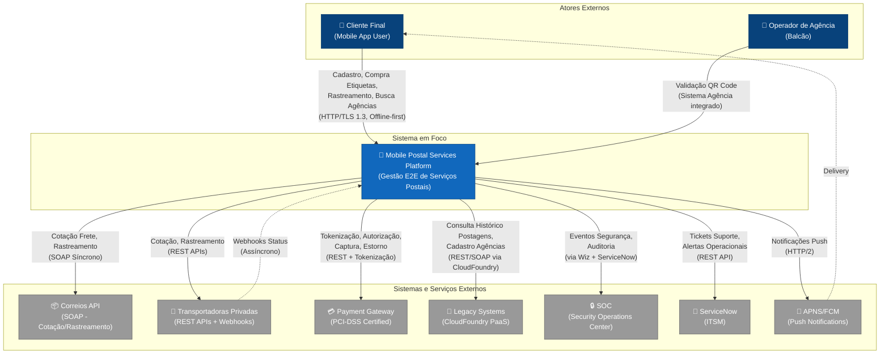
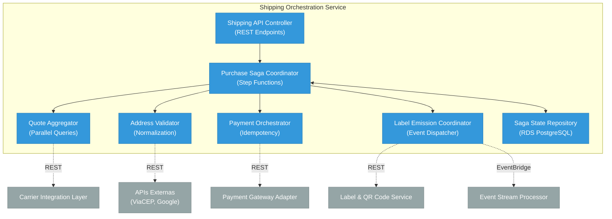
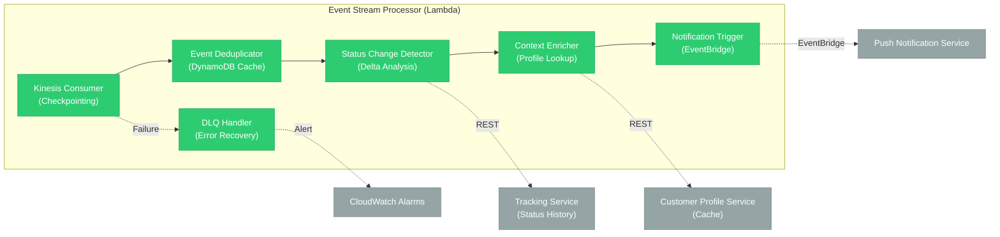
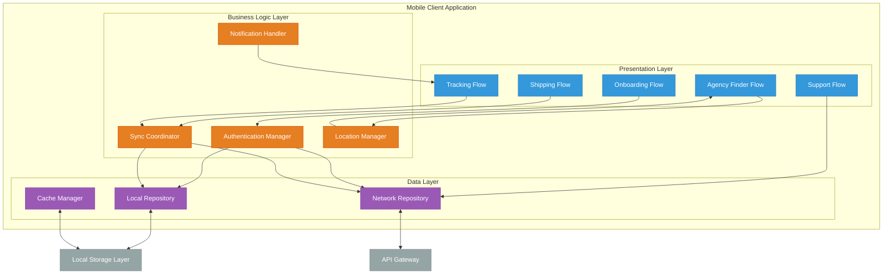
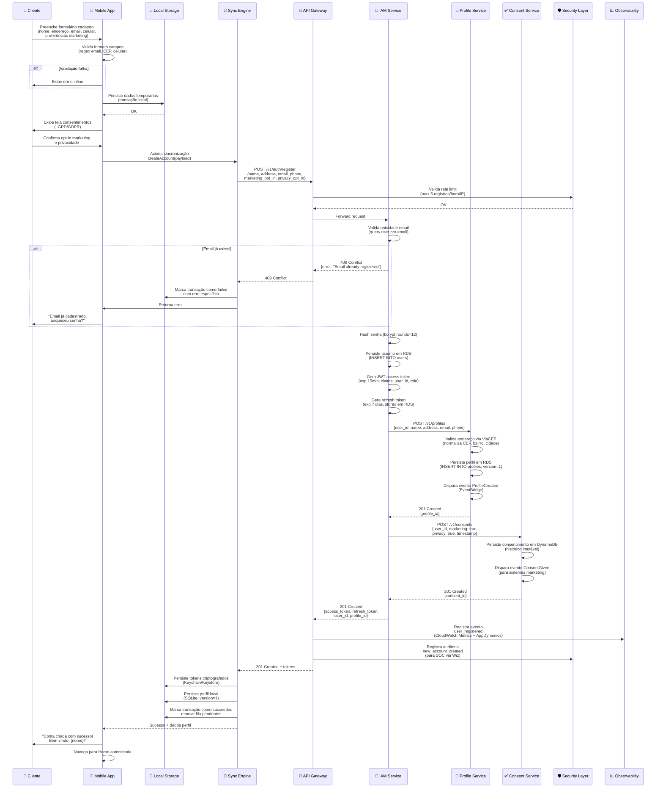
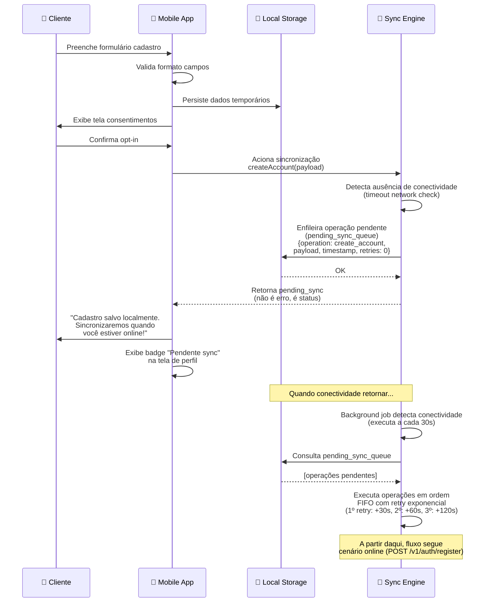
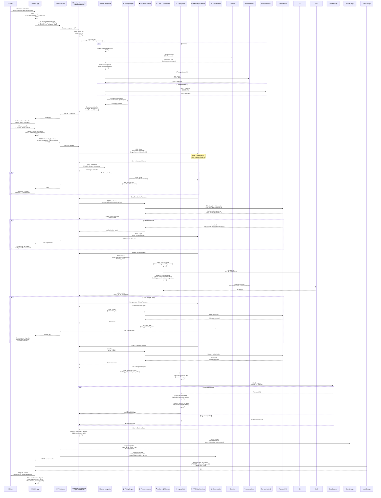

# 1. Visão Geral da Arquitetura

## Resumo Executivo

A solução apresentada constitui um ecossistema digital integrado para gestão end-to-end de serviços postais via aplicativo mobile nativo, operando em modo offline-first com sincronização eventual. O sistema suporta a jornada completa do cliente: desde criação de conta e onboarding com gestão de consentimentos LGPD/GDPR, passando por compra de etiquetas com processamento PCI-DSS compliant, rastreamento near-real-time de objetos postais, busca geolocalizada de agências e suporte integrado via ServiceNow.

A arquitetura foi projetada para atender requisitos críticos de disponibilidade em cenários de conectividade intermitente, integrando sistemas legados via CloudFoundry PaaS e adotando microsserviços cloud-native em AWS. A solução equilibra trade-offs entre latência, consistência, resiliência e conformidade regulatória, implementando padrões consolidados como Saga para transações distribuídas, Circuit Breaker para proteção contra cascata de falhas e Event-Driven Architecture para desacoplamento temporal.

## Propósito e Contexto de Negócio

O sistema habilita transformação digital de serviços postais tradicionais, democratizando acesso via canal mobile e eliminando fricções operacionais (deslocamento físico para agências, filas, horário comercial limitado). A proposta de valor central reside na autonomia do cliente para operações transacionais (compra de etiquetas, pagamento, geração de QR Code) e informacionais (rastreamento, busca de agências) independente de conectividade.

O contexto estratégico inclui integração mandatória com sistemas legados corporativos (rastreamento postal, cadastro de agências, histórico transacional), stack tecnológico corporativo definido (AWS, GitHub Actions, AppDynamics, ServiceNow) e requisitos rigorosos de conformidade (LGPD para dados pessoais, GDPR para market reach internacional, PCI-DSS para processamento de pagamentos, auditoria via SOC).

## Principais Drivers Arquiteturais

| Driver | Descrição | Impacto Arquitetural | Prioridade |
|--------|-----------|---------------------|------------|
| Operação offline-first obrigatória (INC01-INC04) | Cliente deve operar funcionalidades críticas sem conectividade, com sincronização eventual quando rede retornar | Arquitetura offline-first com Local Storage Layer dedicado, Synchronization Engine, filas de operações pendentes, resolução de conflitos e versionamento de schema | **Crítica** |
| Integração com múltiplas transportadoras heterogêneas (INC02) | APIs distintas, protocolos variados, SLAs imprevisíveis de provedores logísticos externos | Carrier Integration Layer com pattern Adapter, circuit breakers, cache de cotações, normalização de responses e isolamento de falhas | **Alta** |
| Rastreamento near-real-time (INC03) | Latência mínima entre mudança de status e notificação ao cliente | Arquitetura híbrida: webhooks quando disponíveis + polling inteligente, Event Stream Processor, Push Notification Service (APNS/FCM) | **Alta** |
| Conformidade PCI-DSS para pagamentos (INC02) | Minimizar scope de certificação, nunca armazenar dados de cartão | Payment Gateway Adapter isolado, tokenização, delegação para gateway externo certificado | **Crítica** |
| Resiliência a instabilidades de sistemas legados (INC02-INC03) | Latências imprevisíveis, disponibilidade variável de APIs corporativas via CloudFoundry | Legacy Systems Integration Hub com timeouts agressivos, cache defensivo, fallbacks e degradação graciosa | **Alta** |
| Compliance LGPD/GDPR (INC01, INC04) | Consentimento auditável, direito de portabilidade, histórico imutável de alterações | Consent Management Service, versionamento de dados em Customer Profile Service, logs de auditoria | **Crítica** |
| Escalabilidade horizontal para picos sazonais | Black Friday, datas comemorativas, campanhas de marketing | Microserviços stateless em AWS, auto-scaling, cache distribuído, Event-Driven Architecture para absorção de carga | **Média** |
| Observabilidade end-to-end e integração SOC (todos INC) | Visibilidade de comportamento distribuído, detecção proativa de anomalias operacionais e de segurança | Instrumentação transversal via AppDynamics, CloudWatch, Datadog, integração com SOC via Wiz, traces distribuídos | **Alta** |
| Time-to-market acelerado e deployment seguro | Releases frequentes sem downtime, rollback rápido em caso de regressão | CI/CD automatizado via GitHub Actions, blue-green deployment, testes automatizados em múltiplas camadas, AWS CodeArtifact | **Média** |
| Disaster Recovery com RTO/RPO diferenciados | Continuidade operacional em falhas de região AWS, corrupção de dados | Disaster Recovery Orchestrator, replicação cross-region, snapshots, Game Day scenarios trimestrais | **Alta** |

## Restrições e Premissas Assumidas

### Restrições Organizacionais e Tecnológicas

**Infraestrutura:**
- **Cloud Provider mandatório:** AWS (Amazon Web Services)
- **PaaS para integração legada:** CloudFoundry (sistemas legados corporativos)
- **CI/CD e versionamento:** GitHub (repositórios) + GitHub Actions (workflows)
- **Gestão de artefatos:** AWS CodeArtifact
- **Observabilidade corporativa:** AppDynamics (APM), CloudWatch (logs/métricas AWS), Datadog (agregação)
- **Segurança e compliance:** Wiz (análise de vulnerabilidades), integração obrigatória com SOC
- **ITSM:** ServiceNow (tickets de suporte, alertas operacionais, aprovações de releases)

**Conformidade Regulatória:**
- **Dados pessoais:** LGPD (Brasil) e GDPR (União Europeia) - opt-in/opt-out auditável, portabilidade, direito ao esquecimento
- **Pagamentos:** PCI-DSS Level 1 - tokenização mandatória, SAQ-A (escopo reduzido via gateway externo)
- **Acessibilidade:** WCAG 2.1 Level AA, ABNT NBR 17060

**Governança:**
- Participação mandatória em SteerCos (steering committees) mensais para decisões estratégicas
- Design Forums quinzenais para validação de decisões técnicas com arquitetos corporativos
- Release Board (aprovações formais antes de deployment produtivo)
- Documentação mandatória: HLD (High Level Design), LLD (Low Level Design), DR Plans
- Rastreabilidade total de requisitos via Jira (stories → commits → PRs → releases)
- Game Day scenarios trimestrais para validação de DR e transferência de conhecimento BAU
- PEN testing (penetration testing) externo semestral
- Modelo RACI definido para transição BAU após cada incremento

### Premissas de Negócio

**Operação offline-first:**
- Funcionalidades críticas (autenticação, visualização de etiquetas compradas, rastreamento local, busca de agências cacheadas) devem operar sem conectividade
- Sincronização eventual é aceitável (não há requisito de strong consistency para maioria dos dados)
- Expectativa de conectividade intermitente em 30% do tempo de uso típico (áreas rurais, transporte público, ambientes internos)

**Integração com sistemas legados:**
- APIs legadas via CloudFoundry não podem ser migradas no horizonte do projeto
- SLAs de sistemas legados: 95% disponibilidade, p95 latência 3-5 segundos
- Janela de manutenção semanal dos legados (domingos 2h-6h BRT)

**Transportadoras:**
- Correios (obrigatório): API SOAP, sem webhooks (polling necessário), SLA 99%
- Transportadoras privadas (2-3 parceiros iniciais): APIs REST heterogêneas, webhooks parciais

**Escalabilidade:**
- MVP: 10K usuários ativos mensais (MAU), 50K transações/mês
- 12 meses: 100K MAU, 500K transações/mês
- 24 meses: 500K MAU, 3M transações/mês
- Pico sazonal: 3x tráfego médio (Black Friday, Natal)

### Premissas Técnicas

**Plataformas mobile:**
- Android 8.0+ (API 26+) - 85% da base instalada
- iOS 13.0+ - 15% da base instalada
- React Native não é viável (expertise interna em Swift/Kotlin, requisitos de acessibilidade nativa)

**Conectividade:**
- Latência média: 150ms (3G/4G)
- Latência p95: 500ms
- Disponibilidade de rede: 70% (ambientes urbanos)

**Segurança:**
- Rotação de chaves criptográficas: trimestral
- Tokens JWT: 15 minutos (access token), 7 dias (refresh token)
- Criptografia em trânsito: TLS 1.3
- Criptografia em repouso: AES-256

## Estilo Arquitetural Predominante

A solução adota arquitetura **híbrida** combinando múltiplos estilos complementares:

**1. Microsserviços Cloud-Native (Backend):**
- Decomposição funcional por bounded contexts (Identity, Profile, Shipping, Tracking, Location)
- Serviços independentemente deployáveis, escaláveis e resilientes
- Comunicação via API Gateway com autenticação centralizada
- Hospedagem em AWS com auto-scaling, health checks e blue-green deployments

**2. Event-Driven Architecture (Rastreamento, Notificações):**
- Desacoplamento temporal entre produtores e consumidores de eventos
- Event Stream Processor para enriquecimento e transformação near-real-time
- Push Notification Service acionado por mudanças de status
- Garantias de entrega: at-least-once (idempotência nos consumidores)

**3. Layered Architecture (Mobile Client):**
- Separação clara entre UI, lógica de negócio e persistência
- Local Storage Layer como abstração de armazenamento (SQLite, Keychain/Keystore)
- Synchronization Engine como camada de coordenação de sincronização
- Dependency injection para testabilidade

**4. Adapter Pattern (Integrações):**
- Carrier Integration Layer abstrai heterogeneidade de transportadoras
- Legacy Systems Integration Hub normaliza protocolos de sistemas corporativos
- Payment Gateway Adapter isola processamento PCI-DSS
- Support Ticketing Adapter encapsula integração ServiceNow

**Justificativa do Estilo Híbrido:**

A combinação de estilos atende drivers conflitantes que nenhum padrão isolado resolveria adequadamente:
- **Microsserviços** endereçam escalabilidade, deployment independente e isolamento de falhas
- **Event-Driven** reduz acoplamento temporal em rastreamento e notificações
- **Layered (mobile)** facilita manutenção, testabilidade e operação offline
- **Adapter** protege sistema core de variabilidade de integrações externas

## Visão de Contexto Estratégico

O sistema opera na intersecção de três ecossistemas:

**1. Ecossistema Interno (Corporativo):**
- Integração com CloudFoundry PaaS (legados: rastreamento postal, cadastro de agências)
- Dependência de SOC para auditoria de segurança e resposta a incidentes
- Alinhamento com stack tecnológico corporativo (AWS, AppDynamics, ServiceNow)
- Conformidade com processos de governança (SteerCos, Design Forums, Release Board)

**2. Ecossistema Externo (Parceiros Logísticos):**
- Dependência de APIs de transportadoras (Correios, privadas)
- Variabilidade de SLAs, protocolos e custos de integração
- Necessidade de circuit breakers e fallbacks para resiliência

**3. Ecossistema de Usuários Finais:**
- Expectativa de disponibilidade 24/7 independente de conectividade
- Requisitos de acessibilidade (WCAG 2.1, ABNT NBR 17060)
- Preferências de privacidade (opt-in/opt-out LGPD/GDPR)

**Tensões Arquiteturais Principais:**

| Tensão | Trade-off Escolhido | Justificativa |
|--------|---------------------|---------------|
| Consistência vs. Disponibilidade (CAP) | Disponibilidade (eventual consistency) | Operação offline mandatória prioriza disponibilidade local sobre consistência imediata |
| Latência vs. Custo (APIs externas) | Cache agressivo, polling otimizado | Reduz custos de chamadas frequentes sacrificando latência de atualização |
| Segurança vs. Usabilidade (autenticação) | Tokens de longa duração, renovação oportunística | Permite autenticação offline sem comprometer UX |
| Conformidade vs. Flexibilidade (stack) | Stack corporativo mandatório | Conformidade organizacional prevalece sobre escolha puramente técnica |
| Autonomia vs. Resiliência (microserviços) | Microsserviços com API Gateway central | Balanceia deployment independente com observabilidade e segurança centralizadas |

## Próximas Seções

Este documento estabelece fundações conceituais da arquitetura. As seções seguintes detalharão:
- **Diagramas C4:** Decomposição visual em múltiplas perspectivas (contexto, containers, componentes, deployment)
- **Diagramas de Comportamento:** Fluxos principais (sequência, eventos)
- **ADRs:** Decisões estruturais documentadas com trade-offs explícitos
- **Requisitos Não Funcionais:** Performance, segurança, observabilidade, governança
- **Análise de Stack:** Decisão assistida de tecnologias por categoria
- **Roadmap de Evolução:** Limitações conhecidas e próximos passos

# 2. Diagramas C4

## Introdução

Esta seção apresenta a arquitetura do sistema em múltiplas perspectivas utilizando o modelo C4 (Context, Containers, Components, Code), criado por Simon Brown. Os diagramas evoluem progressivamente de uma visão de alto nível (contexto de negócio) para detalhes de implementação (componentes internos), mantendo consistência de nomenclatura e rastreabilidade entre camadas.

---

## 2.1. C4 – Contexto

### Descrição

O diagrama de contexto apresenta a visão mais externa do sistema, identificando atores humanos, sistemas terceiros e o escopo de responsabilidade da solução. O sistema central ("Mobile Postal Services Platform") atua como hub digital integrando clientes finais, operações de agências físicas, parceiros logísticos, sistemas legados corporativos e infraestrutura de segurança/observabilidade.

O cliente final interage exclusivamente via aplicativo mobile nativo (Android/iOS), que

 mantém operação offline-first sincronizando periodicamente com backend cloud. Agências físicas validam QR Codes apresentados por clientes no balcão, fechando o ciclo transacional iniciado digitalmente. Transportadoras fornecem APIs de cotação e rastreamento (síncronas) e webhooks de mudanças de status (assíncronos). Sistemas legados via CloudFoundry mantêm registros históricos de postagens e cadastro autoritativo de agências. O SOC (Security Operations Center) consome eventos de segurança para detecção de anomalias e resposta a incidentes.

### Atores e Sistemas Externos

- **Cliente Final (Pessoa):** Usuário do aplicativo mobile que cria conta, compra etiquetas, rastreia encomendas, busca agências e abre tickets de suporte. Opera em cenários de conectividade intermitente.

- **Operador de Agência (Pessoa):** Atendente de balcão que valida QR Codes apresentados por clientes usando sistema de agência integrado, confirmando postagem física.

- **Correios API (Sistema Externo):** Sistema legado SOAP para cotação de frete e rastreamento de objetos postais. Protocolo síncrono apenas (sem webhooks), SLA 99%, p95 latência 3-5s.

- **Transportadoras Privadas (Sistema Externo):** Parceiros logísticos com APIs REST heterogêneas para cotação e rastreamento. Suporte parcial a webhooks para notificação proativa de mudanças de status.

- **Payment Gateway (Sistema Externo):** Provedor PCI-DSS Level 1 certificado para processamento de pagamentos com cartão de crédito. Tokenização, autorização, captura e estorno.

- **Legacy Systems via CloudFoundry (Sistema Externo):** Sistemas corporativos de rastreamento postal histórico e cadastro de agências. Integração via APIs REST/SOAP hospedadas em CloudFoundry PaaS.

- **SOC (Security Operations Center) (Sistema Externo):** Equipe e ferramental corporativo (SIEM, SOAR) que consome eventos de segurança via Wiz e ServiceNow para auditoria e resposta a incidentes.

- **ServiceNow (Sistema Externo):** Plataforma ITSM corporativa para gestão de tickets de suporte, alertas operacionais e aprovações de releases.

- **Push Notification Services (Sistema Externo):** APNS (Apple Push Notification Service) para iOS e FCM (Firebase Cloud Messaging) para Android.

### Diagrama



### Observações

**Limites de Responsabilidade:**
- **Dentro do escopo:** Aplicativo mobile, backend de microsserviços AWS, orquestração de integrações, sincronização offline, geração de QR Codes
- **Fora do escopo:** Processamento de pagamentos (delegado a gateway externo), operação física de agências, logística de transportadoras, detecção de fraude (SOC)

**Padrões de Comunicação:**
- Linhas sólidas (→): Comunicação síncrona (request/response)
- Linhas tracejadas (-.->): Comunicação assíncrona (webhooks, push notifications)

---

## 2.2. C4 – Containers (Visão Lógica)

### Descrição

O diagrama de containers decompõe a plataforma em unidades lógicas de deployment, expondo tecnologias de alto nível e protocolos de comunicação. O Mobile Client Application é implementado nativamente (Swift para iOS, Kotlin para Android) e interage com backend via API Gateway único que atua como ponto de entrada seguro. Backend é estruturado em microsserviços independentes hospedados em AWS, cada um com responsabilidade funcional clara (Identity, Profile, Shipping, Tracking, etc.). Camadas transversais (Observability, Security, CI/CD, DR) proveem capabilities compartilhados.

### Containers Identificados

#### **Frontend**

**1. Mobile Client Application**
- **Tecnologia:** Swift (iOS), Kotlin (Android)
- **Responsabilidade:** Interface nativa, gerenciamento de estado local, captura de geolocalização, exibição de QR Codes, implementação WCAG 2.1/ABNT NBR 17060
- **Comunicação:** HTTPS (TLS 1.3) com API Gateway, sincronização bidirecional offline-first
- **Incrementos:** INC01, INC02, INC03, INC04

**2. Local Storage Layer**
- **Tecnologia:** SQLite (dados estruturados), Keychain/Keystore (credenciais), File System (imagens QR Code)
- **Responsabilidade:** Persistência local criptografada, versionamento de schema, filas de sincronização
- **Comunicação:** Acesso direto via Synchronization Engine
- **Incrementos:** INC01, INC02, INC03, INC04

**3. Synchronization Engine**
- **Tecnologia:** Kotlin/Swift (módulo nativo)
- **Responsabilidade:** Orquestração de sincronização, detecção de conflitos, retry com backoff exponencial, gestão de conectividade
- **Comunicação:** HTTPS com API Gateway (autenticado via JWT)
- **Incrementos:** INC01, INC02, INC03, INC04

#### **Gateway**

**4. API Gateway**
- **Tecnologia:** AWS API Gateway (REST APIs + WebSocket para notificações)
- **Responsabilidade:** Roteamento, autenticação JWT, rate limiting (per-user, global), agregação de respostas, transformação de protocolos, logs de auditoria
- **Comunicação:** TLS 1.3 inbound (mobile), HTTPS outbound (microsserviços)
- **Incrementos:** INC01, INC02, INC03, INC04

#### **Backend Microservices (AWS)**

**5. Identity and Access Management Service**
- **Tecnologia:** Spring Boot (Java 17), AWS RDS PostgreSQL
- **Responsabilidade:** Autenticação, emissão/validação JWT, refresh tokens, gestão de sessões, auditoria de acessos
- **Comunicação:** REST (síncrono)
- **Incrementos:** INC01, INC04

**6. Customer Profile Service**
- **Tecnologia:** Spring Boot (Java 17), AWS RDS PostgreSQL
- **Responsabilidade:** CRUD de perfil do cliente, versionamento de dados, histórico de alterações, propagação de mudanças via eventos
- **Comunicação:** REST (síncrono), EventBridge (assíncrono)
- **Incrementos:** INC01, INC04

**7. Consent Management Service**
- **Tecnologia:** Spring Boot (Java 17), AWS DynamoDB (histórico imutável)
- **Responsabilidade:** Gestão de consentimentos LGPD/GDPR, histórico auditável, integração com sistemas de marketing
- **Comunicação:** REST (síncrono)
- **Incrementos:** INC01, INC04

**8. Shipping Orchestration Service**
- **Tecnologia:** Spring Boot (Java 17), AWS Step Functions (Saga), AWS RDS PostgreSQL
- **Responsabilidade:** Orquestração de compra de etiqueta (Saga pattern), coordenação de cotação/pagamento/emissão, compensação de falhas
- **Comunicação:** REST (síncrono), Step Functions (assíncrono)
- **Incrementos:** INC02

**9. Carrier Integration Layer**
- **Tecnologia:** Spring Boot (Java 17), AWS ElastiCache Redis (cache cotações)
- **Responsabilidade:** Abstração de APIs de transportadoras, normalização de responses, circuit breakers (Resilience4j), cache de cotações (TTL 5min)
- **Comunicação:** REST/SOAP outbound (transportadoras), REST inbound (orquestrador)
- **Incrementos:** INC02, INC03

**10. Pricing Engine**
- **Tecnologia:** Spring Boot (Java 17), AWS RDS PostgreSQL (tabelas preço)
- **Responsabilidade:** Cálculo de frete, aplicação de regras de negócio, cache de tabelas de preço
- **Comunicação:** REST (síncrono)
- **Incrementos:** INC02

**11. Payment Gateway Adapter**
- **Tecnologia:** Spring Boot (Java 17)
- **Responsabilidade:** Integração PCI-DSS, tokenização, autorização/captura/estorno, logs auditáveis
- **Comunicação:** HTTPS (gateway externo), REST inbound (orquestrador)
- **Incrementos:** INC02

**12. Label and QR Code Service**
- **Tecnologia:** Spring Boot (Java 17), AWS S3 (armazenamento PDFs), AWS KMS (criptografia assinaturas)
- **Responsabilidade:** Geração de etiquetas PDF, QR Codes assinados criptograficamente, validação one-time-use
- **Comunicação:** REST (síncrono)
- **Incrementos:** INC02

**13. Legacy Systems Integration Hub**
- **Tecnologia:** Spring Boot (Java 17), AWS ElastiCache Redis (cache defensivo)
- **Responsabilidade:** Mediação com CloudFoundry, transformação SOAP/REST, circuit breakers, timeouts agressivos (2s), fallbacks
- **Comunicação:** REST/SOAP outbound (legados), REST inbound (consumidores)
- **Incrementos:** INC02, INC03

**14. Tracking Service**
- **Tecnologia:** Spring Boot (Java 17), AWS RDS PostgreSQL, AWS SQS (fila polling)
- **Responsabilidade:** Agregação de rastreamento, polling inteligente (backoff exponencial), cache de status (TTL 10min)
- **Comunicação:** REST/SOAP (transportadoras), webhooks inbound, REST (consultas)
- **Incrementos:** INC03

**15. Event Stream Processor**
- **Tecnologia:** AWS Lambda (Node.js 18), AWS Kinesis Data Streams
- **Responsabilidade:** Processamento near-real-time de eventos de rastreamento, enriquecimento com contexto, deduplicação, disparo de notificações
- **Comunicação:** Kinesis (inbound), EventBridge (outbound)
- **Incrementos:** INC03

**16. Push Notification Service**
- **Tecnologia:** Spring Boot (Java 17), AWS SNS
- **Responsabilidade:** Envio para APNS/FCM, segmentação de audiência, retry de falhas, respeit a preferências
- **Comunicação:** HTTP/2 (APNS/FCM), EventBridge (triggers)
- **Incrementos:** INC03

**17. Location and Agency Service**
- **Tecnologia:** Spring Boot (Java 17), AWS RDS PostgreSQL + PostGIS (geoespacial)
- **Responsabilidade:** Catálogo de agências, busca por proximidade (índice geoespacial), cache regional, sincronização com legados
- **Comunicação:** REST (síncrono)
- **Incrementos:** INC04

**18. Support Ticketing Adapter**
- **Tecnologia:** Spring Boot (Java 17)
- **Responsabilidade:** Integração com ServiceNow, categorização automática de tickets, anexo de contexto do cliente
- **Comunicação:** REST (ServiceNow API)
- **Incrementos:** INC04

#### **Infraestrutura Transversal**

**19. Observability and Monitoring Layer**
- **Tecnologia:** AWS CloudWatch (logs/métricas), AppDynamics (APM), Datadog (agregação), AWS X-Ray (traces)
- **Responsabilidade:** Coleta de métricas, traces distribuídos, logs estruturados, alertas operacionais/segurança
- **Comunicação:** Agents (sidecar), APIs push
- **Incrementos:** INC01, INC02, INC03, INC04

**20. Security and Compliance Layer**
- **Tecnologia:** AWS KMS (criptografia), AWS WAF (firewall), Wiz (análise vulnerabilidades), AWS GuardDuty (anomalias)
- **Responsabilidade:** Criptografia em trânsito/repouso, DLP, detecção de anomalias, rotação de chaves, auditoria
- **Comunicação:** Integração com SOC via ServiceNow
- **Incrementos:** INC01, INC02, INC03, INC04

**21. CI/CD Pipeline**
- **Tecnologia:** GitHub Actions (workflows), AWS CodeArtifact (artefatos), AWS CodeDeploy (deployment)
- **Responsabilidade:** Build, testes automatizados, empacotamento, deployment blue-green, rollback
- **Comunicação:** Webhooks (GitHub), AWS APIs
- **Incrementos:** INC01, INC02, INC03, INC04

**22. Disaster Recovery Orchestrator**
- **Tecnologia:** AWS Backup, AWS S3 (snapshots), AWS Cross-Region Replication
- **Responsabilidade:** Backups automatizados, replicação cross-region, orquestração de failover, Game Day scenarios
- **Comunicação:** AWS APIs, scripts Lambda
- **Incrementos:** INC01, INC02, INC03, INC04

### Diagrama



```mermaid
graph TB
    subgraph "Mobile Client (Android/iOS)"
        MobileApp["Mobile Client Application<br/>(Swift/Kotlin)<br/>UI/UX, Geolocalização"]
        LocalStorage["Local Storage Layer<br/>(SQLite, Keychain/Keystore)<br/>Persistência Offline"]
        SyncEngine["Synchronization Engine<br/>(Native Module)<br/>Sincronização Bidirecional"]
        
        MobileApp <--> LocalStorage
        MobileApp <--> SyncEngine
    end
    
    subgraph "API Gateway Layer (AWS)"
        APIGW["API Gateway<br/>(AWS API Gateway)<br/>Autenticação, Rate Limiting,<br/>Roteamento"]
    end
    
    subgraph "Backend Microservices (AWS)"
        subgraph "Identity & Profile"
            IAM["Identity Service<br/>(Spring Boot + RDS)<br/>Autenticação JWT"]
            Profile["Customer Profile Service<br/>(Spring Boot + RDS)<br/>CRUD Perfil"]
            Consent["Consent Management<br/>(Spring Boot + DynamoDB)<br/>LGPD/GDPR"]
        end
        
        subgraph "Shipping & Payment"
            ShipOrch["Shipping Orchestrator<br/>(Spring Boot + Step Functions)<br/>Saga Pattern"]
            CarrierInt["Carrier Integration<br/>(Spring Boot + Redis)<br/>Circuit Breakers"]
            Pricing["Pricing Engine<br/>(Spring Boot + RDS)<br/>Cálculo Frete"]
            PaymentAdp["Payment Adapter<br/>(Spring Boot)<br/>PCI-DSS Tokenização"]
            LabelQR["Label & QR Service<br/>(Spring Boot + S3 + KMS)<br/>Geração Segura"]
        end
        
        subgraph "Tracking & Notifications"
            Tracking["Tracking Service<br/>(Spring Boot + SQS)<br/>Polling + Webhooks"]
            EventProc["Event Stream Processor<br/>(Lambda + Kinesis)<br/>Near-Real-Time"]
            PushNotif["Push Notification<br/>(Spring Boot + SNS)<br/>APNS/FCM"]
        end
        
        subgraph "Location & Support"
            Location["Location Service<br/>(Spring Boot + PostGIS)<br/>Busca Geoespacial"]
            Support["Support Adapter<br/>(Spring Boot)<br/>ServiceNow Integration"]
        end
        
        subgraph "Legacy Integration"
            LegacyHub["Legacy Systems Hub<br/>(Spring Boot + Redis)<br/>CloudFoundry Mediator"]
        end
    end
    
    subgraph "External Systems"
        CorreiosAPI["Correios API<br/>(SOAP)"]
        TransportAPI["Transportadoras<br/>(REST + Webhooks)"]
        PaymentGW["Payment Gateway<br/>(PCI-DSS)"]
        CloudFoundry["Legacy Systems<br/>(CloudFoundry)"]
        APNS_FCM["APNS/FCM"]
        ServiceNow["ServiceNow<br/>(ITSM)"]
    end
    
    subgraph "Infrastructure (AWS)"
        Observability["Observability Layer<br/>(CloudWatch, AppDynamics,<br/>Datadog, X-Ray)"]
        Security["Security Layer<br/>(KMS, WAF, Wiz,<br/>GuardDuty)"]
        CICD["CI/CD Pipeline<br/>(GitHub Actions,<br/>CodeArtifact, CodeDeploy)"]
        DR["DR Orchestrator<br/>(Backup, S3,<br/>Cross-Region Replication)"]
    end
    
    SyncEngine -.->|"HTTPS<br/>(JWT Auth)"| APIGW
    
    APIGW --> IAM
    APIGW --> Profile
    APIGW --> Consent
    APIGW --> ShipOrch
    APIGW --> Tracking
    APIGW --> Location
    APIGW --> Support
    
    ShipOrch --> CarrierInt
    ShipOrch --> Pricing
    ShipOrch --> PaymentAdp
    ShipOrch --> LabelQR
    ShipOrch --> LegacyHub
    
    CarrierInt --> CorreiosAPI
    CarrierInt --> TransportAPI
    TransportAPI -.->|"Webhooks"| Tracking
    
    Tracking --> EventProc
    EventProc --> PushNotif
    PushNotif --> APNS_FCM
    
    PaymentAdp --> PaymentGW
    LegacyHub --> CloudFoundry
    Support --> ServiceNow
    
    IAM -.-> Observability
    Profile -.-> Observability
    ShipOrch -.-> Observability
    Tracking -.-> Observability
    
    Security -.-> ServiceNow
    Security -.-> Observability
    
    classDef frontend fill:#3498db,stroke:#2980b9,color:#fff
    classDef gateway fill:#e74c3c,stroke:#c0392b,color:#fff
    classDef backend fill:#2ecc71,stroke:#27ae60,color:#fff
    classDef external fill:#95a5a6,stroke:#7f8c8d,color:#fff
    classDef infra fill:#f39c12,stroke:#d68910,color:#fff
    
    class MobileApp,LocalStorage,SyncEngine frontend
    class APIGW gateway
    class IAM,Profile,Consent,ShipOrch,CarrierInt,Pricing,PaymentAdp,LabelQR,Tracking,EventProc,PushNotif,Location,Support,LegacyHub backend
    class CorreiosAPI,TransportAPI,PaymentGW,CloudFoundry,APNS_FCM,ServiceNow external
    class Observability,Security,CICD,DR infra
```

### Legenda de Comunicação

- **Síncrona (→):** REST APIs HTTPS, latência esperada 100-500ms
- **Assíncrona (-.->):** Webhooks, EventBridge, Kinesis, SQS (desacoplamento temporal)
- **Observabilidade (-.->):** Instrumentação transversal (métricas, logs, traces)

### Observações Arquiteturais

**Padrões Aplicados:**
- **API Gateway Pattern:** Ponto de entrada único, simplifica segurança e observabilidade
- **Microservices:** Decomposição funcional, deployment independente, escalabilidade granular
- **Saga Pattern:** Transações distribuídas com compensação (Shipping Orchestration)
- **Circuit Breaker:** Proteção contra cascata de falhas (Carrier Integration, Legacy Hub)
- **Cache-Aside:** Redução de latência e carga (cotações, rastreamento, agências)
- **Event Sourcing (parcial):** Histórico imutável de eventos de rastreamento (Kinesis)
- **Strangler Fig:** Legacy Systems Integration Hub permite migração gradual de legados

**Decisões de Tecnologia (Stack Corporativo):**
- **AWS:** Mandatório como cloud provider (EC2, RDS, S3, Lambda, API Gateway, etc.)
- **Spring Boot:** Framework Java consolidado para microsserviços backend
- **GitHub Actions:** CI/CD corporativo mandatório
- **AppDynamics + CloudWatch:** Observabilidade corporativa (APM + infra)
- **ServiceNow:** ITSM corporativo para tickets e alertas

---

## 2.3. C4 – Componentes

Esta seção detalha componentes internos de containers com responsabilidades complexas (3+ responsabilidades distintas). Containers simples são descritos textualmente sem diagramas.

### Shipping Orchestration Service (INC02)

**Responsabilidade:** Orquestrar jornada de compra de etiqueta como transação distribuída (Saga pattern), coordenando cotação, validação, pagamento e emissão com capacidade de compensação em caso de falhas parciais.

**Componentes Internos:**

1. **Shipping API Controller**
   - Expõe endpoints REST para iniciar compra, consultar status, cancelar
   - Valida payload de entrada, autentica requisições via JWT
   - Aciona Purchase Saga Coordinator

2. **Purchase Saga Coordinator**
   - Implementa padrão Saga (AWS Step Functions)
   - Define máquina de estados: Quote → Validate → Authorize Payment → Generate Label → Confirm
   - Gerencia compensações em caso de falha: Refund Payment, Invalidate Label

3. **Quote Aggregator**
   - Consulta Carrier Integration Layer para múltiplas transportadoras em paralelo
   - Aplica regras de negócio para filtrar/classificar cotações
   - Retorna opções ordenadas por preço, prazo, reputação

4. **Address Validator**
   - Valida CEP, normaliza endereços via APIs externas (ViaCEP, Google Geocoding)
   - Identifica endereços de risco (PO Boxes, zonas não atendidas)

5. **Payment Orchestrator**
   - Coordena autorização, captura e estorno via Payment Gateway Adapter
   - Implementa idempotência (evita cobranças duplicadas em retries)
   - Registra eventos de auditoria financeira

6. **Label Emission Coordinator**
   - Aciona Label and QR Code Service após confirmação de pagamento
   - Persiste metadados de etiqueta (ID, transportadora, valor, data)
   - Dispara evento "LabelIssued" para Event Stream Processor

7. **Saga State Repository**
   - Persiste estado de cada saga em execução (RDS PostgreSQL)
   - Permite retomada de sagas interrompidas (crash recovery)
   - Auditoria completa de transações distribuídas

**Diagrama:**



**Padrões Aplicados:**
- **Saga Pattern (Orchestration):** Coordenação centralizada via Step Functions
- **Compensating Transaction:** Estorno de pagamento, invalidação de label em caso de falha
- **Idempotency:** Evita cobranças duplicadas via chaves únicas de transação

**Rastreabilidade:**
- INC02 (Compra de Etiqueta e Geração de QR Code)

---

### Event Stream Processor (INC03)

**Responsabilidade:** Processar eventos de rastreamento near-real-time, enriquecer com contexto do cliente, detectar mudanças de status, deduplicar eventos e disparar notificações push.

**Componentes Internos:**

1. **Kinesis Consumer**
   - Consome eventos de Kinesis Data Streams (sharded por tracking_code)
   - Implementa checkpointing (exatamente uma vez via DynamoDB)
   - Paralelização via múltiplas instâncias Lambda

2. **Event Deduplicator**
   - Identifica eventos duplicados via hash (tracking_code + timestamp + status)
   - Cache distribuído (DynamoDB TTL 24h)
   - Previne notificações redundantes

3. **Status Change Detector**
   - Compara status novo vs. anterior (consulta Tracking Service)
   - Identifica transições relevantes (postado → em_transito → entregue)
   - Filtra mudanças não-notificáveis (micro-atualizações de localização)

4. **Context Enricher**
   - Enriquece evento com dados do cliente (nome, preferências notificação)
   - Consulta Customer Profile Service (cache local 5min)
   - Adiciona metadados para segmentação (idioma, timezone)

5. **Notification Trigger**
   - Dispara evento "SendPushNotification" via EventBridge
   - Aplica regras de preferências (cliente pode desabilitar notificações)
   - Implementa throttling (máx 3 notificações/hora por objeto)

6. **Dead Letter Queue Handler**
   - Processa eventos que falharam após 3 retries
   - Registra em DLQ para análise manual
   - Dispara alerta operacional via CloudWatch

**Diagrama:**



**Padrões Aplicados:**
- **Event Sourcing (parcial):** Kinesis mantém log imutável de eventos
- **Exactly-Once Semantics:** Checkpointing + deduplicação
- **Enrichment Pattern:** Adiciona contexto antes de notificação
- **Dead Letter Queue:** Recuperação de falhas transientes

**Rastreabilidade:**
- INC03 (Rastreamento de Encomenda com Sincronização Offline)

---

### Mobile Client Application (INC01-INC04)

**Responsabilidade:** Interface nativa multiplataforma (iOS/Android) com operação offline-first, captura de entrada do usuário, apresentação de UI acessível e sincronização bidirecional com backend.

**Componentes Internos:**

**Camada de Apresentação (UI):**
1. **Onboarding Flow** (INC01): Telas de cadastro, login, consentimentos
2. **Shipping Flow** (INC02): Cotação, seleção transportadora, pagamento, exibição QR Code
3. **Tracking Flow** (INC03): Lista de objetos rastreados, detalhes de status, timeline
4. **Agency Finder Flow** (INC04): Busca geolocalizada, lista de agências, detalhes (horários, serviços)
5. **Support Flow** (INC04): Formulário de contato, FAQ, chat (futuro)

**Camada de Lógica de Negócio:**
6. **Authentication Manager**: Validação de tokens, renovação automática, logout
7. **Sync Coordinator**: Orquestra sincronização de Local Storage Layer com backend via Synchronization Engine
8. **Location Manager**: Abstração de geolocalização nativa (CLLocationManager iOS, FusedLocationProvider Android)
9. **Notification Handler**: Recebe push notifications (APNS/FCM), atualiza UI se app em foreground

**Camada de Dados:**
10. **Local Repository**: Interface para Local Storage Layer (SQLite, Keychain)
11. **Network Repository**: Interface para API Gateway (Retrofit Android, URLSession iOS)
12. **Cache Manager**: Estratégias de invalidação, TTL

**Diagrama (Simplificado - Estrutura Layered):**



**Padrões Aplicados:**
- **Model-View-ViewModel (MVVM):** Separação UI/lógica (SwiftUI, Jetpack Compose)
- **Repository Pattern:** Abstração de fontes de dados (local vs. remota)
- **Dependency Injection:** Testabilidade (Hilt Android, SwiftUI Environment)

**Rastreabilidade:**
- INC01 (Criação de Conta), INC02 (Compra Etiqueta), INC03 (Rastreamento), INC04 (Agências, Suporte)

---

### Containers com Descrição Textual (Sem Diagrama)

**Carrier Integration Layer:**
- **Adapter Factory:** Cria adapters específicos por transportadora (Correios, Fedex, DHL)
- **Circuit Breaker Manager:** Gerencia estado de circuit breakers (Resilience4j)
- **Response Normalizer:** Transforma responses heterogêneos em modelo unificado
- **Cache Manager:** Redis para cotações (TTL 5min), invalidação manual

**Legacy Systems Integration Hub:**
- **Protocol Transformer:** Converte REST ↔ SOAP, JSON ↔ XML
- **Timeout Manager:** Timeouts agressivos (2s default), retry 3x com backoff exponencial
- **Fallback Provider:** Responses estáticas em caso de indisponibilidade total
- **Cache Layer:** Redis para cadastro de agências (TTL 24h)

**Tracking Service:**
- **Polling Scheduler:** Cron jobs com backoff exponencial (intervalo aumenta se sem mudanças)
- **Webhook Receiver:** Endpoint REST para webhooks de transportadoras
- **Event Publisher:** Publica eventos de mudança de status em Kinesis
- **Status Cache:** Redis (TTL 10min) para reduzir consultas redundantes

**Location and Agency Service:**
- **Geospatial Query Engine:** PostGIS para busca por raio (ST_DWithin)
- **Sync Agent:** Polling periódico de legados (1x/dia) para atualizar catálogo
- **Cache Manager:** Cache regional (por UF) para reduzir latência

---

## 2.4. C4 – Deployment (Visão Física)

### Descrição

O diagrama de deployment apresenta distribuição física de containers em nós de infraestrutura, segmentação de rede e estratégia de deployment. A solução opera em AWS com segregação entre camadas (web, application, data) e ambientes (development, staging, production). Frontend mobile é distribuído via App Store/Google Play. Backend de microsserviços usa Elastic Container Service (ECS) com Fargate (serverless containers). Deployment segue padrão blue-green para zero downtime. Disaster Recovery implementa replicação cross-region (us-east-1 primary → us-west-2 secondary).

### Ambientes

**Development:**
- **Propósito:** Desenvolvimento ativo, testes unitários/integração
- **Características:** Single AZ, RDS t3.micro, Redis t3.micro, sem cross-region replication
- **Acesso:** VPN corporativa, desenvolvedores apenas

**Staging:**
- **Propósito:** Testes E2E, UAT, PEN testing, simulação de carga
- **Características:** Multi-AZ, RDS t3.small, Redis t3.small, dados anonimizados de produção
- **Acesso:** VPN corporativa, QA + stakeholders

**Production:**
- **Propósito:** Operação real, usuários finais
- **Características:** Multi-AZ, Multi-Region (DR), RDS r5.large (primary), Redis r5.large, auto-scaling, WAF, GuardDuty
- **Acesso:** Público (API Gateway), interno via bastions (operações)

### Segmentação de Rede (Production)

**DMZ (Internet-Facing):**
- API Gateway (ALB + WAF)
- CloudFront (CDN para assets estáticos - futuro)

**Application Tier (Private Subnets):**
- ECS Fargate Tasks (microserviços)
- Lambda Functions (Event Stream Processor)
- NAT Gateway para saída (APIs externas)

**Data Tier (Private Subnets - Isolated):**
- RDS PostgreSQL (Multi-AZ)
- ElastiCache Redis (Multi-AZ)
- S3 (etiquetas PDF, backups) - acesso via VPC Endpoint

**Management Tier (Private Subnets):**
- Bastion Hosts (acesso SSH via SSM Session Manager)
- GitHub Actions Runners (self-hosted para deploy)

### Diagrama



```mermaid
graph TB
    subgraph "End Users"
        iOS["📱 iOS Devices<br/>(App Store)"]
        Android["📱 Android Devices<br/>(Google Play)"]
    end
    
    subgraph "AWS Region: us-east-1 (Primary)"
        subgraph "DMZ (Public Subnets)"
            ALB["Application Load Balancer<br/>(WAF Enabled)"]
            APIGW_Primary["API Gateway"]
        end
        
        subgraph "Application Tier (Private Subnets - Multi-AZ)"
            subgraph "AZ-1a"
                ECS_1a["ECS Fargate Tasks<br/>(Microservices)"]
                Lambda_1a["Lambda Functions<br/>(Event Processor)"]
            end
            
            subgraph "AZ-1b"
                ECS_1b["ECS Fargate Tasks<br/>(Microservices)"]
                Lambda_1b["Lambda Functions<br/>(Event Processor)"]
            end
            
            NAT["NAT Gateway<br/>(Outbound Internet)"]
        end
        
        subgraph "Data Tier (Private Subnets - Isolated - Multi-AZ)"
            RDS_Primary["RDS PostgreSQL<br/>(Primary)<br/>r5.large Multi-AZ"]
            Redis_Primary["ElastiCache Redis<br/>(Cluster Mode)<br/>r5.large Multi-AZ"]
            S3_Primary["S3 Buckets<br/>(Etiquetas PDF, Backups)"]
            Kinesis["Kinesis Data Streams<br/>(Event Log)"]
        end
        
        subgraph "Management Tier"
            Bastion["Bastion Hosts<br/>(SSM Session Manager)"]
            GHA_Runner["GitHub Actions Runner<br/>(Self-Hosted)"]
        end
    end
    
    subgraph "AWS Region: us-west-2 (DR - Secondary)"
        RDS_Secondary["RDS PostgreSQL<br/>(Read Replica)<br/>Standby"]
        S3_Secondary["S3 Buckets<br/>(Cross-Region Replication)"]
    end
    
    subgraph "External Systems"
        Correios_Ext["Correios API"]
        Transport_Ext["Transportadoras"]
        Payment_Ext["Payment Gateway"]
        CloudFoundry_Ext["CloudFoundry<br/>(Legacy Systems)"]
        APNS["Apple Push Service"]
        FCM["Firebase Cloud Messaging"]
        ServiceNow_Ext["ServiceNow"]
    end
    
    subgraph "Observability & Security (Cross-Region)"
        CloudWatch["CloudWatch<br/>(Logs, Metrics, Alarms)"]
        AppDynamics["AppDynamics<br/>(APM)"]
        Datadog["Datadog<br/>(Aggregation)"]
        Wiz["Wiz<br/>(Vulnerability Scanning)"]
        GuardDuty["GuardDuty<br/>(Threat Detection)"]
    end
    
    iOS -.->|"HTTPS (TLS 1.3)"| ALB
    Android -.->|"HTTPS (TLS 1.3)"| ALB
    
    ALB --> APIGW_Primary
    APIGW_Primary --> ECS_1a
    APIGW_Primary --> ECS_1b
    
    ECS_1a --> RDS_Primary
    ECS_1b --> RDS_Primary
    ECS_1a --> Redis_Primary
    ECS_1b --> Redis_Primary
    ECS_1a --> S3_Primary
    ECS_1b --> S3_Primary
    
    Lambda_1a --> Kinesis
    Lambda_1b --> Kinesis
    Lambda_1a --> RDS_Primary
    
    ECS_1a -.->|"Via NAT"| Correios_Ext
    ECS_1a -.->|"Via NAT"| Transport_Ext
    ECS_1a -.->|"Via NAT"| Payment_Ext
    ECS_1a -.->|"Via NAT"| CloudFoundry_Ext
    Lambda_1a -.->|"HTTP/2"| APNS
    Lambda_1a -.->|"HTTP/2"| FCM
    ECS_1a -.->|"REST"| ServiceNow_Ext
    
    RDS_Primary -.->|"Async Replication"| RDS_Secondary
    S3_Primary -.->|"Cross-Region Replication"| S3_Secondary
    
    ECS_1a -.-> CloudWatch
    Lambda_1a -.-> CloudWatch
    ECS_1a -.-> AppDynamics
    ECS_1a -.-> Datadog
    
    Wiz -.->|"Scans"| ECS_1a
    GuardDuty -.->|"Monitors"| ALB
    
    Bastion -.-> ECS_1a
    GHA_Runner -.->|"Deploy"| ECS_1a
    
    classDef user fill:#3498db,stroke:#2980b9,color:#fff
    classDef aws fill:#FF9900,stroke:#EC7211,color:#fff
    classDef data fill:#2ecc71,stroke:#27ae60,color:#fff
    classDef external fill:#95a5a6,stroke:#7f8c8d,color:#fff
    classDef observability fill:#9b59b6,stroke:#8e44ad,color:#fff
    
    class iOS,Android user
    class ALB,APIGW_Primary,ECS_1a,ECS_1b,Lambda_1a,Lambda_1b,NAT,Bastion,GHA_Runner aws
    class RDS_Primary,Redis_Primary,S3_Primary,Kinesis,RDS_Secondary,S3_Secondary data
    class Correios_Ext,Transport_Ext,Payment_Ext,CloudFoundry_Ext,APNS,FCM,ServiceNow_Ext external
    class CloudWatch,AppDynamics,Datadog,Wiz,GuardDuty observability
```

### Estratégia de Deployment

**Blue-Green Deployment:**
1. **Preparação:** Nova versão (green) deployada em paralelo com versão atual (blue)
2. **Validação:** Testes de smoke em green (health checks, testes sintéticos)
3. **Cutover:** API Gateway redireciona 10% tráfego para green (canary)
4. **Monitoramento:** Observa métricas de erro, latência p95, CPU/memória por 10min
5. **Promoção ou Rollback:**
   - Se métricas OK: redireciona 100% tráfego para green, blue permanece standby 1h
   - Se degradação: rollback automático para blue, green é descartado

**Frequência de Deployment:**
- **Development:** Contínuo (push to main → auto-deploy)
- **Staging:** Diário (releases candidatas)
- **Production:** Semanal (terças-feiras 10h BRT - fora de pico) ou hotfix sob demanda

### Disaster Recovery

**RTO (Recovery Time Objective):**
- **Tier 1 (INC02 - Transacional):** 1 hora
- **Tier 2 (INC03 - Rastreamento):** 4 horas
- **Tier 3 (INC01, INC04 - Informacional):** 8 horas

**RPO (Recovery Point Objective):**
- **Tier 1 (Dados financeiros):** 5 minutos (replicação síncrona RDS Multi-AZ + WAL shipping cross-region)
- **Tier 2 (Eventos rastreamento):** 15 minutos (Kinesis cross-region replication)
- **Tier 3 (Perfis, agências):** 1 hora (snapshots automáticos RDS)

**Procedimento de Failover:**
1. **Detecção:** GuardDuty + CloudWatch detectam indisponibilidade de região primária (health checks falham por 5min consecutivos)
2. **Promoção:** RDS read replica em us-west-2 promovida a primary (automático via AWS RDS Multi-Region)
3. **Roteamento:** Route 53 health check falha, tráfego redirecionado para ALB em us-west-2
4. **Validação:** Game Day scenario trimestral valida RTO/RPO real
5. **Failback:** Após restauração de us-east-1, dados sincronizados reversivelmente e tráfego retorna (decisão manual)

### Observações de Segurança

- **Criptografia em trânsito:** TLS 1.3 (ALB), TLS 1.2 (RDS, Redis)
- **Criptografia em repouso:** AES-256 (RDS, S3, EBS volumes)
- **Rotação de chaves:** Trimestral via AWS KMS
- **Acesso a dados:** Princípio de least privilege (IAM roles granulares), MFA obrigatório para produção
- **Auditoria:** CloudTrail (todas API calls), VPC Flow Logs (tráfego rede), GuardDuty (anomalias)

# 3. Diagramas de Comportamento

## Introdução

Esta seção apresenta diagramas que capturam comportamento dinâmico do sistema em runtime, complementando a visão estrutural dos diagramas C4. Incluímos diagramas de sequência para fluxos síncronos críticos (INC-001, INC-002) e diagrama de eventos para arquitetura assíncrona. Os diagramas diferenciam visualmente comunicações síncronas (requisição/resposta bloqueante) de assíncronas (publish/subscribe, webhooks).

---

## 3.1. Diagramas de Sequência (Fluxos Principais)

### 3.1.1. INC-001: Fluxo de Criação de Conta e Onboarding

**Contexto:**
Cliente final acessa o aplicativo mobile pela primeira vez e realiza cadastro completo preenchendo dados pessoais (nome, endereço, e-mail, celular) e consentimentos de marketing/privacidade. O fluxo deve funcionar parcialmente offline (captura de dados) com sincronização posterior quando conectividade retornar. Conformidade LGPD/GDPR é mandatória (opt-in explícito, auditoria de consentimentos).

**Ator Principal:** Cliente (via Mobile Client Application)

**Pré-condições:**
- Aplicativo instalado (App Store/Google Play)
- Cliente possui conectividade (cenário online) ou dados serão enfileirados localmente

**Pós-condições:**
- Conta criada com sucesso
- Credenciais armazenadas localmente criptografadas (Keychain/Keystore)
- Tokens JWT emitidos (access token 15min, refresh token 7 dias)
- Consentimentos registrados com timestamp e histórico imutável
- Dados sincronizados com backend (Customer Profile Service, Consent Management Service)
- Cliente autenticado, apto a utilizar funcionalidades protegidas

**Fluxo Principal (Cenário Online):**



**Fluxo Alternativo (Cenário Offline):**



**Pontos de Decisão:**
1. **Validação de formato:** Evita envio de dados inválidos para backend
2. **Unicidade de email:** Previne contas duplicadas (409 Conflict)
3. **Conectividade:** Determina persistência local vs. sincronização imediata
4. **Rate limiting:** Protege contra abuso (criação massiva de contas)

**Tratamento de Erros:**
- **Email duplicado:** Mensagem clara com sugestão de recuperação de senha
- **Timeout de rede:** Enfileiramento automático para retry posterior
- **Falha validação endereço (ViaCEP):** Continua com dados informados, mas sinaliza "não validado"
- **Falha persistência backend:** Retry automático 3x (backoff exponencial 30s/60s/120s), se falhar marca como pending_sync

**Padrões Aplicados:**
- **Optimistic UI:** Confirmação visual imediata, sincronização em background
- **Retry with Exponential Backoff:** Evita sobrecarga de backend em instabilidades
- **Idempotency:** Múltiplos retries não criam contas duplicadas (email como chave natural)

**Observabilidade:**
- **Métricas:** `user_registration_attempts`, `user_registration_success`, `user_registration_failures_by_reason`
- **Traces:** Distributed tracing via AppDynamics (span por serviço: IAM, Profile, Consent)
- **Logs:** Structured logging JSON (timestamp, user_id, operation, outcome, duration_ms)

---

### 3.1.2. INC-002: Fluxo de Compra de Etiqueta e Geração de QR Code

**Contexto:**
Cliente autenticado inicia compra de etiqueta de postagem preenchendo dados de origem/destino, peso e dimensões do objeto. Sistema cotação com múltiplas transportadoras (paralelo), cliente seleciona melhor opção, efetua pagamento via gateway PCI-DSS e recebe etiqueta PDF + QR Code para apresentação em agência. Fluxo é transacional distribuído (Saga pattern) com compensação automática em caso de falhas parciais.

**Ator Principal:** Cliente autenticado (via Mobile Client Application)

**Pré-condições:**
- Cliente autenticado (token JWT válido)
- Conectividade disponível (fluxo requer interação síncrona para pagamento)
- Saldo/limite de cartão suficiente

**Pós-condições:**
- Etiqueta de postagem emitida (PDF em S3, metadados em RDS)
- QR Code criptograficamente assinado gerado (one-time-use ou time-bound)
- Pagamento processado e confirmado via gateway PCI-DSS
- Dados persistidos localmente para acesso offline
- Transação registrada em sistemas legados (CloudFoundry)
- Notificação de sucesso exibida ao cliente
- Eventos de negócio registrados (Datadog, EventBridge)

**Fluxo Principal:**



**Compensações da Saga (Cenários de Falha):**

| Etapa Falha | Compensação Executada | Observação |
|-------------|----------------------|------------|
| ValidateAddress | Nenhuma | Saga abortada antes de side effects |
| AuthorizePayment | Nenhuma | Autorização não concedida, sem débito |
| GenerateLabel | RefundPayment | Estorno automático, notificação cliente |
| CapturePayment | InvalidateLabel, RefundAuthorization | Raro (rede entre autorização e captura) |
| RegisterLegacy | Nenhuma | Falha não é crítica, retry assíncrono via SQS |

**Pontos de Decisão:**
1. **Cotação paralela:** Maximiza chances de melhor preço, timeout 5s por transportadora
2. **Autorização antes de geração:** Evita gerar etiquetas sem pagamento garantido
3. **Captura após geração:** Só debita cliente se etiqueta foi criada com sucesso
4. **Legado não bloqueante:** Circuit breaker + fallback SQS permitem continuar sem legado

**Tratamento de Erros:**
- **Transportadora indisponível:** Cotação omitida, outras opções exibidas
- **Pagamento recusado:** Mensagem clara, possibilidade de tentar outro cartão
- **Timeout legado:** Enfileirado para retry assíncrono, não bloqueia cliente
- **Falha S3 (upload PDF):** Retry 3x, se falhar aborta Saga e estorna pagamento

**Padrões Aplicados:**
- **Saga Pattern (Orchestration):** Coordenação centralizada via Step Functions
- **Compensating Transaction:** Estorno automático em caso de falhas parciais
- **Idempotency Key:** Evita cobranças duplicadas em retries (payment_adapter)
- **Circuit Breaker:** Proteção contra cascata de falhas em legados/transportadoras
- **Cache-Aside:** Cotações cacheadas (Redis, TTL 5min) para reduzir latência

**Observabilidade:**
- **Métricas:** `label_purchase_attempts`, `label_purchase_success`, `label_purchase_failures_by_step`, `saga_compensation_executed`, `payment_authorization_success_rate`
- **Traces:** Distributed tracing completo via AppDynamics (saga_id como correlation ID)
- **Logs:** Structured logging JSON com saga_id, user_id, step, outcome, duration_ms
- **Alertas:** CloudWatch Alarm se `payment_authorization_success_rate < 90%` ou `saga_compensation_rate > 5%`

---

## 3.2. Diagrama de Eventos (Arquitetura Orientada a Eventos)

### Descrição

O sistema utiliza Event-Driven Architecture para desacoplamento temporal entre serviços, especialmente em rastreamento de objetos postais e notificações push. Eventos de domínio são publicados via AWS EventBridge (event bus corporativo) e processados via Event Stream Processor (Lambda + Kinesis). A arquitetura implementa padrão publish/subscribe com garantias de entrega at-least-once e idempotência nos consumidores.

### Eventos de Domínio Principais

| Evento | Produtor | Consumidor(es) | Incremento | Propósito | Payload Conceitual |
|--------|----------|----------------|------------|-----------|-------------------|
| **ProfileCreated** | Customer Profile Service | Marketing Systems (externo), Consent Service | INC01 | Habilitar comunicações de marketing após consentimento | `{user_id, email, name, timestamp}` |
| **ConsentGiven** | Consent Management Service | Marketing Systems (externo), Observability | INC01 | Registrar opt-in para conformidade LGPD/GDPR | `{user_id, consent_type, granted: true, timestamp}` |
| **ConsentRevoked** | Consent Management Service | Marketing Systems (externo), Observability | INC04 | Registrar opt-out, bloquear comunicações | `{user_id, consent_type, granted: false, timestamp}` |
| **LabelPurchased** | Shipping Orchestration Service | Tracking Service, Event Stream Processor, Observability, Legacy Hub (async) | INC02 | Iniciar rastreamento proativo, registro em legados | `{user_id, tracking_code, carrier, service, value, timestamp}` |
| **TrackingStatusChanged** | Tracking Service | Event Stream Processor | INC03 | Processar mudança de status (postado → em_transito → entregue) | `{tracking_code, old_status, new_status, location, timestamp, carrier}` |
| **SendPushNotification** | Event Stream Processor | Push Notification Service | INC03 | Disparar notificação push para dispositivo do cliente | `{user_id, device_tokens, title, body, tracking_code, timestamp}` |
| **PushNotificationDelivered** | Push Notification Service | Observability | INC03 | Confirmar entrega de notificação (ou falha) | `{user_id, notification_id, status: delivered\|failed, timestamp}` |
| **PaymentCaptured** | Payment Gateway Adapter | Observability, Accounting Systems (externo - futuro) | INC02 | Registrar receita, reconciliação financeira | `{user_id, transaction_id, amount, currency, timestamp}` |
| **PaymentRefunded** | Payment Gateway Adapter | Observability, Accounting Systems (externo - futuro) | INC02 | Registrar estorno, ajustar receita | `{user_id, transaction_id, refund_amount, reason, timestamp}` |
| **SecurityAnomalyDetected** | Security and Compliance Layer (Wiz, GuardDuty) | SOC (via ServiceNow), Observability | Todos INC | Alertar equipe de segurança sobre comportamento suspeito | `{anomaly_type, severity, source_ip, user_id, timestamp, description}` |
| **SagaCompensationExecuted** | Shipping Orchestration Service | Observability | INC02 | Registrar execução de compensação (para análise de taxa de falhas) | `{saga_id, compensation_step, reason, timestamp}` |

### Encadeamento Lógico de Eventos (Coreografia)

**Fluxo de Rastreamento e Notificação (INC03):**

```mermaid
graph LR
    subgraph "Produtores de Eventos"
        TrackingSvc["Tracking Service<br/>(Polling/Webhooks)"]
        CarrierWebhook["Transportadoras<br/>(Webhooks)"]
    end
    
    subgraph "Event Bus"
        EventBridge["AWS EventBridge<br/>(Event Router)"]
        Kinesis["Kinesis Data Streams<br/>(Event Log)"]
    end
    
    subgraph "Processadores de Eventos"
        EventProc["Event Stream Processor<br/>(Lambda)"]
    end
    
    subgraph "Consumidores Finais"
        PushNotif["Push Notification Service"]
        Observability["Observability Layer"]
        MobileApp["Mobile App<br/>(via APNS/FCM)"]
    end
    
    CarrierWebhook -->|"1. Webhook HTTP POST<br/>TrackingStatusChanged"| TrackingSvc
    TrackingSvc -->|"2. Publica evento<br/>TrackingStatusChanged"| Kinesis
    
    Kinesis -->|"3. Consome stream"| EventProc
    EventProc -->|"4. Enriquece + Detecta mudança"| EventProc
    EventProc -->|"5. Publica evento<br/>SendPushNotification"| EventBridge
    
    EventBridge -->|"6. Roteia para subscriber"| PushNotif
    PushNotif -->|"7. Envia para APNS/FCM"| MobileApp
    
    PushNotif -->|"8. Publica evento<br/>PushNotificationDelivered"| EventBridge
    EventBridge -->|"9. Registra métrica"| Observability
    
    TrackingSvc -.->|"Logs estruturados"| Observability
    EventProc -.->|"Traces distribuídos"| Observability
    
    classDef producer fill:#3498db,stroke:#2980b9,color:#fff
    classDef bus fill:#e74c3c,stroke:#c0392b,color:#fff
    classDef processor fill:#2ecc71,stroke:#27ae60,color:#fff
    classDef consumer fill:#f39c12,stroke:#d68910,color:#fff
    
    class TrackingSvc,CarrierWebhook producer
    class EventBridge,Kinesis bus
    class EventProc processor
    class PushNotif,Observability,MobileApp consumer
```



**Sequência Temporal:**

1. **T0:** Transportadora detecta mudança de status (objeto saiu para entrega)
2. **T0+500ms:** Webhook HTTP POST enviado para Tracking Service
3. **T0+600ms:** Tracking Service valida assinatura webhook, persiste em RDS
4. **T0+700ms:** Evento `TrackingStatusChanged` publicado em Kinesis
5. **T0+1s:** Event Stream Processor consome evento (Lambda triggered)
6. **T0+1.2s:** Deduplicação (verifica cache DynamoDB), enriquecimento (consulta Profile Service)
7. **T0+1.5s:** Detecta mudança relevante (status anterior: "em_transito", novo: "saiu_para_entrega")
8. **T0+1.7s:** Evento `SendPushNotification` publicado em EventBridge
9. **T0+2s:** Push Notification Service consome evento, envia para APNS/FCM
10. **T0+3s:** Cliente recebe notificação no dispositivo
11. **T0+3.5s:** Evento `PushNotificationDelivered` registrado em Observability

**Latência Total Esperada (T0 → T10):** ~3 segundos (near-real-time)

### Garantias de Entrega e Consistência

**At-Least-Once Delivery:**
- Kinesis garante entrega de eventos pelo menos uma vez (pode haver duplicatas em falhas)
- EventBridge tem retry automático (backoff exponencial, máx 24h)
- Consumidores implementam idempotência via chaves únicas (tracking_code + timestamp)

**Idempotência nos Consumidores:**
```pseudocode
function handleTrackingStatusChanged(event):
    dedup_key = hash(event.tracking_code + event.timestamp + event.new_status)
    
    if cache.exists(dedup_key):
        log("Duplicate event ignored", dedup_key)
        return ACK
    
    cache.set(dedup_key, TTL=24h)
    
    // Processa evento...
    detectStatusChange(event)
    enrichWithContext(event)
    publishNotification(event)
    
    return ACK
```

**Eventual Consistency:**
- Mudanças de status podem ser recebidas fora de ordem (webhooks assíncronos)
- Event Stream Processor compara timestamps e ignora eventos "mais antigos"
- Cliente mobile exibe status mais recente do cache local (sincronizado periodicamente)

### Observações Arquiteturais

**Padrões Aplicados:**
- **Publish/Subscribe:** Desacoplamento entre produtores e consumidores de eventos
- **Event Sourcing (parcial):** Kinesis mantém log imutável de eventos de rastreamento (retention 7 dias)
- **CQRS (Command Query Responsibility Segregation):** Tracking Service escreve eventos, Event Stream Processor lê e transforma
- **Dead Letter Queue:** Eventos que falham após 3 retries são movidos para DLQ (análise manual)

**Trade-offs:**
- **Latência vs. Garantias:** At-least-once é mais rápido que exactly-once (que requer coordenação distribuída)
- **Custo vs. Retention:** Kinesis 7 dias de retention (balance entre auditoria e custo de armazenamento)
- **Complexidade vs. Desacoplamento:** Eventos adicionam overhead de debugging (traces distribuídos essenciais)

**Escalabilidade:**
- Kinesis shards: 1 shard = 1MB/s write, 2MB/s read (auto-scaling habilitado)
- Lambda concorrência: 1000 execuções paralelas (limit configurável)
- EventBridge throughput: ilimitado (soft limit 10K eventos/s, pode ser aumentado)

**Segurança:**
- Eventos não contêm dados sensíveis (apenas IDs, não PII)
- Webhooks de transportadoras validados via assinatura HMAC
- Kinesis criptografado em repouso (AWS KMS)

# 4. Decisões Arquiteturais (ADRs)

## Introdução

Esta seção documenta Architecture Decision Records (ADRs) para decisões estruturais e estratégicas que impactam a solução. Cada ADR captura contexto, decisão tomada, alternativas consideradas, consequências e rastreabilidade para incrementos. ADRs são imutáveis - decisões superadas recebem status "Superada" e referenciam novo ADR.

---

## ADR-001: Arquitetura Offline-First com Sincronização Eventual

**Status:** Aceita

**Contexto:**
- Requisito de negócio mandatório: cliente deve operar funcionalidades críticas (autenticação, visualização de etiquetas, rastreamento, busca de agências) sem conectividade
- Expectativa de conectividade intermitente em 30% do tempo de uso típico (áreas rurais, transporte público, ambientes internos)
- Sincronização eventual é aceitável (não há requisito de strong consistency para maioria dos dados)
- Aplicativo nativo mobile (Android/iOS) com capacidade de persistência local robusta

**Restrições Organizacionais:**
- Nenhuma (decisão puramente técnica baseada em driver de negócio)

**Decisão:**
- Adotar arquitetura offline-first com Local Storage Layer dedicado (SQLite para dados estruturados, Keychain/Keystore para credenciais)
- Implementar Synchronization Engine baseado em filas de operações pendentes (FIFO) com retry exponencial
- Utilizar padrão de consistência eventual (AP no teorema CAP), priorizando availability sobre consistency imediata
- Versionamento de schema local para permitir migração de dados entre versões do app

**Natureza da Decisão:** Técnica

**Alternativas Consideradas:**

**Opção A: Online-first com cache agressivo**
- Trade-offs: Menor complexidade arquitetural, mas falha completamente sem conectividade
- Adequação: Baixa - não atende requisito mandatório de operação offline

**Opção B: Offline-first com strong consistency (CRDTs)**
- Trade-offs: Consistência eventual mais sofisticada (merge automático sem conflitos), porém complexidade extremamente alta
- Adequação: Média - overengineering para casos de uso do sistema (dados majoritariamente read-only localmente)

**Opção C: Offline-first com last-write-wins (escolhida)**
- Trade-offs: Simplicidade arquitetural, risco de perda de edições concorrentes (raro no contexto)
- Adequação: Alta - balanceia complexidade vs. requisitos

**Consequências:**

**Positivas:**
- Resiliência total a falhas de rede, experiência fluida ao usuário em cenários de conectividade intermitente
- Redução de carga no backend para operações de leitura (dados servidos do cache local)
- Permite operação em regiões com conectividade precária, aumentando market reach
- Menor latência percebida (UI responde instantaneamente, sincronização em background)

**Negativas:**
- Complexidade arquitetural aumentada significativamente (sincronização, resolução de conflitos, versionamento de schema)
- Requer estratégias de migração de dados entre versões do aplicativo em dispositivos com schema desatualizado por períodos prolongados offline
- Maior esforço de desenvolvimento e testes (cenários offline, concorrência, resolução de conflitos)
- Expectativa de usuário por "tempo real" pode não ser atendida em alguns cenários (trade-off precisa ser comunicado em UX)

**Riscos Mitigados:**
- Estratégia de versionamento de schema: migrations automáticas no startup do app (semelhante a Flyway/Liquibase)
- Resolução de conflitos: last-write-wins com timestamp autoritativo do servidor (resolve 95% dos casos)
- Testes de migração: CI/CD testa upgrade de N-2 → N (suporta 2 versões anteriores sem perda de dados)

**Relação com Incrementos:**
- INC01: Autenticação offline (tokens JWT validados localmente)
- INC02: Visualização de etiquetas compradas offline (PDF e QR Code armazenados localmente)
- INC03: Rastreamento com cache local (últimos status conhecidos exibidos sem rede)
- INC04: Busca de agências offline (catálogo cacheado regionalmente)

**Conformidade:**
- N/A (decisão técnica sem implicações regulatórias diretas)

---

## ADR-002: Arquitetura de Microserviços em AWS com API Gateway Centralizado

**Status:** Aceita

**Contexto:**
- Premissa de infraestrutura: AWS como cloud provider mandatório
- Expertise corporativa consolidada em microserviços e AWS
- Necessidade de escalabilidade granular por capability (Identity, Shipping, Tracking têm cargas distintas)
- Deployment frequente (múltiplos times trabalhando em paralelo)
- Isolamento de falhas crítico (falha em rastreamento não pode derrubar autenticação)

**Restrições Organizacionais:**
- Stack Mandatório: AWS (EC2, ECS Fargate, RDS, S3, Lambda, etc.)
- Observabilidade Corporativa: AppDynamics (APM) + CloudWatch (logs/métricas AWS)

**Decisão:**
- Decomposição funcional em microserviços independentes por bounded context (Identity, Profile, Consent, Shipping, Tracking, Location, Support)
- Comunicação via API Gateway único (AWS API Gateway) para roteamento, autenticação JWT, rate limiting e agregação
- Hospedagem em AWS ECS Fargate (containers serverless) com auto-scaling baseado em CPU/memória
- Observabilidade end-to-end via AppDynamics (traces distribuídos) + CloudWatch (logs estruturados JSON)

**Natureza da Decisão:** Híbrida (AWS mandatório = organizacional, decomposição em microserviços = técnica)

**Alternativas Consideradas:**

**Opção A: Monolito modular (Spring Boot único)**
- Trade-offs: Menor complexidade operacional, deployment atômico, latência mínima (in-process)
- Adequação: Baixa - não permite escalabilidade granular, deployment de um módulo requer redeploy completo

**Opção B: Microserviços sem API Gateway (service mesh puro - Istio)**
- Trade-offs: Maior autonomia de serviços, sem single point of failure
- Adequação: Média - aumenta complexidade operacional, dificulta observabilidade centralizada

**Opção C: Microserviços com API Gateway (escolhida)**
- Trade-offs: API Gateway pode ser gargalo (mitigado com auto-scaling), simplifica autenticação/observabilidade
- Adequação: Alta - balanceia autonomia vs. simplicidade operacional

**Consequências:**

**Positivas:**
- Escalabilidade independente por serviço (Shipping escala 3x mais que Identity em Black Friday)
- Deployment sem downtime via blue-green (ECS permite deployments gradua is)
- Isolamento de falhas (falha em Legacy Hub não derruba Tracking Service)
- Time-to-market acelerado (times podem deployar independentemente após validação)
- Ownership claro de componentes (times organizados por domínio - Conway's Law)

**Negativas:**
- Complexidade operacional aumentada (orquestração ECS, service discovery via Route 53, distributed tracing)
- Overhead de comunicação inter-serviços (latência adicional 10-30ms por hop)
- Transações distribuídas (Saga pattern) introduzem complexidade de coordenação e compensação de falhas
- Maior overhead de observabilidade (necessário tracing distribuído via AppDynamics para troubleshooting)
- Debugging mais complexo (falhas podem estar em qualquer serviço da cadeia)

**Trade-offs Aceitos:**
- Preferimos autonomia de deployment + escalabilidade granular vs. simplicidade de monolito
- Complexidade de distributed tracing é compensada por visibilidade via AppDynamics (stack corporativo)

**Relação com Incrementos:**
- INC01: Identity Service, Profile Service, Consent Service (serviços independentes)
- INC02: Shipping Orchestration, Carrier Integration, Pricing, Payment Adapter, Label Service
- INC03: Tracking Service, Event Stream Processor (Lambda), Push Notification Service
- INC04: Location Service, Support Ticketing Adapter

**Conformidade:**
- Requisitos atendidos: Integração com AppDynamics mandatória (stack corporativo)
- Integração com CloudWatch nativa (AWS)

---

## ADR-003: Carrier Integration Layer com Pattern Adapter e Circuit Breakers

**Status:** Aceita

**Contexto:**
- Integração com múltiplas transportadoras heterogêneas (Correios SOAP, privadas REST)
- APIs externas com protocolos, schemas e SLAs distintos
- Indisponibilidade de APIs de terceiros não deve derrubar sistema
- Necessidade de adicionar novas transportadoras sem impacto em componentes upstream (Shipping Orchestrator)

**Decisão:**
- Implementar Carrier Integration Layer como camada de abstração com pattern Adapter
- Um adapter específico por transportadora (CorreiosAdapter, FedexAdapter, DHLAdapter)
- Circuit Breakers (Resilience4j) para proteção contra cascata de falhas (threshold: 3 falhas consecutivas → OPEN por 30s)
- Cache de cotações em Redis (TTL 5min) para reduzir chamadas redundantes
- Normalização de responses heterogêneos em modelo unificado (QuoteDTO)

**Natureza da Decisão:** Técnica

**Alternativas Consideradas:**

**Opção A: Integração direta sem camada de abstração**
- Trade-offs: Menor latência (sem hop adicional), simplicidade inicial
- Adequação: Baixa - cada nova transportadora requer mudanças em Shipping Orchestrator

**Opção B: ESB (Enterprise Service Bus) externo**
- Trade-offs: Centralização de integrações, governança corporativa
- Adequação: Baixa - overengineering, latência adicional significativa, custo de licenciamento

**Opção C: Adapter Pattern com Circuit Breakers (escolhida)**
- Trade-offs: Camada adicional pode introduzir latência (mitigado com cache), isolamento de falhas
- Adequação: Alta - balanceia proteção vs. performance

**Consequências:**

**Positivas:**
- Isolamento de falhas de transportadoras (circuit breaker previne cascata)
- Degradação graciosa (se Correios indisponível, exibe apenas transportadoras privadas)
- Facilidade de adição de novos provedores logísticos (novo adapter, sem mudança upstream)
- Redução de impacto de mudanças em APIs externas (isolado em adapters específicos)
- Cache reduz latência e custo de chamadas (cotações válidas por 5min)

**Negativas:**
- Camada adicional de transformação pode introduzir latência (10-20ms por cotação)
- Requer manutenção de múltiplos adapters e testes de integração específicos para cada transportadora
- Cache de cotações pode gerar divergências de preço se tabela de transportadora mudar antes de expirar TTL
- Circuit breaker pode gerar falsos positivos se threshold muito agressivo (calibração necessária)

**Riscos Mitigados:**
- Cache invalidation: TTL curto (5min) balance freshness vs. performance
- Circuit breaker tunning: threshold 3 falhas + timeout 30s validado em staging antes de produção
- Testes de integração: mock servers para simular indisponibilidades/latências de APIs reais

**Relação com Incrementos:**
- INC02: Cotação de frete (integração síncrona para múltiplas transportadoras)
- INC03: Rastreamento de objetos (polling de APIs externas)

**Conformidade:**
- N/A (decisão técnica sem implicações regulatórias diretas)

---

## ADR-004: Isolamento de Lógica PCI-DSS em Payment Gateway Adapter

**Status:** Aceita

**Contexto:**
- Necessidade de processar pagamentos com cartão de crédito (INC02)
- Conformidade PCI-DSS Level 1 mandatória (empresa processa >6M transações/ano)
- Objetivo: minimizar scope de certificação PCI-DSS (reduzir componentes que manipulam dados de cartão)
- Expertise interna limitada em segurança de pagamentos

**Restrições Organizacionais:**
- Conformidade regulatória: PCI-DSS Level 1 (auditoria anual obrigatória)

**Decisão:**
- Isolar lógica de pagamento em Payment Gateway Adapter dedicado (microserviço separado)
- Utilizar tokenização de cartões (nunca armazenar PAN - Primary Account Number)
- Delegar processamento para gateway externo certificado PCI-DSS (ex: Adyen, Stripe)
- Mobile app nunca envia dados de cartão para backend (tokenização client-side via SDK do gateway)
- Logs de Payment Adapter não contêm dados sensíveis (apenas últimos 4 dígitos + transaction_id)

**Natureza da Decisão:** Híbrida (Conformidade PCI-DSS = organizacional, tokenização = técnica)

**Alternativas Consideradas:**

**Opção A: Processar pagamentos internamente (acquirer direto)**
- Trade-offs: Controle total do fluxo, margens potencialmente melhores
- Adequação: Baixa - scope PCI-DSS massivo (toda infraestrutura), expertise requerida extremamente alta, custo de certificação proibitivo

**Opção B: Tokenização + gateway externo (escolhida)**
- Trade-offs: Dependência de terceiro, custo de MDR (Merchant Discount Rate), menor controle
- Adequação: Alta - minimiza scope PCI-DSS, delega complexidade para especialista

**Opção C: Iframes de gateway externo (hosted payment page)**
- Trade-offs: Scope PCI-DSS mínimo (SAQ-A), porém UX inferior (redirecionamento)
- Adequação: Média - UX compromete conversão em mobile

**Consequências:**

**Positivas:**
- Redução drástica de scope de auditoria PCI-DSS (SAQ-A vs. SAQ-D - economiza ~80% do esforço de compliance)
- Menor superfície de ataque para dados de pagamento (PAN nunca trafega no backend)
- Delegação de complexidade de processamento para provedor especializado com expertise consolidada
- Menor risco de vazamento de dados sensíveis (tokenização irreversível)

**Negativas:**
- Dependência crítica de gateway externo para fluxo de receita (SLA robusto essencial - 99.9%)
- Custo de transação por operação (MDR ~2.5-3.5%, impacta margem)
- Limitação de customização de experiência de checkout se gateway impor restrições
- Vendor lock-in moderado (migrar de gateway requer reintegração significativa)

**Trade-offs Aceitos:**
- Preferimos conformidade + segurança + delegação de complexidade vs. controle total + margens marginalmente melhores
- Custo de MDR é compensado por economia em certificação PCI-DSS + menor risco de multas por vazamento

**Relação com Incrementos:**
- INC02: Compra de etiqueta (processamento de pagamento obrigatório)

**Conformidade:**
- Requisitos atendidos: PCI-DSS Level 1 (SAQ-A - scope reduzido via tokenização)
- Auditoria anual facilitada (Payment Adapter isolado, logs sanitizados)

---

## ADR-005: Arquitetura Híbrida de Rastreamento (Webhooks + Polling Inteligente)

**Status:** Aceita

**Contexto:**
- Necessidade de rastreamento near-real-time de objetos postais (INC03)
- Transportadoras heterogêneas: Correios (apenas polling SOAP), privadas (webhooks parciais REST)
- Latência mínima desejável entre mudança de status e notificação ao cliente (<5s)
- Custo de chamadas de APIs de polling (limites de rate, cobranças por request)

**Decisão:**
- Implementar arquitetura híbrida:
  - **Webhooks:** Para transportadoras que suportam (push notification de mudanças de status)
  - **Polling Inteligente:** Para APIs sem webhooks (Correios), com backoff exponencial (intervalo aumenta se sem mudanças: 1min → 5min → 15min → 60min)
- Event Stream Processor (Lambda + Kinesis) para consumo de webhooks e enriquecimento de eventos
- Cache de status em Redis (TTL 10min) para reduzir consultas redundantes
- Deduplicação de eventos via hash (tracking_code + timestamp + status) em DynamoDB

**Natureza da Decisão:** Técnica

**Alternativas Consideradas:**

**Opção A: Apenas webhooks (aguardar suporte de todas transportadoras)**
- Trade-offs: Latência mínima, custo zero de polling
- Adequação: Baixa - Correios não tem previsão de suporte a webhooks (bloqueador para MVP)

**Opção B: Apenas polling (fixo ou inteligente)**
- Trade-offs: Funciona para todas transportadoras, porém latência variável (depende de intervalo)
- Adequação: Média - latência de 1-5min pode não atender expectativa de "tempo real"

**Opção C: Híbrido webhooks + polling inteligente (escolhida)**
- Trade-offs: Complexidade de orquestração (push + pull), mas maximiza latência mínima onde possível
- Adequação: Alta - balanceia latência vs. cobertura vs. custo

**Consequências:**

**Positivas:**
- Latência mínima para mudanças de status quando webhooks disponíveis (~1-3s)
- Redução de carga via cache (status não muda frequentemente, TTL 10min economiza 80% de requests)
- Flexibilidade para diferentes tipos de API (suporta legados e modernos)
- Polling inteligente reduz custo (backoff exponencial evita polling agressivo desnecessário)

**Negativas:**
- Complexidade de orquestração entre push (webhooks) e pull (polling)
- Requer lógica de deduplicação de eventos (webhook + polling podem reportar mesmo evento)
- Custo operacional de infraestrutura de processamento de eventos (Lambda, Kinesis, DynamoDB)
- Expectativa de 'tempo real' pode não ser atendida para transportadoras sem webhooks (comunicar limitação em UX)

**Riscos Mitigados:**
- Deduplicação: hash(tracking_code + timestamp + status) garante processamento idempotente
- Cache invalidation: TTL curto (10min) vs. custo de requests, validado em staging
- Backoff exponencial: intervalo máximo 60min (evita objetos "esquecidos"), reset se houver mudança

**Relação com Incrementos:**
- INC03: Rastreamento de encomenda com sincronização offline

**Conformidade:**
- N/A (decisão técnica sem implicações regulatórias diretas)

---

## ADR-006: Integração com Sistemas Legados via Hub com Circuit Breakers e Cache Defensivo

**Status:** Aceita

**Contexto:**
- Integração mandatória com sistemas legados corporativos (rastreamento postal histórico, cadastro de agências) via CloudFoundry PaaS
- SLAs de legados: 95% disponibilidade, p95 latência 3-5s (imprevisível)
- Indisponibilidade de legados não pode bloquear fluxos críticos (compra de etiqueta, rastreamento)
- Janela de manutenção semanal (domingos 2h-6h BRT)

**Restrições Organizacionais:**
- Stack Mandatório: CloudFoundry PaaS (sistemas legados não podem ser migrados no horizonte do projeto)

**Decisão:**
- Implementar Legacy Systems Integration Hub como mediador (pattern Mediator)
- Circuit breakers (Resilience4j) para proteção (threshold: 3 falhas → OPEN por 60s)
- Timeouts agressivos (2s default) para prevenir bloqueio de threads
- Cache defensivo em Redis (TTL 24h para cadastro de agências, 1h para histórico de rastreamento)
- Fallbacks: enfileiramento em SQS para retry assíncrono posterior (não bloqueia cliente)
- Transformação de protocolos (REST ↔ SOAP, JSON ↔ XML)

**Natureza da Decisão:** Híbrida (CloudFoundry mandatório = organizacional, Hub + Circuit Breakers = técnica)

**Alternativas Consideradas:**

**Opção A: Integração direta sem hub (cada serviço chama legados)**
- Trade-offs: Menor latência (sem hop adicional), simplicidade inicial
- Adequação: Baixa - duplicação de lógica de transformação/resiliência, instabilidades impactam múltiplos serviços

**Opção B: ESB (Enterprise Service Bus) corporativo**
- Trade-offs: Governança centralizada, menor ownership de time
- Adequação: Baixa - latência adicional significativa, não resolve problema de timeout/resiliência

**Opção C: Hub com Circuit Breakers + Cache + Fallbacks (escolhida)**
- Trade-offs: Camada adicional, porém isola impacto de instabilidades
- Adequação: Alta - protege sistema core, permite evolução independente

**Consequências:**

**Positivas:**
- Resiliência a falhas de sistemas legados (circuit breaker + fallbacks previnem cascata)
- Isolamento de latências imprevisíveis (timeout 2s protege threads)
- Degradação graciosa mantendo funcionalidades core disponíveis (cache serve dados desatualizados)
- Facilita migração futura para arquitetura moderna (substituir integração hub sem impacto upstream)
- Centralização de lógica de transformação (SOAP/REST, XML/JSON)

**Negativas:**
- Complexidade de gestão de cache (invalidação, consistência eventual)
- Cache pode gerar inconsistências se dados legados mudarem sem invalidação adequada (mitigado com TTL curto)
- Timeouts agressivos (2s) podem gerar falsos positivos em picos de carga legítimos (calibração via monitoring)
- Enfileiramento SQS posterga registro em legados (eventual consistency - não é crítico para negócio)

**Trade-offs Aceitos:**
- Preferimos resiliência + degradação graciosa vs. consistência imediata com legados
- Cache com TTL curto é compromisso aceitável entre freshness e resiliência

**Relação com Incrementos:**
- INC02: Registro de postagem em legados (enfileirado se indisponível)
- INC03: Consulta de histórico de rastreamento em legados (cache defensivo)
- INC04: Sincronização de cadastro de agências (cache 24h)

**Conformidade:**
- Requisitos atendidos: Integração com CloudFoundry PaaS (mandatório)

---

## ADR-007: Observabilidade End-to-End com AppDynamics, CloudWatch e Datadog

**Status:** Aceita

**Contexto:**
- Necessidade de visibilidade end-to-end de fluxos distribuídos (microserviços, eventos, integrações externas)
- Detecção proativa de anomalias operacionais e de segurança
- Troubleshooting acelerado via traces distribuídos
- Integração obrigatória com SOC corporativo para auditoria de segurança

**Restrições Organizacionais:**
- Stack Mandatório:
  - AppDynamics (APM corporativo)
  - CloudWatch (logs/métricas AWS)
- Integração obrigatória: SOC via Wiz + ServiceNow

**Decisão:**
- Implementar Observability and Monitoring Layer transversal:
  - **AppDynamics:** APM (distributed tracing, transaction profiling)
  - **CloudWatch:** Logs estruturados JSON, métricas de infraestrutura AWS, alarmes
  - **Datadog:** Agregação opcional (dashboards customizados, correlação de eventos)
  - **AWS X-Ray:** Traces para Lambda functions (complementa AppDynamics)
- Instrumentação de todos os componentes (backend, mobile app via SDK, integrações)
- Coleta de métricas de negócio (label_purchase_success, user_registrations) e técnicas (latency_p95, error_rate)
- Integração com SOC: eventos de segurança (Wiz) → ServiceNow

**Natureza da Decisão:** Híbrida (AppDynamics + CloudWatch mandatórios = organizacional, arquitetura de correlação = técnica)

**Alternativas Consideradas:**

**Opção A: Apenas CloudWatch (stack AWS nativo)**
- Trade-offs: Menor custo, integração nativa AWS
- Adequação: Baixa - não atende requisito corporativo de AppDynamics, APM limitado

**Opção B: Apenas AppDynamics (consolidação em ferramenta única)**
- Trade-offs: UX unificada, menos complexidade de correlação
- Adequação: Baixa - não coleta métricas nativas de AWS (EC2, RDS, Lambda)

**Opção C: AppDynamics + CloudWatch + Datadog (escolhida)**
- Trade-offs: Necessidade de correlação via tags, custo operacional de 3 ferramentas
- Adequação: Alta - atende mandatório corporativo + coleta completa de telemetria

**Consequências:**

**Positivas:**
- Visibilidade completa de comportamento de sistema distribuído (traces E2E via AppDynamics)
- Detecção proativa de problemas (CloudWatch Alarms, anomaly detection)
- Troubleshooting acelerado via distributed tracing (span por serviço, correlation IDs)
- Métricas de negócio em tempo real para tomada de decisão
- Compliance com auditoria de segurança via SOC (integração Wiz → ServiceNow)

**Negativas:**
- Sobrecarga de instrumentação em código (agents AppDynamics, SDK CloudWatch, X-Ray)
- Custo operacional de plataformas de observabilidade (AppDynamics enterprise, Datadog pro)
- Volume de dados gerados (logs estruturados JSON, traces, métricas) requer gestão de retention
- Necessidade de treinamento de equipes para interpretação de traces e métricas distribuídas
- Potencial de alert fatigue se thresholds não forem adequadamente calibrados

**Trade-offs Aceitos:**
- Preferimos visibilidade completa + integração corporativa vs. simplicidade de stack único
- Custo de observabilidade é justificado por redução de MTTR (Mean Time To Repair)

**Relação com Incrementos:**
- INC01, INC02, INC03, INC04: Instrumentação transversal de todos os incrementos

**Conformidade:**
- Requisitos atendidos: Integração com AppDynamics mandatória (stack corporativo)
- Integração com SOC obrigatória (Wiz + ServiceNow)

---

## Decisões Futuras (Candidatas a ADRs)

**ADR-008 (Draft):** Estratégia de Disaster Recovery com RTO/RPO Diferenciados
- Replicação cross-region AWS (us-east-1 → us-west-2)
- RTO: 1h (Tier 1 - Transacional), 4h (Tier 2 - Rastreamento), 8h (Tier 3 - Informacional)
- RPO: 5min (Dados financeiros), 15min (Eventos), 1h (Perfis)
- Game Day scenarios trimestrais para validação

**ADR-009 (Draft):** CI/CD Automatizado com GitHub Actions e AWS CodeArtifact
- Pipeline end-to-end (build, testes, deploy)
- Blue-green deployment em produção
- Gates de qualidade (cobertura de testes >80%, PEN testing aprovado)

**ADR-010 (Draft):** Gestão de Consentimentos LGPD/GDPR com Histórico Imutável
- Consent Management Service com DynamoDB (append-only log)
- Auditoria completa de opt-in/opt-out
- Integração com sistemas de marketing para bloqueio automático
