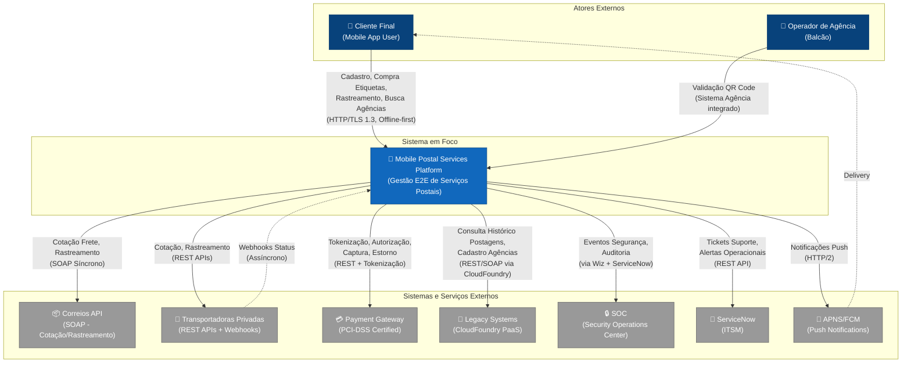
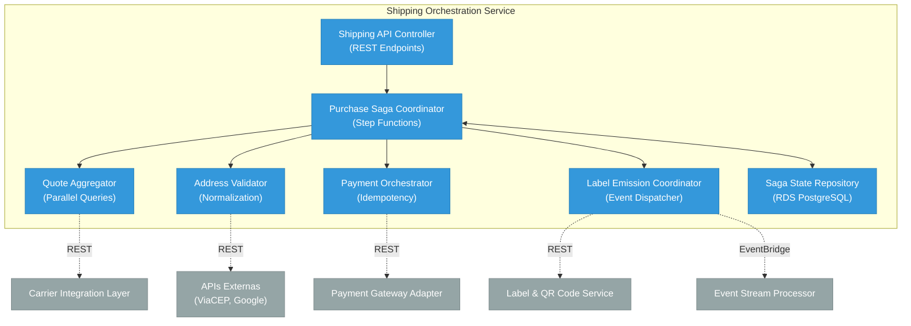
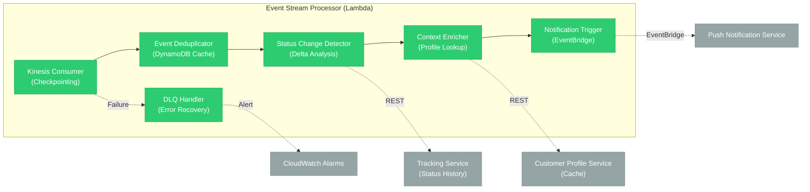
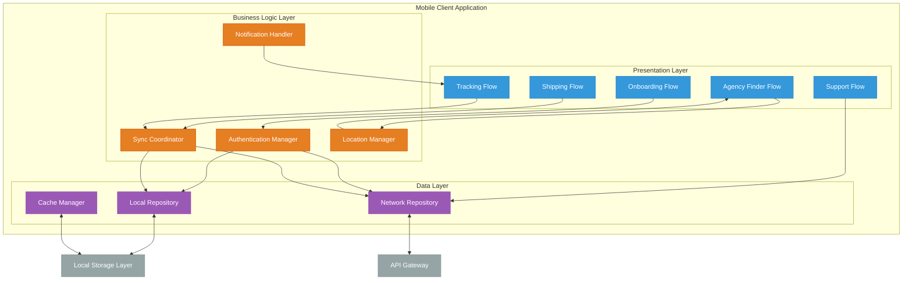
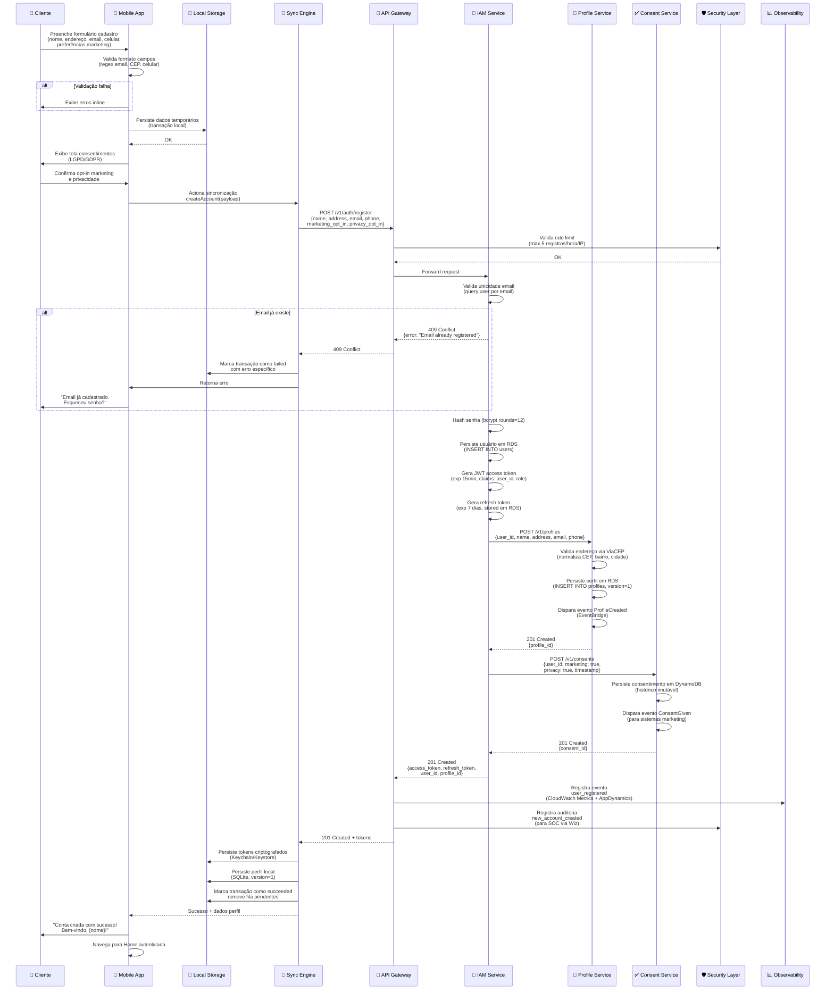
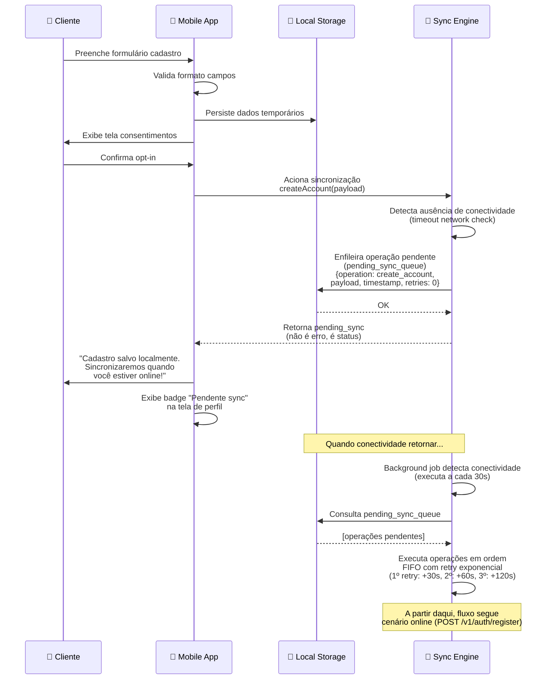
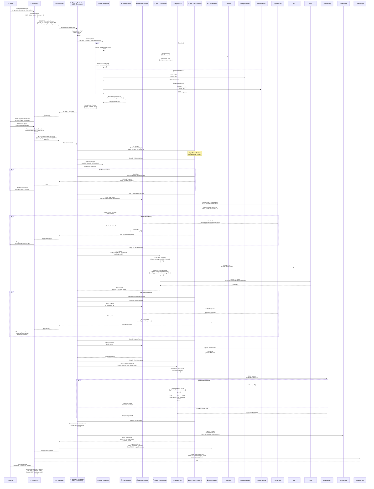

# Documentação Arquitetural – Solução Mobile de Autoatendimento Postal

## Sumário
1. [Visão Geral da Arquitetura](#1-visão-geral-da-arquitetura)
2. [Diagramas C4](#2-diagramas-c4)
3. [Diagramas de Comportamento](#3-diagramas-de-comportamento)
4. [Decisões Arquiteturais (ADRs)](#4-decisões-arquiteturais-adrs)
5. [Requisitos Não Funcionais Derivados](#5-requisitos-não-funcionais-derivados)
6. [Análise Técnica e Decisão de Stack](#6-análise-técnica-e-decisão-de-stack)
7. [Dataset Estruturado de Decisão Arquitetural](#7-dataset-estruturado-de-decisão-arquitetural)
8. [Roadmap de Evolução Arquitetural](#8-roadmap-de-evolução-arquitetural)
9. [Conformidade e Governança](#9-conformidade-e-governança)
10. [Anexos](#anexos)

---

# 1. Visão Geral da Arquitetura

## Resumo Executivo

A solução apresentada constitui um ecossistema digital integrado para gestão end-to-end de serviços postais via aplicativo mobile nativo, operando em modo offline-first com sincronização eventual. O sistema suporta a jornada completa do cliente: desde criação de conta e onboarding com gestão de consentimentos LGPD/GDPR, passando por compra de etiquetas com processamento PCI-DSS compliant, rastreamento near-real-time de objetos postais, busca geolocalizada de agências e suporte integrado via ServiceNow.

A arquitetura foi projetada para atender requisitos críticos de disponibilidade em cenários de conectividade intermitente, integrando sistemas legados via CloudFoundry PaaS e adotando microsserviços cloud-native em AWS. A solução equilibra trade-offs entre latência, consistência, resiliência e conformidade regulatória, implementando padrões consolidados como Saga para transações distribuídas, Circuit Breaker para proteção contra cascata de falhas e Event-Driven Architecture para desacoplamento temporal.

## Propósito e Contexto de Negócio

O sistema habilita transformação digital de serviços postais tradicionais, democratizando acesso via canal mobile e eliminando fricções operacionais (deslocamento físico para agências, filas, horário comercial limitado). A proposta de valor central reside na autonomia do cliente para operações transacionais (compra de etiquetas, pagamento, geração de QR Code) e informacionais (rastreamento, busca de agências) independente de conectividade.

O contexto estratégico inclui integração mandatória com sistemas legados corporativos (rastreamento postal, cadastro de agências, histórico transacional), stack tecnológico corporativo definido (AWS, GitHub Actions, AppDynamics, ServiceNow) e requisitos rigorosos de conformidade (LGPD para dados pessoais, GDPR para market reach internacional, PCI-DSS para processamento de pagamentos, auditoria via SOC).

## Principais Drivers Arquiteturais

| Driver | Descrição | Impacto Arquitetural | Prioridade |
|--------|-----------|---------------------|------------|
| Operação offline-first obrigatória (INC01-INC04) | Cliente deve operar funcionalidades críticas sem conectividade, com sincronização eventual quando rede retornar | Arquitetura offline-first com Local Storage Layer dedicado, Synchronization Engine, filas de operações pendentes, resolução de conflitos e versionamento de schema | **Crítica** |
| Integração com múltiplas transportadoras heterogêneas (INC02) | APIs distintas, protocolos variados, SLAs imprevisíveis de provedores logísticos externos | Carrier Integration Layer com pattern Adapter, circuit breakers, cache de cotações, normalização de responses e isolamento de falhas | **Alta** |
| Rastreamento near-real-time (INC03) | Latência mínima entre mudança de status e notificação ao cliente | Arquitetura híbrida: webhooks quando disponíveis + polling inteligente, Event Stream Processor, Push Notification Service (APNS/FCM) | **Alta** |
| Conformidade PCI-DSS para pagamentos (INC02) | Minimizar scope de certificação, nunca armazenar dados de cartão | Payment Gateway Adapter isolado, tokenização, delegação para gateway externo certificado | **Crítica** |
| Resiliência a instabilidades de sistemas legados (INC02-INC03) | Latências imprevisíveis, disponibilidade variável de APIs corporativas via CloudFoundry | Legacy Systems Integration Hub com timeouts agressivos, cache defensivo, fallbacks e degradação graciosa | **Alta** |
| Compliance LGPD/GDPR (INC01, INC04) | Consentimento auditável, direito de portabilidade, histórico imutável de alterações | Consent Management Service, versionamento de dados em Customer Profile Service, logs de auditoria | **Crítica** |
| Escalabilidade horizontal para picos sazonais | Black Friday, datas comemorativas, campanhas de marketing | Microserviços stateless em AWS, auto-scaling, cache distribuído, Event-Driven Architecture para absorção de carga | **Média** |
| Observabilidade end-to-end e integração SOC (todos INC) | Visibilidade de comportamento distribuído, detecção proativa de anomalias operacionais e de segurança | Instrumentação transversal via AppDynamics, CloudWatch, Datadog, integração com SOC via Wiz, traces distribuídos | **Alta** |
| Time-to-market acelerado e deployment seguro | Releases frequentes sem downtime, rollback rápido em caso de regressão | CI/CD automatizado via GitHub Actions, blue-green deployment, testes automatizados em múltiplas camadas, AWS CodeArtifact | **Média** |
| Disaster Recovery com RTO/RPO diferenciados | Continuidade operacional em falhas de região AWS, corrupção de dados | Disaster Recovery Orchestrator, replicação cross-region, snapshots, Game Day scenarios trimestrais | **Alta** |

## Restrições e Premissas Assumidas

### Restrições Organizacionais e Tecnológicas

**Infraestrutura:**
- **Cloud Provider mandatório:** AWS (Amazon Web Services)
- **PaaS para integração legada:** CloudFoundry (sistemas legados corporativos)
- **CI/CD e versionamento:** GitHub (repositórios) + GitHub Actions (workflows)
- **Gestão de artefatos:** AWS CodeArtifact
- **Observabilidade corporativa:** AppDynamics (APM), CloudWatch (logs/métricas AWS), Datadog (agregação)
- **Segurança e compliance:** Wiz (análise de vulnerabilidades), integração obrigatória com SOC
- **ITSM:** ServiceNow (tickets de suporte, alertas operacionais, aprovações de releases)

**Conformidade Regulatória:**
- **Dados pessoais:** LGPD (Brasil) e GDPR (União Europeia) - opt-in/opt-out auditável, portabilidade, direito ao esquecimento
- **Pagamentos:** PCI-DSS Level 1 - tokenização mandatória, SAQ-A (escopo reduzido via gateway externo)
- **Acessibilidade:** WCAG 2.1 Level AA, ABNT NBR 17060

**Governança:**
- Participação mandatória em SteerCos (steering committees) mensais para decisões estratégicas
- Design Forums quinzenais para validação de decisões técnicas com arquitetos corporativos
- Release Board (aprovações formais antes de deployment produtivo)
- Documentação mandatória: HLD (High Level Design), LLD (Low Level Design), DR Plans
- Rastreabilidade total de requisitos via Jira (stories → commits → PRs → releases)
- Game Day scenarios trimestrais para validação de DR e transferência de conhecimento BAU
- PEN testing (penetration testing) externo semestral
- Modelo RACI definido para transição BAU após cada incremento

### Premissas de Negócio

**Operação offline-first:**
- Funcionalidades críticas (autenticação, visualização de etiquetas compradas, rastreamento local, busca de agências cacheadas) devem operar sem conectividade
- Sincronização eventual é aceitável (não há requisito de strong consistency para maioria dos dados)
- Expectativa de conectividade intermitente em 30% do tempo de uso típico (áreas rurais, transporte público, ambientes internos)

**Integração com sistemas legados:**
- APIs legadas via CloudFoundry não podem ser migradas no horizonte do projeto
- SLAs de sistemas legados: 95% disponibilidade, p95 latência 3-5 segundos
- Janela de manutenção semanal dos legados (domingos 2h-6h BRT)

**Transportadoras:**
- Correios (obrigatório): API SOAP, sem webhooks (polling necessário), SLA 99%
- Transportadoras privadas (2-3 parceiros iniciais): APIs REST heterogêneas, webhooks parciais

**Escalabilidade:**
- MVP: 10K usuários ativos mensais (MAU), 50K transações/mês
- 12 meses: 100K MAU, 500K transações/mês
- 24 meses: 500K MAU, 3M transações/mês
- Pico sazonal: 3x tráfego médio (Black Friday, Natal)

### Premissas Técnicas

**Plataformas mobile:**
- Android 8.0+ (API 26+) - 85% da base instalada
- iOS 13.0+ - 15% da base instalada
- React Native não é viável (expertise interna em Swift/Kotlin, requisitos de acessibilidade nativa)

**Conectividade:**
- Latência média: 150ms (3G/4G)
- Latência p95: 500ms
- Disponibilidade de rede: 70% (ambientes urbanos)

**Segurança:**
- Rotação de chaves criptográficas: trimestral
- Tokens JWT: 15 minutos (access token), 7 dias (refresh token)
- Criptografia em trânsito: TLS 1.3
- Criptografia em repouso: AES-256

## Estilo Arquitetural Predominante

A solução adota arquitetura **híbrida** combinando múltiplos estilos complementares:

**1. Microsserviços Cloud-Native (Backend):**
- Decomposição funcional por bounded contexts (Identity, Profile, Shipping, Tracking, Location)
- Serviços independentemente deployáveis, escaláveis e resilientes
- Comunicação via API Gateway com autenticação centralizada
- Hospedagem em AWS com auto-scaling, health checks e blue-green deployments

**2. Event-Driven Architecture (Rastreamento, Notificações):**
- Desacoplamento temporal entre produtores e consumidores de eventos
- Event Stream Processor para enriquecimento e transformação near-real-time
- Push Notification Service acionado por mudanças de status
- Garantias de entrega: at-least-once (idempotência nos consumidores)

**3. Layered Architecture (Mobile Client):**
- Separação clara entre UI, lógica de negócio e persistência
- Local Storage Layer como abstração de armazenamento (SQLite, Keychain/Keystore)
- Synchronization Engine como camada de coordenação de sincronização
- Dependency injection para testabilidade

**4. Adapter Pattern (Integrações):**
- Carrier Integration Layer abstrai heterogeneidade de transportadoras
- Legacy Systems Integration Hub normaliza protocolos de sistemas corporativos
- Payment Gateway Adapter isola processamento PCI-DSS
- Support Ticketing Adapter encapsula integração ServiceNow

**Justificativa do Estilo Híbrido:**

A combinação de estilos atende drivers conflitantes que nenhum padrão isolado resolveria adequadamente:
- **Microsserviços** endereçam escalabilidade, deployment independente e isolamento de falhas
- **Event-Driven** reduz acoplamento temporal em rastreamento e notificações
- **Layered (mobile)** facilita manutenção, testabilidade e operação offline
- **Adapter** protege sistema core de variabilidade de integrações externas

## Visão de Contexto Estratégico

O sistema opera na intersecção de três ecossistemas:

**1. Ecossistema Interno (Corporativo):**
- Integração com CloudFoundry PaaS (legados: rastreamento postal, cadastro de agências)
- Dependência de SOC para auditoria de segurança e resposta a incidentes
- Alinhamento com stack tecnológico corporativo (AWS, AppDynamics, ServiceNow)
- Conformidade com processos de governança (SteerCos, Design Forums, Release Board)

**2. Ecossistema Externo (Parceiros Logísticos):**
- Dependência de APIs de transportadoras (Correios, privadas)
- Variabilidade de SLAs, protocolos e custos de integração
- Necessidade de circuit breakers e fallbacks para resiliência

**3. Ecossistema de Usuários Finais:**
- Expectativa de disponibilidade 24/7 independente de conectividade
- Requisitos de acessibilidade (WCAG 2.1, ABNT NBR 17060)
- Preferências de privacidade (opt-in/opt-out LGPD/GDPR)

**Tensões Arquiteturais Principais:**

| Tensão | Trade-off Escolhido | Justificativa |
|--------|---------------------|---------------|
| Consistência vs. Disponibilidade (CAP) | Disponibilidade (eventual consistency) | Operação offline mandatória prioriza disponibilidade local sobre consistência imediata |
| Latência vs. Custo (APIs externas) | Cache agressivo, polling otimizado | Reduz custos de chamadas frequentes sacrificando latência de atualização |
| Segurança vs. Usabilidade (autenticação) | Tokens de longa duração, renovação oportunística | Permite autenticação offline sem comprometer UX |
| Conformidade vs. Flexibilidade (stack) | Stack corporativo mandatório | Conformidade organizacional prevalece sobre escolha puramente técnica |
| Autonomia vs. Resiliência (microserviços) | Microsserviços com API Gateway central | Balanceia deployment independente com observabilidade e segurança centralizadas |

## Próximas Seções

Este documento estabelece fundações conceituais da arquitetura. As seções seguintes detalharão:
- **Diagramas C4:** Decomposição visual em múltiplas perspectivas (contexto, containers, componentes, deployment)
- **Diagramas de Comportamento:** Fluxos principais (sequência, eventos)
- **ADRs:** Decisões estruturais documentadas com trade-offs explícitos
- **Requisitos Não Funcionais:** Performance, segurança, observabilidade, governança
- **Análise de Stack:** Decisão assistida de tecnologias por categoria
- **Roadmap de Evolução:** Limitações conhecidas e próximos passos

# 2. Diagramas C4

## Introdução

Esta seção apresenta a arquitetura do sistema em múltiplas perspectivas utilizando o modelo C4 (Context, Containers, Components, Code), criado por Simon Brown. Os diagramas evoluem progressivamente de uma visão de alto nível (contexto de negócio) para detalhes de implementação (componentes internos), mantendo consistência de nomenclatura e rastreabilidade entre camadas.

---

## 2.1. C4 – Contexto

### Descrição

O diagrama de contexto apresenta a visão mais externa do sistema, identificando atores humanos, sistemas terceiros e o escopo de responsabilidade da solução. O sistema central ("Mobile Postal Services Platform") atua como hub digital integrando clientes finais, operações de agências físicas, parceiros logísticos, sistemas legados corporativos e infraestrutura de segurança/observabilidade.

O cliente final interage exclusivamente via aplicativo mobile nativo (Android/iOS), que

 mantém operação offline-first sincronizando periodicamente com backend cloud. Agências físicas validam QR Codes apresentados por clientes no balcão, fechando o ciclo transacional iniciado digitalmente. Transportadoras fornecem APIs de cotação e rastreamento (síncronas) e webhooks de mudanças de status (assíncronos). Sistemas legados via CloudFoundry mantêm registros históricos de postagens e cadastro autoritativo de agências. O SOC (Security Operations Center) consome eventos de segurança para detecção de anomalias e resposta a incidentes.

### Atores e Sistemas Externos

- **Cliente Final (Pessoa):** Usuário do aplicativo mobile que cria conta, compra etiquetas, rastreia encomendas, busca agências e abre tickets de suporte. Opera em cenários de conectividade intermitente.

- **Operador de Agência (Pessoa):** Atendente de balcão que valida QR Codes apresentados por clientes usando sistema de agência integrado, confirmando postagem física.

- **Correios API (Sistema Externo):** Sistema legado SOAP para cotação de frete e rastreamento de objetos postais. Protocolo síncrono apenas (sem webhooks), SLA 99%, p95 latência 3-5s.

- **Transportadoras Privadas (Sistema Externo):** Parceiros logísticos com APIs REST heterogêneas para cotação e rastreamento. Suporte parcial a webhooks para notificação proativa de mudanças de status.

- **Payment Gateway (Sistema Externo):** Provedor PCI-DSS Level 1 certificado para processamento de pagamentos com cartão de crédito. Tokenização, autorização, captura e estorno.

- **Legacy Systems via CloudFoundry (Sistema Externo):** Sistemas corporativos de rastreamento postal histórico e cadastro de agências. Integração via APIs REST/SOAP hospedadas em CloudFoundry PaaS.

- **SOC (Security Operations Center) (Sistema Externo):** Equipe e ferramental corporativo (SIEM, SOAR) que consome eventos de segurança via Wiz e ServiceNow para auditoria e resposta a incidentes.

- **ServiceNow (Sistema Externo):** Plataforma ITSM corporativa para gestão de tickets de suporte, alertas operacionais e aprovações de releases.

- **Push Notification Services (Sistema Externo):** APNS (Apple Push Notification Service) para iOS e FCM (Firebase Cloud Messaging) para Android.

### Diagrama



### Observações

**Limites de Responsabilidade:**
- **Dentro do escopo:** Aplicativo mobile, backend de microsserviços AWS, orquestração de integrações, sincronização offline, geração de QR Codes
- **Fora do escopo:** Processamento de pagamentos (delegado a gateway externo), operação física de agências, logística de transportadoras, detecção de fraude (SOC)

**Padrões de Comunicação:**
- Linhas sólidas (→): Comunicação síncrona (request/response)
- Linhas tracejadas (-.->): Comunicação assíncrona (webhooks, push notifications)

---

## 2.2. C4 – Containers (Visão Lógica)

### Descrição

O diagrama de containers decompõe a plataforma em unidades lógicas de deployment, expondo tecnologias de alto nível e protocolos de comunicação. O Mobile Client Application é implementado nativamente (Swift para iOS, Kotlin para Android) e interage com backend via API Gateway único que atua como ponto de entrada seguro. Backend é estruturado em microsserviços independentes hospedados em AWS, cada um com responsabilidade funcional clara (Identity, Profile, Shipping, Tracking, etc.). Camadas transversais (Observability, Security, CI/CD, DR) proveem capabilities compartilhados.

### Containers Identificados

#### **Frontend**

**1. Mobile Client Application**
- **Tecnologia:** Swift (iOS), Kotlin (Android)
- **Responsabilidade:** Interface nativa, gerenciamento de estado local, captura de geolocalização, exibição de QR Codes, implementação WCAG 2.1/ABNT NBR 17060
- **Comunicação:** HTTPS (TLS 1.3) com API Gateway, sincronização bidirecional offline-first
- **Incrementos:** INC01, INC02, INC03, INC04

**2. Local Storage Layer**
- **Tecnologia:** SQLite (dados estruturados), Keychain/Keystore (credenciais), File System (imagens QR Code)
- **Responsabilidade:** Persistência local criptografada, versionamento de schema, filas de sincronização
- **Comunicação:** Acesso direto via Synchronization Engine
- **Incrementos:** INC01, INC02, INC03, INC04

**3. Synchronization Engine**
- **Tecnologia:** Kotlin/Swift (módulo nativo)
- **Responsabilidade:** Orquestração de sincronização, detecção de conflitos, retry com backoff exponencial, gestão de conectividade
- **Comunicação:** HTTPS com API Gateway (autenticado via JWT)
- **Incrementos:** INC01, INC02, INC03, INC04

#### **Gateway**

**4. API Gateway**
- **Tecnologia:** AWS API Gateway (REST APIs + WebSocket para notificações)
- **Responsabilidade:** Roteamento, autenticação JWT, rate limiting (per-user, global), agregação de respostas, transformação de protocolos, logs de auditoria
- **Comunicação:** TLS 1.3 inbound (mobile), HTTPS outbound (microsserviços)
- **Incrementos:** INC01, INC02, INC03, INC04

#### **Backend Microservices (AWS)**

**5. Identity and Access Management Service**
- **Tecnologia:** Spring Boot (Java 17), AWS RDS PostgreSQL
- **Responsabilidade:** Autenticação, emissão/validação JWT, refresh tokens, gestão de sessões, auditoria de acessos
- **Comunicação:** REST (síncrono)
- **Incrementos:** INC01, INC04

**6. Customer Profile Service**
- **Tecnologia:** Spring Boot (Java 17), AWS RDS PostgreSQL
- **Responsabilidade:** CRUD de perfil do cliente, versionamento de dados, histórico de alterações, propagação de mudanças via eventos
- **Comunicação:** REST (síncrono), EventBridge (assíncrono)
- **Incrementos:** INC01, INC04

**7. Consent Management Service**
- **Tecnologia:** Spring Boot (Java 17), AWS DynamoDB (histórico imutável)
- **Responsabilidade:** Gestão de consentimentos LGPD/GDPR, histórico auditável, integração com sistemas de marketing
- **Comunicação:** REST (síncrono)
- **Incrementos:** INC01, INC04

**8. Shipping Orchestration Service**
- **Tecnologia:** Spring Boot (Java 17), AWS Step Functions (Saga), AWS RDS PostgreSQL
- **Responsabilidade:** Orquestração de compra de etiqueta (Saga pattern), coordenação de cotação/pagamento/emissão, compensação de falhas
- **Comunicação:** REST (síncrono), Step Functions (assíncrono)
- **Incrementos:** INC02

**9. Carrier Integration Layer**
- **Tecnologia:** Spring Boot (Java 17), AWS ElastiCache Redis (cache cotações)
- **Responsabilidade:** Abstração de APIs de transportadoras, normalização de responses, circuit breakers (Resilience4j), cache de cotações (TTL 5min)
- **Comunicação:** REST/SOAP outbound (transportadoras), REST inbound (orquestrador)
- **Incrementos:** INC02, INC03

**10. Pricing Engine**
- **Tecnologia:** Spring Boot (Java 17), AWS RDS PostgreSQL (tabelas preço)
- **Responsabilidade:** Cálculo de frete, aplicação de regras de negócio, cache de tabelas de preço
- **Comunicação:** REST (síncrono)
- **Incrementos:** INC02

**11. Payment Gateway Adapter**
- **Tecnologia:** Spring Boot (Java 17)
- **Responsabilidade:** Integração PCI-DSS, tokenização, autorização/captura/estorno, logs auditáveis
- **Comunicação:** HTTPS (gateway externo), REST inbound (orquestrador)
- **Incrementos:** INC02

**12. Label and QR Code Service**
- **Tecnologia:** Spring Boot (Java 17), AWS S3 (armazenamento PDFs), AWS KMS (criptografia assinaturas)
- **Responsabilidade:** Geração de etiquetas PDF, QR Codes assinados criptograficamente, validação one-time-use
- **Comunicação:** REST (síncrono)
- **Incrementos:** INC02

**13. Legacy Systems Integration Hub**
- **Tecnologia:** Spring Boot (Java 17), AWS ElastiCache Redis (cache defensivo)
- **Responsabilidade:** Mediação com CloudFoundry, transformação SOAP/REST, circuit breakers, timeouts agressivos (2s), fallbacks
- **Comunicação:** REST/SOAP outbound (legados), REST inbound (consumidores)
- **Incrementos:** INC02, INC03

**14. Tracking Service**
- **Tecnologia:** Spring Boot (Java 17), AWS RDS PostgreSQL, AWS SQS (fila polling)
- **Responsabilidade:** Agregação de rastreamento, polling inteligente (backoff exponencial), cache de status (TTL 10min)
- **Comunicação:** REST/SOAP (transportadoras), webhooks inbound, REST (consultas)
- **Incrementos:** INC03

**15. Event Stream Processor**
- **Tecnologia:** AWS Lambda (Node.js 18), AWS Kinesis Data Streams
- **Responsabilidade:** Processamento near-real-time de eventos de rastreamento, enriquecimento com contexto, deduplicação, disparo de notificações
- **Comunicação:** Kinesis (inbound), EventBridge (outbound)
- **Incrementos:** INC03

**16. Push Notification Service**
- **Tecnologia:** Spring Boot (Java 17), AWS SNS
- **Responsabilidade:** Envio para APNS/FCM, segmentação de audiência, retry de falhas, respeit a preferências
- **Comunicação:** HTTP/2 (APNS/FCM), EventBridge (triggers)
- **Incrementos:** INC03

**17. Location and Agency Service**
- **Tecnologia:** Spring Boot (Java 17), AWS RDS PostgreSQL + PostGIS (geoespacial)
- **Responsabilidade:** Catálogo de agências, busca por proximidade (índice geoespacial), cache regional, sincronização com legados
- **Comunicação:** REST (síncrono)
- **Incrementos:** INC04

**18. Support Ticketing Adapter**
- **Tecnologia:** Spring Boot (Java 17)
- **Responsabilidade:** Integração com ServiceNow, categorização automática de tickets, anexo de contexto do cliente
- **Comunicação:** REST (ServiceNow API)
- **Incrementos:** INC04

#### **Infraestrutura Transversal**

**19. Observability and Monitoring Layer**
- **Tecnologia:** AWS CloudWatch (logs/métricas), AppDynamics (APM), Datadog (agregação), AWS X-Ray (traces)
- **Responsabilidade:** Coleta de métricas, traces distribuídos, logs estruturados, alertas operacionais/segurança
- **Comunicação:** Agents (sidecar), APIs push
- **Incrementos:** INC01, INC02, INC03, INC04

**20. Security and Compliance Layer**
- **Tecnologia:** AWS KMS (criptografia), AWS WAF (firewall), Wiz (análise vulnerabilidades), AWS GuardDuty (anomalias)
- **Responsabilidade:** Criptografia em trânsito/repouso, DLP, detecção de anomalias, rotação de chaves, auditoria
- **Comunicação:** Integração com SOC via ServiceNow
- **Incrementos:** INC01, INC02, INC03, INC04

**21. CI/CD Pipeline**
- **Tecnologia:** GitHub Actions (workflows), AWS CodeArtifact (artefatos), AWS CodeDeploy (deployment)
- **Responsabilidade:** Build, testes automatizados, empacotamento, deployment blue-green, rollback
- **Comunicação:** Webhooks (GitHub), AWS APIs
- **Incrementos:** INC01, INC02, INC03, INC04

**22. Disaster Recovery Orchestrator**
- **Tecnologia:** AWS Backup, AWS S3 (snapshots), AWS Cross-Region Replication
- **Responsabilidade:** Backups automatizados, replicação cross-region, orquestração de failover, Game Day scenarios
- **Comunicação:** AWS APIs, scripts Lambda
- **Incrementos:** INC01, INC02, INC03, INC04

### Diagrama



```mermaid
graph TB
    subgraph "Mobile Client (Android/iOS)"
        MobileApp["Mobile Client Application<br/>(Swift/Kotlin)<br/>UI/UX, Geolocalização"]
        LocalStorage["Local Storage Layer<br/>(SQLite, Keychain/Keystore)<br/>Persistência Offline"]
        SyncEngine["Synchronization Engine<br/>(Native Module)<br/>Sincronização Bidirecional"]
        
        MobileApp <--> LocalStorage
        MobileApp <--> SyncEngine
    end
    
    subgraph "API Gateway Layer (AWS)"
        APIGW["API Gateway<br/>(AWS API Gateway)<br/>Autenticação, Rate Limiting,<br/>Roteamento"]
    end
    
    subgraph "Backend Microservices (AWS)"
        subgraph "Identity & Profile"
            IAM["Identity Service<br/>(Spring Boot + RDS)<br/>Autenticação JWT"]
            Profile["Customer Profile Service<br/>(Spring Boot + RDS)<br/>CRUD Perfil"]
            Consent["Consent Management<br/>(Spring Boot + DynamoDB)<br/>LGPD/GDPR"]
        end
        
        subgraph "Shipping & Payment"
            ShipOrch["Shipping Orchestrator<br/>(Spring Boot + Step Functions)<br/>Saga Pattern"]
            CarrierInt["Carrier Integration<br/>(Spring Boot + Redis)<br/>Circuit Breakers"]
            Pricing["Pricing Engine<br/>(Spring Boot + RDS)<br/>Cálculo Frete"]
            PaymentAdp["Payment Adapter<br/>(Spring Boot)<br/>PCI-DSS Tokenização"]
            LabelQR["Label & QR Service<br/>(Spring Boot + S3 + KMS)<br/>Geração Segura"]
        end
        
        subgraph "Tracking & Notifications"
            Tracking["Tracking Service<br/>(Spring Boot + SQS)<br/>Polling + Webhooks"]
            EventProc["Event Stream Processor<br/>(Lambda + Kinesis)<br/>Near-Real-Time"]
            PushNotif["Push Notification<br/>(Spring Boot + SNS)<br/>APNS/FCM"]
        end
        
        subgraph "Location & Support"
            Location["Location Service<br/>(Spring Boot + PostGIS)<br/>Busca Geoespacial"]
            Support["Support Adapter<br/>(Spring Boot)<br/>ServiceNow Integration"]
        end
        
        subgraph "Legacy Integration"
            LegacyHub["Legacy Systems Hub<br/>(Spring Boot + Redis)<br/>CloudFoundry Mediator"]
        end
    end
    
    subgraph "External Systems"
        CorreiosAPI["Correios API<br/>(SOAP)"]
        TransportAPI["Transportadoras<br/>(REST + Webhooks)"]
        PaymentGW["Payment Gateway<br/>(PCI-DSS)"]
        CloudFoundry["Legacy Systems<br/>(CloudFoundry)"]
        APNS_FCM["APNS/FCM"]
        ServiceNow["ServiceNow<br/>(ITSM)"]
    end
    
    subgraph "Infrastructure (AWS)"
        Observability["Observability Layer<br/>(CloudWatch, AppDynamics,<br/>Datadog, X-Ray)"]
        Security["Security Layer<br/>(KMS, WAF, Wiz,<br/>GuardDuty)"]
        CICD["CI/CD Pipeline<br/>(GitHub Actions,<br/>CodeArtifact, CodeDeploy)"]
        DR["DR Orchestrator<br/>(Backup, S3,<br/>Cross-Region Replication)"]
    end
    
    SyncEngine -.->|"HTTPS<br/>(JWT Auth)"| APIGW
    
    APIGW --> IAM
    APIGW --> Profile
    APIGW --> Consent
    APIGW --> ShipOrch
    APIGW --> Tracking
    APIGW --> Location
    APIGW --> Support
    
    ShipOrch --> CarrierInt
    ShipOrch --> Pricing
    ShipOrch --> PaymentAdp
    ShipOrch --> LabelQR
    ShipOrch --> LegacyHub
    
    CarrierInt --> CorreiosAPI
    CarrierInt --> TransportAPI
    TransportAPI -.->|"Webhooks"| Tracking
    
    Tracking --> EventProc
    EventProc --> PushNotif
    PushNotif --> APNS_FCM
    
    PaymentAdp --> PaymentGW
    LegacyHub --> CloudFoundry
    Support --> ServiceNow
    
    IAM -.-> Observability
    Profile -.-> Observability
    ShipOrch -.-> Observability
    Tracking -.-> Observability
    
    Security -.-> ServiceNow
    Security -.-> Observability
    
    classDef frontend fill:#3498db,stroke:#2980b9,color:#fff
    classDef gateway fill:#e74c3c,stroke:#c0392b,color:#fff
    classDef backend fill:#2ecc71,stroke:#27ae60,color:#fff
    classDef external fill:#95a5a6,stroke:#7f8c8d,color:#fff
    classDef infra fill:#f39c12,stroke:#d68910,color:#fff
    
    class MobileApp,LocalStorage,SyncEngine frontend
    class APIGW gateway
    class IAM,Profile,Consent,ShipOrch,CarrierInt,Pricing,PaymentAdp,LabelQR,Tracking,EventProc,PushNotif,Location,Support,LegacyHub backend
    class CorreiosAPI,TransportAPI,PaymentGW,CloudFoundry,APNS_FCM,ServiceNow external
    class Observability,Security,CICD,DR infra
```

### Legenda de Comunicação

- **Síncrona (→):** REST APIs HTTPS, latência esperada 100-500ms
- **Assíncrona (-.->):** Webhooks, EventBridge, Kinesis, SQS (desacoplamento temporal)
- **Observabilidade (-.->):** Instrumentação transversal (métricas, logs, traces)

### Observações Arquiteturais

**Padrões Aplicados:**
- **API Gateway Pattern:** Ponto de entrada único, simplifica segurança e observabilidade
- **Microservices:** Decomposição funcional, deployment independente, escalabilidade granular
- **Saga Pattern:** Transações distribuídas com compensação (Shipping Orchestration)
- **Circuit Breaker:** Proteção contra cascata de falhas (Carrier Integration, Legacy Hub)
- **Cache-Aside:** Redução de latência e carga (cotações, rastreamento, agências)
- **Event Sourcing (parcial):** Histórico imutável de eventos de rastreamento (Kinesis)
- **Strangler Fig:** Legacy Systems Integration Hub permite migração gradual de legados

**Decisões de Tecnologia (Stack Corporativo):**
- **AWS:** Mandatório como cloud provider (EC2, RDS, S3, Lambda, API Gateway, etc.)
- **Spring Boot:** Framework Java consolidado para microsserviços backend
- **GitHub Actions:** CI/CD corporativo mandatório
- **AppDynamics + CloudWatch:** Observabilidade corporativa (APM + infra)
- **ServiceNow:** ITSM corporativo para tickets e alertas

---

## 2.3. C4 – Componentes

Esta seção detalha componentes internos de containers com responsabilidades complexas (3+ responsabilidades distintas). Containers simples são descritos textualmente sem diagramas.

### Shipping Orchestration Service (INC02)

**Responsabilidade:** Orquestrar jornada de compra de etiqueta como transação distribuída (Saga pattern), coordenando cotação, validação, pagamento e emissão com capacidade de compensação em caso de falhas parciais.

**Componentes Internos:**

1. **Shipping API Controller**
   - Expõe endpoints REST para iniciar compra, consultar status, cancelar
   - Valida payload de entrada, autentica requisições via JWT
   - Aciona Purchase Saga Coordinator

2. **Purchase Saga Coordinator**
   - Implementa padrão Saga (AWS Step Functions)
   - Define máquina de estados: Quote → Validate → Authorize Payment → Generate Label → Confirm
   - Gerencia compensações em caso de falha: Refund Payment, Invalidate Label

3. **Quote Aggregator**
   - Consulta Carrier Integration Layer para múltiplas transportadoras em paralelo
   - Aplica regras de negócio para filtrar/classificar cotações
   - Retorna opções ordenadas por preço, prazo, reputação

4. **Address Validator**
   - Valida CEP, normaliza endereços via APIs externas (ViaCEP, Google Geocoding)
   - Identifica endereços de risco (PO Boxes, zonas não atendidas)

5. **Payment Orchestrator**
   - Coordena autorização, captura e estorno via Payment Gateway Adapter
   - Implementa idempotência (evita cobranças duplicadas em retries)
   - Registra eventos de auditoria financeira

6. **Label Emission Coordinator**
   - Aciona Label and QR Code Service após confirmação de pagamento
   - Persiste metadados de etiqueta (ID, transportadora, valor, data)
   - Dispara evento "LabelIssued" para Event Stream Processor

7. **Saga State Repository**
   - Persiste estado de cada saga em execução (RDS PostgreSQL)
   - Permite retomada de sagas interrompidas (crash recovery)
   - Auditoria completa de transações distribuídas

**Diagrama:**



**Padrões Aplicados:**
- **Saga Pattern (Orchestration):** Coordenação centralizada via Step Functions
- **Compensating Transaction:** Estorno de pagamento, invalidação de label em caso de falha
- **Idempotency:** Evita cobranças duplicadas via chaves únicas de transação

**Rastreabilidade:**
- INC02 (Compra de Etiqueta e Geração de QR Code)

---

### Event Stream Processor (INC03)

**Responsabilidade:** Processar eventos de rastreamento near-real-time, enriquecer com contexto do cliente, detectar mudanças de status, deduplicar eventos e disparar notificações push.

**Componentes Internos:**

1. **Kinesis Consumer**
   - Consome eventos de Kinesis Data Streams (sharded por tracking_code)
   - Implementa checkpointing (exatamente uma vez via DynamoDB)
   - Paralelização via múltiplas instâncias Lambda

2. **Event Deduplicator**
   - Identifica eventos duplicados via hash (tracking_code + timestamp + status)
   - Cache distribuído (DynamoDB TTL 24h)
   - Previne notificações redundantes

3. **Status Change Detector**
   - Compara status novo vs. anterior (consulta Tracking Service)
   - Identifica transições relevantes (postado → em_transito → entregue)
   - Filtra mudanças não-notificáveis (micro-atualizações de localização)

4. **Context Enricher**
   - Enriquece evento com dados do cliente (nome, preferências notificação)
   - Consulta Customer Profile Service (cache local 5min)
   - Adiciona metadados para segmentação (idioma, timezone)

5. **Notification Trigger**
   - Dispara evento "SendPushNotification" via EventBridge
   - Aplica regras de preferências (cliente pode desabilitar notificações)
   - Implementa throttling (máx 3 notificações/hora por objeto)

6. **Dead Letter Queue Handler**
   - Processa eventos que falharam após 3 retries
   - Registra em DLQ para análise manual
   - Dispara alerta operacional via CloudWatch

**Diagrama:**



**Padrões Aplicados:**
- **Event Sourcing (parcial):** Kinesis mantém log imutável de eventos
- **Exactly-Once Semantics:** Checkpointing + deduplicação
- **Enrichment Pattern:** Adiciona contexto antes de notificação
- **Dead Letter Queue:** Recuperação de falhas transientes

**Rastreabilidade:**
- INC03 (Rastreamento de Encomenda com Sincronização Offline)

---

### Mobile Client Application (INC01-INC04)

**Responsabilidade:** Interface nativa multiplataforma (iOS/Android) com operação offline-first, captura de entrada do usuário, apresentação de UI acessível e sincronização bidirecional com backend.

**Componentes Internos:**

**Camada de Apresentação (UI):**
1. **Onboarding Flow** (INC01): Telas de cadastro, login, consentimentos
2. **Shipping Flow** (INC02): Cotação, seleção transportadora, pagamento, exibição QR Code
3. **Tracking Flow** (INC03): Lista de objetos rastreados, detalhes de status, timeline
4. **Agency Finder Flow** (INC04): Busca geolocalizada, lista de agências, detalhes (horários, serviços)
5. **Support Flow** (INC04): Formulário de contato, FAQ, chat (futuro)

**Camada de Lógica de Negócio:**
6. **Authentication Manager**: Validação de tokens, renovação automática, logout
7. **Sync Coordinator**: Orquestra sincronização de Local Storage Layer com backend via Synchronization Engine
8. **Location Manager**: Abstração de geolocalização nativa (CLLocationManager iOS, FusedLocationProvider Android)
9. **Notification Handler**: Recebe push notifications (APNS/FCM), atualiza UI se app em foreground

**Camada de Dados:**
10. **Local Repository**: Interface para Local Storage Layer (SQLite, Keychain)
11. **Network Repository**: Interface para API Gateway (Retrofit Android, URLSession iOS)
12. **Cache Manager**: Estratégias de invalidação, TTL

**Diagrama (Simplificado - Estrutura Layered):**



**Padrões Aplicados:**
- **Model-View-ViewModel (MVVM):** Separação UI/lógica (SwiftUI, Jetpack Compose)
- **Repository Pattern:** Abstração de fontes de dados (local vs. remota)
- **Dependency Injection:** Testabilidade (Hilt Android, SwiftUI Environment)

**Rastreabilidade:**
- INC01 (Criação de Conta), INC02 (Compra Etiqueta), INC03 (Rastreamento), INC04 (Agências, Suporte)

---

### Containers com Descrição Textual (Sem Diagrama)

**Carrier Integration Layer:**
- **Adapter Factory:** Cria adapters específicos por transportadora (Correios, Fedex, DHL)
- **Circuit Breaker Manager:** Gerencia estado de circuit breakers (Resilience4j)
- **Response Normalizer:** Transforma responses heterogêneos em modelo unificado
- **Cache Manager:** Redis para cotações (TTL 5min), invalidação manual

**Legacy Systems Integration Hub:**
- **Protocol Transformer:** Converte REST ↔ SOAP, JSON ↔ XML
- **Timeout Manager:** Timeouts agressivos (2s default), retry 3x com backoff exponencial
- **Fallback Provider:** Responses estáticas em caso de indisponibilidade total
- **Cache Layer:** Redis para cadastro de agências (TTL 24h)

**Tracking Service:**
- **Polling Scheduler:** Cron jobs com backoff exponencial (intervalo aumenta se sem mudanças)
- **Webhook Receiver:** Endpoint REST para webhooks de transportadoras
- **Event Publisher:** Publica eventos de mudança de status em Kinesis
- **Status Cache:** Redis (TTL 10min) para reduzir consultas redundantes

**Location and Agency Service:**
- **Geospatial Query Engine:** PostGIS para busca por raio (ST_DWithin)
- **Sync Agent:** Polling periódico de legados (1x/dia) para atualizar catálogo
- **Cache Manager:** Cache regional (por UF) para reduzir latência

---

## 2.4. C4 – Deployment (Visão Física)

### Descrição

O diagrama de deployment apresenta distribuição física de containers em nós de infraestrutura, segmentação de rede e estratégia de deployment. A solução opera em AWS com segregação entre camadas (web, application, data) e ambientes (development, staging, production). Frontend mobile é distribuído via App Store/Google Play. Backend de microsserviços usa Elastic Container Service (ECS) com Fargate (serverless containers). Deployment segue padrão blue-green para zero downtime. Disaster Recovery implementa replicação cross-region (us-east-1 primary → us-west-2 secondary).

### Ambientes

**Development:**
- **Propósito:** Desenvolvimento ativo, testes unitários/integração
- **Características:** Single AZ, RDS t3.micro, Redis t3.micro, sem cross-region replication
- **Acesso:** VPN corporativa, desenvolvedores apenas

**Staging:**
- **Propósito:** Testes E2E, UAT, PEN testing, simulação de carga
- **Características:** Multi-AZ, RDS t3.small, Redis t3.small, dados anonimizados de produção
- **Acesso:** VPN corporativa, QA + stakeholders

**Production:**
- **Propósito:** Operação real, usuários finais
- **Características:** Multi-AZ, Multi-Region (DR), RDS r5.large (primary), Redis r5.large, auto-scaling, WAF, GuardDuty
- **Acesso:** Público (API Gateway), interno via bastions (operações)

### Segmentação de Rede (Production)

**DMZ (Internet-Facing):**
- API Gateway (ALB + WAF)
- CloudFront (CDN para assets estáticos - futuro)

**Application Tier (Private Subnets):**
- ECS Fargate Tasks (microserviços)
- Lambda Functions (Event Stream Processor)
- NAT Gateway para saída (APIs externas)

**Data Tier (Private Subnets - Isolated):**
- RDS PostgreSQL (Multi-AZ)
- ElastiCache Redis (Multi-AZ)
- S3 (etiquetas PDF, backups) - acesso via VPC Endpoint

**Management Tier (Private Subnets):**
- Bastion Hosts (acesso SSH via SSM Session Manager)
- GitHub Actions Runners (self-hosted para deploy)

### Diagrama



```mermaid
graph TB
    subgraph "End Users"
        iOS["📱 iOS Devices<br/>(App Store)"]
        Android["📱 Android Devices<br/>(Google Play)"]
    end
    
    subgraph "AWS Region: us-east-1 (Primary)"
        subgraph "DMZ (Public Subnets)"
            ALB["Application Load Balancer<br/>(WAF Enabled)"]
            APIGW_Primary["API Gateway"]
        end
        
        subgraph "Application Tier (Private Subnets - Multi-AZ)"
            subgraph "AZ-1a"
                ECS_1a["ECS Fargate Tasks<br/>(Microservices)"]
                Lambda_1a["Lambda Functions<br/>(Event Processor)"]
            end
            
            subgraph "AZ-1b"
                ECS_1b["ECS Fargate Tasks<br/>(Microservices)"]
                Lambda_1b["Lambda Functions<br/>(Event Processor)"]
            end
            
            NAT["NAT Gateway<br/>(Outbound Internet)"]
        end
        
        subgraph "Data Tier (Private Subnets - Isolated - Multi-AZ)"
            RDS_Primary["RDS PostgreSQL<br/>(Primary)<br/>r5.large Multi-AZ"]
            Redis_Primary["ElastiCache Redis<br/>(Cluster Mode)<br/>r5.large Multi-AZ"]
            S3_Primary["S3 Buckets<br/>(Etiquetas PDF, Backups)"]
            Kinesis["Kinesis Data Streams<br/>(Event Log)"]
        end
        
        subgraph "Management Tier"
            Bastion["Bastion Hosts<br/>(SSM Session Manager)"]
            GHA_Runner["GitHub Actions Runner<br/>(Self-Hosted)"]
        end
    end
    
    subgraph "AWS Region: us-west-2 (DR - Secondary)"
        RDS_Secondary["RDS PostgreSQL<br/>(Read Replica)<br/>Standby"]
        S3_Secondary["S3 Buckets<br/>(Cross-Region Replication)"]
    end
    
    subgraph "External Systems"
        Correios_Ext["Correios API"]
        Transport_Ext["Transportadoras"]
        Payment_Ext["Payment Gateway"]
        CloudFoundry_Ext["CloudFoundry<br/>(Legacy Systems)"]
        APNS["Apple Push Service"]
        FCM["Firebase Cloud Messaging"]
        ServiceNow_Ext["ServiceNow"]
    end
    
    subgraph "Observability & Security (Cross-Region)"
        CloudWatch["CloudWatch<br/>(Logs, Metrics, Alarms)"]
        AppDynamics["AppDynamics<br/>(APM)"]
        Datadog["Datadog<br/>(Aggregation)"]
        Wiz["Wiz<br/>(Vulnerability Scanning)"]
        GuardDuty["GuardDuty<br/>(Threat Detection)"]
    end
    
    iOS -.->|"HTTPS (TLS 1.3)"| ALB
    Android -.->|"HTTPS (TLS 1.3)"| ALB
    
    ALB --> APIGW_Primary
    APIGW_Primary --> ECS_1a
    APIGW_Primary --> ECS_1b
    
    ECS_1a --> RDS_Primary
    ECS_1b --> RDS_Primary
    ECS_1a --> Redis_Primary
    ECS_1b --> Redis_Primary
    ECS_1a --> S3_Primary
    ECS_1b --> S3_Primary
    
    Lambda_1a --> Kinesis
    Lambda_1b --> Kinesis
    Lambda_1a --> RDS_Primary
    
    ECS_1a -.->|"Via NAT"| Correios_Ext
    ECS_1a -.->|"Via NAT"| Transport_Ext
    ECS_1a -.->|"Via NAT"| Payment_Ext
    ECS_1a -.->|"Via NAT"| CloudFoundry_Ext
    Lambda_1a -.->|"HTTP/2"| APNS
    Lambda_1a -.->|"HTTP/2"| FCM
    ECS_1a -.->|"REST"| ServiceNow_Ext
    
    RDS_Primary -.->|"Async Replication"| RDS_Secondary
    S3_Primary -.->|"Cross-Region Replication"| S3_Secondary
    
    ECS_1a -.-> CloudWatch
    Lambda_1a -.-> CloudWatch
    ECS_1a -.-> AppDynamics
    ECS_1a -.-> Datadog
    
    Wiz -.->|"Scans"| ECS_1a
    GuardDuty -.->|"Monitors"| ALB
    
    Bastion -.-> ECS_1a
    GHA_Runner -.->|"Deploy"| ECS_1a
    
    classDef user fill:#3498db,stroke:#2980b9,color:#fff
    classDef aws fill:#FF9900,stroke:#EC7211,color:#fff
    classDef data fill:#2ecc71,stroke:#27ae60,color:#fff
    classDef external fill:#95a5a6,stroke:#7f8c8d,color:#fff
    classDef observability fill:#9b59b6,stroke:#8e44ad,color:#fff
    
    class iOS,Android user
    class ALB,APIGW_Primary,ECS_1a,ECS_1b,Lambda_1a,Lambda_1b,NAT,Bastion,GHA_Runner aws
    class RDS_Primary,Redis_Primary,S3_Primary,Kinesis,RDS_Secondary,S3_Secondary data
    class Correios_Ext,Transport_Ext,Payment_Ext,CloudFoundry_Ext,APNS,FCM,ServiceNow_Ext external
    class CloudWatch,AppDynamics,Datadog,Wiz,GuardDuty observability
```

### Estratégia de Deployment

**Blue-Green Deployment:**
1. **Preparação:** Nova versão (green) deployada em paralelo com versão atual (blue)
2. **Validação:** Testes de smoke em green (health checks, testes sintéticos)
3. **Cutover:** API Gateway redireciona 10% tráfego para green (canary)
4. **Monitoramento:** Observa métricas de erro, latência p95, CPU/memória por 10min
5. **Promoção ou Rollback:**
   - Se métricas OK: redireciona 100% tráfego para green, blue permanece standby 1h
   - Se degradação: rollback automático para blue, green é descartado

**Frequência de Deployment:**
- **Development:** Contínuo (push to main → auto-deploy)
- **Staging:** Diário (releases candidatas)
- **Production:** Semanal (terças-feiras 10h BRT - fora de pico) ou hotfix sob demanda

### Disaster Recovery

**RTO (Recovery Time Objective):**
- **Tier 1 (INC02 - Transacional):** 1 hora
- **Tier 2 (INC03 - Rastreamento):** 4 horas
- **Tier 3 (INC01, INC04 - Informacional):** 8 horas

**RPO (Recovery Point Objective):**
- **Tier 1 (Dados financeiros):** 5 minutos (replicação síncrona RDS Multi-AZ + WAL shipping cross-region)
- **Tier 2 (Eventos rastreamento):** 15 minutos (Kinesis cross-region replication)
- **Tier 3 (Perfis, agências):** 1 hora (snapshots automáticos RDS)

**Procedimento de Failover:**
1. **Detecção:** GuardDuty + CloudWatch detectam indisponibilidade de região primária (health checks falham por 5min consecutivos)
2. **Promoção:** RDS read replica em us-west-2 promovida a primary (automático via AWS RDS Multi-Region)
3. **Roteamento:** Route 53 health check falha, tráfego redirecionado para ALB em us-west-2
4. **Validação:** Game Day scenario trimestral valida RTO/RPO real
5. **Failback:** Após restauração de us-east-1, dados sincronizados reversivelmente e tráfego retorna (decisão manual)

### Observações de Segurança

- **Criptografia em trânsito:** TLS 1.3 (ALB), TLS 1.2 (RDS, Redis)
- **Criptografia em repouso:** AES-256 (RDS, S3, EBS volumes)
- **Rotação de chaves:** Trimestral via AWS KMS
- **Acesso a dados:** Princípio de least privilege (IAM roles granulares), MFA obrigatório para produção
- **Auditoria:** CloudTrail (todas API calls), VPC Flow Logs (tráfego rede), GuardDuty (anomalias)

# 3. Diagramas de Comportamento

## Introdução

Esta seção apresenta diagramas que capturam comportamento dinâmico do sistema em runtime, complementando a visão estrutural dos diagramas C4. Incluímos diagramas de sequência para fluxos síncronos críticos (INC-001, INC-002) e diagrama de eventos para arquitetura assíncrona. Os diagramas diferenciam visualmente comunicações síncronas (requisição/resposta bloqueante) de assíncronas (publish/subscribe, webhooks).

---

## 3.1. Diagramas de Sequência (Fluxos Principais)

### 3.1.1. INC-001: Fluxo de Criação de Conta e Onboarding

**Contexto:**
Cliente final acessa o aplicativo mobile pela primeira vez e realiza cadastro completo preenchendo dados pessoais (nome, endereço, e-mail, celular) e consentimentos de marketing/privacidade. O fluxo deve funcionar parcialmente offline (captura de dados) com sincronização posterior quando conectividade retornar. Conformidade LGPD/GDPR é mandatória (opt-in explícito, auditoria de consentimentos).

**Ator Principal:** Cliente (via Mobile Client Application)

**Pré-condições:**
- Aplicativo instalado (App Store/Google Play)
- Cliente possui conectividade (cenário online) ou dados serão enfileirados localmente

**Pós-condições:**
- Conta criada com sucesso
- Credenciais armazenadas localmente criptografadas (Keychain/Keystore)
- Tokens JWT emitidos (access token 15min, refresh token 7 dias)
- Consentimentos registrados com timestamp e histórico imutável
- Dados sincronizados com backend (Customer Profile Service, Consent Management Service)
- Cliente autenticado, apto a utilizar funcionalidades protegidas

**Fluxo Principal (Cenário Online):**



**Fluxo Alternativo (Cenário Offline):**



**Pontos de Decisão:**
1. **Validação de formato:** Evita envio de dados inválidos para backend
2. **Unicidade de email:** Previne contas duplicadas (409 Conflict)
3. **Conectividade:** Determina persistência local vs. sincronização imediata
4. **Rate limiting:** Protege contra abuso (criação massiva de contas)

**Tratamento de Erros:**
- **Email duplicado:** Mensagem clara com sugestão de recuperação de senha
- **Timeout de rede:** Enfileiramento automático para retry posterior
- **Falha validação endereço (ViaCEP):** Continua com dados informados, mas sinaliza "não validado"
- **Falha persistência backend:** Retry automático 3x (backoff exponencial 30s/60s/120s), se falhar marca como pending_sync

**Padrões Aplicados:**
- **Optimistic UI:** Confirmação visual imediata, sincronização em background
- **Retry with Exponential Backoff:** Evita sobrecarga de backend em instabilidades
- **Idempotency:** Múltiplos retries não criam contas duplicadas (email como chave natural)

**Observabilidade:**
- **Métricas:** `user_registration_attempts`, `user_registration_success`, `user_registration_failures_by_reason`
- **Traces:** Distributed tracing via AppDynamics (span por serviço: IAM, Profile, Consent)
- **Logs:** Structured logging JSON (timestamp, user_id, operation, outcome, duration_ms)

---

### 3.1.2. INC-002: Fluxo de Compra de Etiqueta e Geração de QR Code

**Contexto:**
Cliente autenticado inicia compra de etiqueta de postagem preenchendo dados de origem/destino, peso e dimensões do objeto. Sistema cotação com múltiplas transportadoras (paralelo), cliente seleciona melhor opção, efetua pagamento via gateway PCI-DSS e recebe etiqueta PDF + QR Code para apresentação em agência. Fluxo é transacional distribuído (Saga pattern) com compensação automática em caso de falhas parciais.

**Ator Principal:** Cliente autenticado (via Mobile Client Application)

**Pré-condições:**
- Cliente autenticado (token JWT válido)
- Conectividade disponível (fluxo requer interação síncrona para pagamento)
- Saldo/limite de cartão suficiente

**Pós-condições:**
- Etiqueta de postagem emitida (PDF em S3, metadados em RDS)
- QR Code criptograficamente assinado gerado (one-time-use ou time-bound)
- Pagamento processado e confirmado via gateway PCI-DSS
- Dados persistidos localmente para acesso offline
- Transação registrada em sistemas legados (CloudFoundry)
- Notificação de sucesso exibida ao cliente
- Eventos de negócio registrados (Datadog, EventBridge)

**Fluxo Principal:**



**Compensações da Saga (Cenários de Falha):**

| Etapa Falha | Compensação Executada | Observação |
|-------------|----------------------|------------|
| ValidateAddress | Nenhuma | Saga abortada antes de side effects |
| AuthorizePayment | Nenhuma | Autorização não concedida, sem débito |
| GenerateLabel | RefundPayment | Estorno automático, notificação cliente |
| CapturePayment | InvalidateLabel, RefundAuthorization | Raro (rede entre autorização e captura) |
| RegisterLegacy | Nenhuma | Falha não é crítica, retry assíncrono via SQS |

**Pontos de Decisão:**
1. **Cotação paralela:** Maximiza chances de melhor preço, timeout 5s por transportadora
2. **Autorização antes de geração:** Evita gerar etiquetas sem pagamento garantido
3. **Captura após geração:** Só debita cliente se etiqueta foi criada com sucesso
4. **Legado não bloqueante:** Circuit breaker + fallback SQS permitem continuar sem legado

**Tratamento de Erros:**
- **Transportadora indisponível:** Cotação omitida, outras opções exibidas
- **Pagamento recusado:** Mensagem clara, possibilidade de tentar outro cartão
- **Timeout legado:** Enfileirado para retry assíncrono, não bloqueia cliente
- **Falha S3 (upload PDF):** Retry 3x, se falhar aborta Saga e estorna pagamento

**Padrões Aplicados:**
- **Saga Pattern (Orchestration):** Coordenação centralizada via Step Functions
- **Compensating Transaction:** Estorno automático em caso de falhas parciais
- **Idempotency Key:** Evita cobranças duplicadas em retries (payment_adapter)
- **Circuit Breaker:** Proteção contra cascata de falhas em legados/transportadoras
- **Cache-Aside:** Cotações cacheadas (Redis, TTL 5min) para reduzir latência

**Observabilidade:**
- **Métricas:** `label_purchase_attempts`, `label_purchase_success`, `label_purchase_failures_by_step`, `saga_compensation_executed`, `payment_authorization_success_rate`
- **Traces:** Distributed tracing completo via AppDynamics (saga_id como correlation ID)
- **Logs:** Structured logging JSON com saga_id, user_id, step, outcome, duration_ms
- **Alertas:** CloudWatch Alarm se `payment_authorization_success_rate < 90%` ou `saga_compensation_rate > 5%`

---

## 3.2. Diagrama de Eventos (Arquitetura Orientada a Eventos)

### Descrição

O sistema utiliza Event-Driven Architecture para desacoplamento temporal entre serviços, especialmente em rastreamento de objetos postais e notificações push. Eventos de domínio são publicados via AWS EventBridge (event bus corporativo) e processados via Event Stream Processor (Lambda + Kinesis). A arquitetura implementa padrão publish/subscribe com garantias de entrega at-least-once e idempotência nos consumidores.

### Eventos de Domínio Principais

| Evento | Produtor | Consumidor(es) | Incremento | Propósito | Payload Conceitual |
|--------|----------|----------------|------------|-----------|-------------------|
| **ProfileCreated** | Customer Profile Service | Marketing Systems (externo), Consent Service | INC01 | Habilitar comunicações de marketing após consentimento | `{user_id, email, name, timestamp}` |
| **ConsentGiven** | Consent Management Service | Marketing Systems (externo), Observability | INC01 | Registrar opt-in para conformidade LGPD/GDPR | `{user_id, consent_type, granted: true, timestamp}` |
| **ConsentRevoked** | Consent Management Service | Marketing Systems (externo), Observability | INC04 | Registrar opt-out, bloquear comunicações | `{user_id, consent_type, granted: false, timestamp}` |
| **LabelPurchased** | Shipping Orchestration Service | Tracking Service, Event Stream Processor, Observability, Legacy Hub (async) | INC02 | Iniciar rastreamento proativo, registro em legados | `{user_id, tracking_code, carrier, service, value, timestamp}` |
| **TrackingStatusChanged** | Tracking Service | Event Stream Processor | INC03 | Processar mudança de status (postado → em_transito → entregue) | `{tracking_code, old_status, new_status, location, timestamp, carrier}` |
| **SendPushNotification** | Event Stream Processor | Push Notification Service | INC03 | Disparar notificação push para dispositivo do cliente | `{user_id, device_tokens, title, body, tracking_code, timestamp}` |
| **PushNotificationDelivered** | Push Notification Service | Observability | INC03 | Confirmar entrega de notificação (ou falha) | `{user_id, notification_id, status: delivered\|failed, timestamp}` |
| **PaymentCaptured** | Payment Gateway Adapter | Observability, Accounting Systems (externo - futuro) | INC02 | Registrar receita, reconciliação financeira | `{user_id, transaction_id, amount, currency, timestamp}` |
| **PaymentRefunded** | Payment Gateway Adapter | Observability, Accounting Systems (externo - futuro) | INC02 | Registrar estorno, ajustar receita | `{user_id, transaction_id, refund_amount, reason, timestamp}` |
| **SecurityAnomalyDetected** | Security and Compliance Layer (Wiz, GuardDuty) | SOC (via ServiceNow), Observability | Todos INC | Alertar equipe de segurança sobre comportamento suspeito | `{anomaly_type, severity, source_ip, user_id, timestamp, description}` |
| **SagaCompensationExecuted** | Shipping Orchestration Service | Observability | INC02 | Registrar execução de compensação (para análise de taxa de falhas) | `{saga_id, compensation_step, reason, timestamp}` |

### Encadeamento Lógico de Eventos (Coreografia)

**Fluxo de Rastreamento e Notificação (INC03):**

```mermaid
graph LR
    subgraph "Produtores de Eventos"
        TrackingSvc["Tracking Service<br/>(Polling/Webhooks)"]
        CarrierWebhook["Transportadoras<br/>(Webhooks)"]
    end
    
    subgraph "Event Bus"
        EventBridge["AWS EventBridge<br/>(Event Router)"]
        Kinesis["Kinesis Data Streams<br/>(Event Log)"]
    end
    
    subgraph "Processadores de Eventos"
        EventProc["Event Stream Processor<br/>(Lambda)"]
    end
    
    subgraph "Consumidores Finais"
        PushNotif["Push Notification Service"]
        Observability["Observability Layer"]
        MobileApp["Mobile App<br/>(via APNS/FCM)"]
    end
    
    CarrierWebhook -->|"1. Webhook HTTP POST<br/>TrackingStatusChanged"| TrackingSvc
    TrackingSvc -->|"2. Publica evento<br/>TrackingStatusChanged"| Kinesis
    
    Kinesis -->|"3. Consome stream"| EventProc
    EventProc -->|"4. Enriquece + Detecta mudança"| EventProc
    EventProc -->|"5. Publica evento<br/>SendPushNotification"| EventBridge
    
    EventBridge -->|"6. Roteia para subscriber"| PushNotif
    PushNotif -->|"7. Envia para APNS/FCM"| MobileApp
    
    PushNotif -->|"8. Publica evento<br/>PushNotificationDelivered"| EventBridge
    EventBridge -->|"9. Registra métrica"| Observability
    
    TrackingSvc -.->|"Logs estruturados"| Observability
    EventProc -.->|"Traces distribuídos"| Observability
    
    classDef producer fill:#3498db,stroke:#2980b9,color:#fff
    classDef bus fill:#e74c3c,stroke:#c0392b,color:#fff
    classDef processor fill:#2ecc71,stroke:#27ae60,color:#fff
    classDef consumer fill:#f39c12,stroke:#d68910,color:#fff
    
    class TrackingSvc,CarrierWebhook producer
    class EventBridge,Kinesis bus
    class EventProc processor
    class PushNotif,Observability,MobileApp consumer
```



**Sequência Temporal:**

1. **T0:** Transportadora detecta mudança de status (objeto saiu para entrega)
2. **T0+500ms:** Webhook HTTP POST enviado para Tracking Service
3. **T0+600ms:** Tracking Service valida assinatura webhook, persiste em RDS
4. **T0+700ms:** Evento `TrackingStatusChanged` publicado em Kinesis
5. **T0+1s:** Event Stream Processor consome evento (Lambda triggered)
6. **T0+1.2s:** Deduplicação (verifica cache DynamoDB), enriquecimento (consulta Profile Service)
7. **T0+1.5s:** Detecta mudança relevante (status anterior: "em_transito", novo: "saiu_para_entrega")
8. **T0+1.7s:** Evento `SendPushNotification` publicado em EventBridge
9. **T0+2s:** Push Notification Service consome evento, envia para APNS/FCM
10. **T0+3s:** Cliente recebe notificação no dispositivo
11. **T0+3.5s:** Evento `PushNotificationDelivered` registrado em Observability

**Latência Total Esperada (T0 → T10):** ~3 segundos (near-real-time)

### Garantias de Entrega e Consistência

**At-Least-Once Delivery:**
- Kinesis garante entrega de eventos pelo menos uma vez (pode haver duplicatas em falhas)
- EventBridge tem retry automático (backoff exponencial, máx 24h)
- Consumidores implementam idempotência via chaves únicas (tracking_code + timestamp)

**Idempotência nos Consumidores:**
```pseudocode
function handleTrackingStatusChanged(event):
    dedup_key = hash(event.tracking_code + event.timestamp + event.new_status)
    
    if cache.exists(dedup_key):
        log("Duplicate event ignored", dedup_key)
        return ACK
    
    cache.set(dedup_key, TTL=24h)
    
    // Processa evento...
    detectStatusChange(event)
    enrichWithContext(event)
    publishNotification(event)
    
    return ACK
```

**Eventual Consistency:**
- Mudanças de status podem ser recebidas fora de ordem (webhooks assíncronos)
- Event Stream Processor compara timestamps e ignora eventos "mais antigos"
- Cliente mobile exibe status mais recente do cache local (sincronizado periodicamente)

### Observações Arquiteturais

**Padrões Aplicados:**
- **Publish/Subscribe:** Desacoplamento entre produtores e consumidores de eventos
- **Event Sourcing (parcial):** Kinesis mantém log imutável de eventos de rastreamento (retention 7 dias)
- **CQRS (Command Query Responsibility Segregation):** Tracking Service escreve eventos, Event Stream Processor lê e transforma
- **Dead Letter Queue:** Eventos que falham após 3 retries são movidos para DLQ (análise manual)

**Trade-offs:**
- **Latência vs. Garantias:** At-least-once é mais rápido que exactly-once (que requer coordenação distribuída)
- **Custo vs. Retention:** Kinesis 7 dias de retention (balance entre auditoria e custo de armazenamento)
- **Complexidade vs. Desacoplamento:** Eventos adicionam overhead de debugging (traces distribuídos essenciais)

**Escalabilidade:**
- Kinesis shards: 1 shard = 1MB/s write, 2MB/s read (auto-scaling habilitado)
- Lambda concorrência: 1000 execuções paralelas (limit configurável)
- EventBridge throughput: ilimitado (soft limit 10K eventos/s, pode ser aumentado)

**Segurança:**
- Eventos não contêm dados sensíveis (apenas IDs, não PII)
- Webhooks de transportadoras validados via assinatura HMAC
- Kinesis criptografado em repouso (AWS KMS)

# 4. Decisões Arquiteturais (ADRs)

## Introdução

Esta seção documenta Architecture Decision Records (ADRs) para decisões estruturais e estratégicas que impactam a solução. Cada ADR captura contexto, decisão tomada, alternativas consideradas, consequências e rastreabilidade para incrementos. ADRs são imutáveis - decisões superadas recebem status "Superada" e referenciam novo ADR.

---

## ADR-001: Arquitetura Offline-First com Sincronização Eventual

**Status:** Aceita

**Contexto:**
- Requisito de negócio mandatório: cliente deve operar funcionalidades críticas (autenticação, visualização de etiquetas, rastreamento, busca de agências) sem conectividade
- Expectativa de conectividade intermitente em 30% do tempo de uso típico (áreas rurais, transporte público, ambientes internos)
- Sincronização eventual é aceitável (não há requisito de strong consistency para maioria dos dados)
- Aplicativo nativo mobile (Android/iOS) com capacidade de persistência local robusta

**Restrições Organizacionais:**
- Nenhuma (decisão puramente técnica baseada em driver de negócio)

**Decisão:**
- Adotar arquitetura offline-first com Local Storage Layer dedicado (SQLite para dados estruturados, Keychain/Keystore para credenciais)
- Implementar Synchronization Engine baseado em filas de operações pendentes (FIFO) com retry exponencial
- Utilizar padrão de consistência eventual (AP no teorema CAP), priorizando availability sobre consistency imediata
- Versionamento de schema local para permitir migração de dados entre versões do app

**Natureza da Decisão:** Técnica

**Alternativas Consideradas:**

**Opção A: Online-first com cache agressivo**
- Trade-offs: Menor complexidade arquitetural, mas falha completamente sem conectividade
- Adequação: Baixa - não atende requisito mandatório de operação offline

**Opção B: Offline-first com strong consistency (CRDTs)**
- Trade-offs: Consistência eventual mais sofisticada (merge automático sem conflitos), porém complexidade extremamente alta
- Adequação: Média - overengineering para casos de uso do sistema (dados majoritariamente read-only localmente)

**Opção C: Offline-first com last-write-wins (escolhida)**
- Trade-offs: Simplicidade arquitetural, risco de perda de edições concorrentes (raro no contexto)
- Adequação: Alta - balanceia complexidade vs. requisitos

**Consequências:**

**Positivas:**
- Resiliência total a falhas de rede, experiência fluida ao usuário em cenários de conectividade intermitente
- Redução de carga no backend para operações de leitura (dados servidos do cache local)
- Permite operação em regiões com conectividade precária, aumentando market reach
- Menor latência percebida (UI responde instantaneamente, sincronização em background)

**Negativas:**
- Complexidade arquitetural aumentada significativamente (sincronização, resolução de conflitos, versionamento de schema)
- Requer estratégias de migração de dados entre versões do aplicativo em dispositivos com schema desatualizado por períodos prolongados offline
- Maior esforço de desenvolvimento e testes (cenários offline, concorrência, resolução de conflitos)
- Expectativa de usuário por "tempo real" pode não ser atendida em alguns cenários (trade-off precisa ser comunicado em UX)

**Riscos Mitigados:**
- Estratégia de versionamento de schema: migrations automáticas no startup do app (semelhante a Flyway/Liquibase)
- Resolução de conflitos: last-write-wins com timestamp autoritativo do servidor (resolve 95% dos casos)
- Testes de migração: CI/CD testa upgrade de N-2 → N (suporta 2 versões anteriores sem perda de dados)

**Relação com Incrementos:**
- INC01: Autenticação offline (tokens JWT validados localmente)
- INC02: Visualização de etiquetas compradas offline (PDF e QR Code armazenados localmente)
- INC03: Rastreamento com cache local (últimos status conhecidos exibidos sem rede)
- INC04: Busca de agências offline (catálogo cacheado regionalmente)

**Conformidade:**
- N/A (decisão técnica sem implicações regulatórias diretas)

---

## ADR-002: Arquitetura de Microserviços em AWS com API Gateway Centralizado

**Status:** Aceita

**Contexto:**
- Premissa de infraestrutura: AWS como cloud provider mandatório
- Expertise corporativa consolidada em microserviços e AWS
- Necessidade de escalabilidade granular por capability (Identity, Shipping, Tracking têm cargas distintas)
- Deployment frequente (múltiplos times trabalhando em paralelo)
- Isolamento de falhas crítico (falha em rastreamento não pode derrubar autenticação)

**Restrições Organizacionais:**
- Stack Mandatório: AWS (EC2, ECS Fargate, RDS, S3, Lambda, etc.)
- Observabilidade Corporativa: AppDynamics (APM) + CloudWatch (logs/métricas AWS)

**Decisão:**
- Decomposição funcional em microserviços independentes por bounded context (Identity, Profile, Consent, Shipping, Tracking, Location, Support)
- Comunicação via API Gateway único (AWS API Gateway) para roteamento, autenticação JWT, rate limiting e agregação
- Hospedagem em AWS ECS Fargate (containers serverless) com auto-scaling baseado em CPU/memória
- Observabilidade end-to-end via AppDynamics (traces distribuídos) + CloudWatch (logs estruturados JSON)

**Natureza da Decisão:** Híbrida (AWS mandatório = organizacional, decomposição em microserviços = técnica)

**Alternativas Consideradas:**

**Opção A: Monolito modular (Spring Boot único)**
- Trade-offs: Menor complexidade operacional, deployment atômico, latência mínima (in-process)
- Adequação: Baixa - não permite escalabilidade granular, deployment de um módulo requer redeploy completo

**Opção B: Microserviços sem API Gateway (service mesh puro - Istio)**
- Trade-offs: Maior autonomia de serviços, sem single point of failure
- Adequação: Média - aumenta complexidade operacional, dificulta observabilidade centralizada

**Opção C: Microserviços com API Gateway (escolhida)**
- Trade-offs: API Gateway pode ser gargalo (mitigado com auto-scaling), simplifica autenticação/observabilidade
- Adequação: Alta - balanceia autonomia vs. simplicidade operacional

**Consequências:**

**Positivas:**
- Escalabilidade independente por serviço (Shipping escala 3x mais que Identity em Black Friday)
- Deployment sem downtime via blue-green (ECS permite deployments gradua is)
- Isolamento de falhas (falha em Legacy Hub não derruba Tracking Service)
- Time-to-market acelerado (times podem deployar independentemente após validação)
- Ownership claro de componentes (times organizados por domínio - Conway's Law)

**Negativas:**
- Complexidade operacional aumentada (orquestração ECS, service discovery via Route 53, distributed tracing)
- Overhead de comunicação inter-serviços (latência adicional 10-30ms por hop)
- Transações distribuídas (Saga pattern) introduzem complexidade de coordenação e compensação de falhas
- Maior overhead de observabilidade (necessário tracing distribuído via AppDynamics para troubleshooting)
- Debugging mais complexo (falhas podem estar em qualquer serviço da cadeia)

**Trade-offs Aceitos:**
- Preferimos autonomia de deployment + escalabilidade granular vs. simplicidade de monolito
- Complexidade de distributed tracing é compensada por visibilidade via AppDynamics (stack corporativo)

**Relação com Incrementos:**
- INC01: Identity Service, Profile Service, Consent Service (serviços independentes)
- INC02: Shipping Orchestration, Carrier Integration, Pricing, Payment Adapter, Label Service
- INC03: Tracking Service, Event Stream Processor (Lambda), Push Notification Service
- INC04: Location Service, Support Ticketing Adapter

**Conformidade:**
- Requisitos atendidos: Integração com AppDynamics mandatória (stack corporativo)
- Integração com CloudWatch nativa (AWS)

---

## ADR-003: Carrier Integration Layer com Pattern Adapter e Circuit Breakers

**Status:** Aceita

**Contexto:**
- Integração com múltiplas transportadoras heterogêneas (Correios SOAP, privadas REST)
- APIs externas com protocolos, schemas e SLAs distintos
- Indisponibilidade de APIs de terceiros não deve derrubar sistema
- Necessidade de adicionar novas transportadoras sem impacto em componentes upstream (Shipping Orchestrator)

**Decisão:**
- Implementar Carrier Integration Layer como camada de abstração com pattern Adapter
- Um adapter específico por transportadora (CorreiosAdapter, FedexAdapter, DHLAdapter)
- Circuit Breakers (Resilience4j) para proteção contra cascata de falhas (threshold: 3 falhas consecutivas → OPEN por 30s)
- Cache de cotações em Redis (TTL 5min) para reduzir chamadas redundantes
- Normalização de responses heterogêneos em modelo unificado (QuoteDTO)

**Natureza da Decisão:** Técnica

**Alternativas Consideradas:**

**Opção A: Integração direta sem camada de abstração**
- Trade-offs: Menor latência (sem hop adicional), simplicidade inicial
- Adequação: Baixa - cada nova transportadora requer mudanças em Shipping Orchestrator

**Opção B: ESB (Enterprise Service Bus) externo**
- Trade-offs: Centralização de integrações, governança corporativa
- Adequação: Baixa - overengineering, latência adicional significativa, custo de licenciamento

**Opção C: Adapter Pattern com Circuit Breakers (escolhida)**
- Trade-offs: Camada adicional pode introduzir latência (mitigado com cache), isolamento de falhas
- Adequação: Alta - balanceia proteção vs. performance

**Consequências:**

**Positivas:**
- Isolamento de falhas de transportadoras (circuit breaker previne cascata)
- Degradação graciosa (se Correios indisponível, exibe apenas transportadoras privadas)
- Facilidade de adição de novos provedores logísticos (novo adapter, sem mudança upstream)
- Redução de impacto de mudanças em APIs externas (isolado em adapters específicos)
- Cache reduz latência e custo de chamadas (cotações válidas por 5min)

**Negativas:**
- Camada adicional de transformação pode introduzir latência (10-20ms por cotação)
- Requer manutenção de múltiplos adapters e testes de integração específicos para cada transportadora
- Cache de cotações pode gerar divergências de preço se tabela de transportadora mudar antes de expirar TTL
- Circuit breaker pode gerar falsos positivos se threshold muito agressivo (calibração necessária)

**Riscos Mitigados:**
- Cache invalidation: TTL curto (5min) balance freshness vs. performance
- Circuit breaker tunning: threshold 3 falhas + timeout 30s validado em staging antes de produção
- Testes de integração: mock servers para simular indisponibilidades/latências de APIs reais

**Relação com Incrementos:**
- INC02: Cotação de frete (integração síncrona para múltiplas transportadoras)
- INC03: Rastreamento de objetos (polling de APIs externas)

**Conformidade:**
- N/A (decisão técnica sem implicações regulatórias diretas)

---

## ADR-004: Isolamento de Lógica PCI-DSS em Payment Gateway Adapter

**Status:** Aceita

**Contexto:**
- Necessidade de processar pagamentos com cartão de crédito (INC02)
- Conformidade PCI-DSS Level 1 mandatória (empresa processa >6M transações/ano)
- Objetivo: minimizar scope de certificação PCI-DSS (reduzir componentes que manipulam dados de cartão)
- Expertise interna limitada em segurança de pagamentos

**Restrições Organizacionais:**
- Conformidade regulatória: PCI-DSS Level 1 (auditoria anual obrigatória)

**Decisão:**
- Isolar lógica de pagamento em Payment Gateway Adapter dedicado (microserviço separado)
- Utilizar tokenização de cartões (nunca armazenar PAN - Primary Account Number)
- Delegar processamento para gateway externo certificado PCI-DSS (ex: Adyen, Stripe)
- Mobile app nunca envia dados de cartão para backend (tokenização client-side via SDK do gateway)
- Logs de Payment Adapter não contêm dados sensíveis (apenas últimos 4 dígitos + transaction_id)

**Natureza da Decisão:** Híbrida (Conformidade PCI-DSS = organizacional, tokenização = técnica)

**Alternativas Consideradas:**

**Opção A: Processar pagamentos internamente (acquirer direto)**
- Trade-offs: Controle total do fluxo, margens potencialmente melhores
- Adequação: Baixa - scope PCI-DSS massivo (toda infraestrutura), expertise requerida extremamente alta, custo de certificação proibitivo

**Opção B: Tokenização + gateway externo (escolhida)**
- Trade-offs: Dependência de terceiro, custo de MDR (Merchant Discount Rate), menor controle
- Adequação: Alta - minimiza scope PCI-DSS, delega complexidade para especialista

**Opção C: Iframes de gateway externo (hosted payment page)**
- Trade-offs: Scope PCI-DSS mínimo (SAQ-A), porém UX inferior (redirecionamento)
- Adequação: Média - UX compromete conversão em mobile

**Consequências:**

**Positivas:**
- Redução drástica de scope de auditoria PCI-DSS (SAQ-A vs. SAQ-D - economiza ~80% do esforço de compliance)
- Menor superfície de ataque para dados de pagamento (PAN nunca trafega no backend)
- Delegação de complexidade de processamento para provedor especializado com expertise consolidada
- Menor risco de vazamento de dados sensíveis (tokenização irreversível)

**Negativas:**
- Dependência crítica de gateway externo para fluxo de receita (SLA robusto essencial - 99.9%)
- Custo de transação por operação (MDR ~2.5-3.5%, impacta margem)
- Limitação de customização de experiência de checkout se gateway impor restrições
- Vendor lock-in moderado (migrar de gateway requer reintegração significativa)

**Trade-offs Aceitos:**
- Preferimos conformidade + segurança + delegação de complexidade vs. controle total + margens marginalmente melhores
- Custo de MDR é compensado por economia em certificação PCI-DSS + menor risco de multas por vazamento

**Relação com Incrementos:**
- INC02: Compra de etiqueta (processamento de pagamento obrigatório)

**Conformidade:**
- Requisitos atendidos: PCI-DSS Level 1 (SAQ-A - scope reduzido via tokenização)
- Auditoria anual facilitada (Payment Adapter isolado, logs sanitizados)

---

## ADR-005: Arquitetura Híbrida de Rastreamento (Webhooks + Polling Inteligente)

**Status:** Aceita

**Contexto:**
- Necessidade de rastreamento near-real-time de objetos postais (INC03)
- Transportadoras heterogêneas: Correios (apenas polling SOAP), privadas (webhooks parciais REST)
- Latência mínima desejável entre mudança de status e notificação ao cliente (<5s)
- Custo de chamadas de APIs de polling (limites de rate, cobranças por request)

**Decisão:**
- Implementar arquitetura híbrida:
  - **Webhooks:** Para transportadoras que suportam (push notification de mudanças de status)
  - **Polling Inteligente:** Para APIs sem webhooks (Correios), com backoff exponencial (intervalo aumenta se sem mudanças: 1min → 5min → 15min → 60min)
- Event Stream Processor (Lambda + Kinesis) para consumo de webhooks e enriquecimento de eventos
- Cache de status em Redis (TTL 10min) para reduzir consultas redundantes
- Deduplicação de eventos via hash (tracking_code + timestamp + status) em DynamoDB

**Natureza da Decisão:** Técnica

**Alternativas Consideradas:**

**Opção A: Apenas webhooks (aguardar suporte de todas transportadoras)**
- Trade-offs: Latência mínima, custo zero de polling
- Adequação: Baixa - Correios não tem previsão de suporte a webhooks (bloqueador para MVP)

**Opção B: Apenas polling (fixo ou inteligente)**
- Trade-offs: Funciona para todas transportadoras, porém latência variável (depende de intervalo)
- Adequação: Média - latência de 1-5min pode não atender expectativa de "tempo real"

**Opção C: Híbrido webhooks + polling inteligente (escolhida)**
- Trade-offs: Complexidade de orquestração (push + pull), mas maximiza latência mínima onde possível
- Adequação: Alta - balanceia latência vs. cobertura vs. custo

**Consequências:**

**Positivas:**
- Latência mínima para mudanças de status quando webhooks disponíveis (~1-3s)
- Redução de carga via cache (status não muda frequentemente, TTL 10min economiza 80% de requests)
- Flexibilidade para diferentes tipos de API (suporta legados e modernos)
- Polling inteligente reduz custo (backoff exponencial evita polling agressivo desnecessário)

**Negativas:**
- Complexidade de orquestração entre push (webhooks) e pull (polling)
- Requer lógica de deduplicação de eventos (webhook + polling podem reportar mesmo evento)
- Custo operacional de infraestrutura de processamento de eventos (Lambda, Kinesis, DynamoDB)
- Expectativa de 'tempo real' pode não ser atendida para transportadoras sem webhooks (comunicar limitação em UX)

**Riscos Mitigados:**
- Deduplicação: hash(tracking_code + timestamp + status) garante processamento idempotente
- Cache invalidation: TTL curto (10min) vs. custo de requests, validado em staging
- Backoff exponencial: intervalo máximo 60min (evita objetos "esquecidos"), reset se houver mudança

**Relação com Incrementos:**
- INC03: Rastreamento de encomenda com sincronização offline

**Conformidade:**
- N/A (decisão técnica sem implicações regulatórias diretas)

---

## ADR-006: Integração com Sistemas Legados via Hub com Circuit Breakers e Cache Defensivo

**Status:** Aceita

**Contexto:**
- Integração mandatória com sistemas legados corporativos (rastreamento postal histórico, cadastro de agências) via CloudFoundry PaaS
- SLAs de legados: 95% disponibilidade, p95 latência 3-5s (imprevisível)
- Indisponibilidade de legados não pode bloquear fluxos críticos (compra de etiqueta, rastreamento)
- Janela de manutenção semanal (domingos 2h-6h BRT)

**Restrições Organizacionais:**
- Stack Mandatório: CloudFoundry PaaS (sistemas legados não podem ser migrados no horizonte do projeto)

**Decisão:**
- Implementar Legacy Systems Integration Hub como mediador (pattern Mediator)
- Circuit breakers (Resilience4j) para proteção (threshold: 3 falhas → OPEN por 60s)
- Timeouts agressivos (2s default) para prevenir bloqueio de threads
- Cache defensivo em Redis (TTL 24h para cadastro de agências, 1h para histórico de rastreamento)
- Fallbacks: enfileiramento em SQS para retry assíncrono posterior (não bloqueia cliente)
- Transformação de protocolos (REST ↔ SOAP, JSON ↔ XML)

**Natureza da Decisão:** Híbrida (CloudFoundry mandatório = organizacional, Hub + Circuit Breakers = técnica)

**Alternativas Consideradas:**

**Opção A: Integração direta sem hub (cada serviço chama legados)**
- Trade-offs: Menor latência (sem hop adicional), simplicidade inicial
- Adequação: Baixa - duplicação de lógica de transformação/resiliência, instabilidades impactam múltiplos serviços

**Opção B: ESB (Enterprise Service Bus) corporativo**
- Trade-offs: Governança centralizada, menor ownership de time
- Adequação: Baixa - latência adicional significativa, não resolve problema de timeout/resiliência

**Opção C: Hub com Circuit Breakers + Cache + Fallbacks (escolhida)**
- Trade-offs: Camada adicional, porém isola impacto de instabilidades
- Adequação: Alta - protege sistema core, permite evolução independente

**Consequências:**

**Positivas:**
- Resiliência a falhas de sistemas legados (circuit breaker + fallbacks previnem cascata)
- Isolamento de latências imprevisíveis (timeout 2s protege threads)
- Degradação graciosa mantendo funcionalidades core disponíveis (cache serve dados desatualizados)
- Facilita migração futura para arquitetura moderna (substituir integração hub sem impacto upstream)
- Centralização de lógica de transformação (SOAP/REST, XML/JSON)

**Negativas:**
- Complexidade de gestão de cache (invalidação, consistência eventual)
- Cache pode gerar inconsistências se dados legados mudarem sem invalidação adequada (mitigado com TTL curto)
- Timeouts agressivos (2s) podem gerar falsos positivos em picos de carga legítimos (calibração via monitoring)
- Enfileiramento SQS posterga registro em legados (eventual consistency - não é crítico para negócio)

**Trade-offs Aceitos:**
- Preferimos resiliência + degradação graciosa vs. consistência imediata com legados
- Cache com TTL curto é compromisso aceitável entre freshness e resiliência

**Relação com Incrementos:**
- INC02: Registro de postagem em legados (enfileirado se indisponível)
- INC03: Consulta de histórico de rastreamento em legados (cache defensivo)
- INC04: Sincronização de cadastro de agências (cache 24h)

**Conformidade:**
- Requisitos atendidos: Integração com CloudFoundry PaaS (mandatório)

---

## ADR-007: Observabilidade End-to-End com AppDynamics, CloudWatch e Datadog

**Status:** Aceita

**Contexto:**
- Necessidade de visibilidade end-to-end de fluxos distribuídos (microserviços, eventos, integrações externas)
- Detecção proativa de anomalias operacionais e de segurança
- Troubleshooting acelerado via traces distribuídos
- Integração obrigatória com SOC corporativo para auditoria de segurança

**Restrições Organizacionais:**
- Stack Mandatório:
  - AppDynamics (APM corporativo)
  - CloudWatch (logs/métricas AWS)
- Integração obrigatória: SOC via Wiz + ServiceNow

**Decisão:**
- Implementar Observability and Monitoring Layer transversal:
  - **AppDynamics:** APM (distributed tracing, transaction profiling)
  - **CloudWatch:** Logs estruturados JSON, métricas de infraestrutura AWS, alarmes
  - **Datadog:** Agregação opcional (dashboards customizados, correlação de eventos)
  - **AWS X-Ray:** Traces para Lambda functions (complementa AppDynamics)
- Instrumentação de todos os componentes (backend, mobile app via SDK, integrações)
- Coleta de métricas de negócio (label_purchase_success, user_registrations) e técnicas (latency_p95, error_rate)
- Integração com SOC: eventos de segurança (Wiz) → ServiceNow

**Natureza da Decisão:** Híbrida (AppDynamics + CloudWatch mandatórios = organizacional, arquitetura de correlação = técnica)

**Alternativas Consideradas:**

**Opção A: Apenas CloudWatch (stack AWS nativo)**
- Trade-offs: Menor custo, integração nativa AWS
- Adequação: Baixa - não atende requisito corporativo de AppDynamics, APM limitado

**Opção B: Apenas AppDynamics (consolidação em ferramenta única)**
- Trade-offs: UX unificada, menos complexidade de correlação
- Adequação: Baixa - não coleta métricas nativas de AWS (EC2, RDS, Lambda)

**Opção C: AppDynamics + CloudWatch + Datadog (escolhida)**
- Trade-offs: Necessidade de correlação via tags, custo operacional de 3 ferramentas
- Adequação: Alta - atende mandatório corporativo + coleta completa de telemetria

**Consequências:**

**Positivas:**
- Visibilidade completa de comportamento de sistema distribuído (traces E2E via AppDynamics)
- Detecção proativa de problemas (CloudWatch Alarms, anomaly detection)
- Troubleshooting acelerado via distributed tracing (span por serviço, correlation IDs)
- Métricas de negócio em tempo real para tomada de decisão
- Compliance com auditoria de segurança via SOC (integração Wiz → ServiceNow)

**Negativas:**
- Sobrecarga de instrumentação em código (agents AppDynamics, SDK CloudWatch, X-Ray)
- Custo operacional de plataformas de observabilidade (AppDynamics enterprise, Datadog pro)
- Volume de dados gerados (logs estruturados JSON, traces, métricas) requer gestão de retention
- Necessidade de treinamento de equipes para interpretação de traces e métricas distribuídas
- Potencial de alert fatigue se thresholds não forem adequadamente calibrados

**Trade-offs Aceitos:**
- Preferimos visibilidade completa + integração corporativa vs. simplicidade de stack único
- Custo de observabilidade é justificado por redução de MTTR (Mean Time To Repair)

**Relação com Incrementos:**
- INC01, INC02, INC03, INC04: Instrumentação transversal de todos os incrementos

**Conformidade:**
- Requisitos atendidos: Integração com AppDynamics mandatória (stack corporativo)
- Integração com SOC obrigatória (Wiz + ServiceNow)

---

## Decisões Futuras (Candidatas a ADRs)

**ADR-008 (Draft):** Estratégia de Disaster Recovery com RTO/RPO Diferenciados
- Replicação cross-region AWS (us-east-1 → us-west-2)
- RTO: 1h (Tier 1 - Transacional), 4h (Tier 2 - Rastreamento), 8h (Tier 3 - Informacional)
- RPO: 5min (Dados financeiros), 15min (Eventos), 1h (Perfis)
- Game Day scenarios trimestrais para validação

**ADR-009 (Draft):** CI/CD Automatizado com GitHub Actions e AWS CodeArtifact
- Pipeline end-to-end (build, testes, deploy)
- Blue-green deployment em produção
- Gates de qualidade (cobertura de testes >80%, PEN testing aprovado)

**ADR-010 (Draft):** Gestão de Consentimentos LGPD/GDPR com Histórico Imutável
- Consent Management Service com DynamoDB (append-only log)
- Auditoria completa de opt-in/opt-out
- Integração com sistemas de marketing para bloqueio automático

# 5. Requisitos Não Funcionais Derivados

## Introdução

Esta seção identifica requisitos técnicos derivados da arquitetura, organizados por categorias de qualidade (ISO/IEC 25010). Os requisitos capturam expectativas quantificáveis de performance, disponibilidade, segurança, observabilidade, manutenibilidade e governança, com rastreabilidade para incrementos e decisões arquiteturais.

---

## 5.1. Performance e Escalabilidade

### Throughput Esperado

| Métrica | MVP (12 meses) | Ano 2 | Ano 3 | Pico Sazonal |
|---------|----------------|-------|-------|--------------|
| Usuários Ativos Mensais (MAU) | 10K | 100K | 500K | 3x médio |
| Transações/mês | 50K | 500K | 3M | 9M |
| Requisições API/segundo (média) | 5 | 50 | 250 | 750 |
| Requisições API/segundo (pico) | 20 | 200 | 1000 | 3000 |
| Eventos rastreamento/segundo | 10 | 100 | 500 | 1500 |
| Push notifications/segundo | 5 | 50 | 250 | 750 |

### Latência Aceitável

| Operação | Target p50 | Target p95 | Target p99 | Restrição Organizacional |
|----------|------------|------------|------------|--------------------------|
| GET /v1/profiles (cache hit) | 50ms | 100ms | 200ms | - |
| GET /v1/profiles (cache miss) | 150ms | 300ms | 500ms | - |
| POST /v1/shipping/quote | 500ms | 1500ms | 3000ms | Correios API p95: 3-5s |
| POST /v1/shipping/purchase (Saga completa) | 2s | 5s | 10s | Payment Gateway p95: 2s |
| GET /v1/tracking/{code} (cache hit) | 50ms | 100ms | 200ms | - |
| GET /v1/tracking/{code} (cache miss + polling) | 1s | 3s | 5s | Legacy Systems p95: 3-5s |
| Webhook → Push Notification (E2E) | 1s | 3s | 5s | APNS/FCM p95: 1-2s |
| POST /v1/auth/register | 300ms | 800ms | 1500ms | - |
| Mobile app startup (offline) | 500ms | 1000ms | 2000ms | - |
| Mobile app sync (100 operações pendentes) | 5s | 15s | 30s | - |

### Estratégia de Escalabilidade Horizontal

**Backend Microservices (ECS Fargate):**
- **Auto-scaling triggers:**
  - CPU > 70% por 2min → scale out (+1 task)
  - CPU < 30% por 10min → scale in (-1 task)
  - Memória > 80% por 2min → scale out
- **Limites:**
  - Min tasks: 2 (High Availability)
  - Max tasks: 50 (MVP), 200 (Ano 2), 500 (Ano 3)
- **Target tracking:** 60% CPU utilization

**API Gateway:**
- **Throttling:**
  - Rate limit per user: 100 req/min (burst 200)
  - Rate limit global: 10K req/min (MVP), 100K (Ano 2)
- **Auto-scaling:** Gerenciado automaticamente por AWS

**Databases (RDS PostgreSQL):**
- **Read Replicas:**
  - MVP: 0 (single instance)
  - Ano 2: 2 read replicas (read-heavy workloads: tracking, profiles)
  - Ano 3: 3-5 read replicas
- **Vertical scaling:**
  - MVP: r5.large (2 vCPU, 16GB RAM)
  - Ano 2: r5.xlarge (4 vCPU, 32GB RAM)
  - Ano 3: r5.2xlarge (8 vCPU, 64GB RAM)
- **Connection pooling:** PgBouncer (max 500 connections)

**Cache (ElastiCache Redis):**
- **Cluster Mode:**
  - MVP: Single node (r5.large)
  - Ano 2: Cluster mode enabled (3 shards, 1 replica cada)
  - Ano 3: 5 shards, 2 replicas
- **Eviction policy:** allkeys-lru (Least Recently Used)

**Event Stream (Kinesis Data Streams):**
- **Sharding:**
  - MVP: 2 shards (2MB/s write, 4MB/s read)
  - Ano 2: 10 shards
  - Ano 3: 50 shards
- **Auto-scaling:** Enhanced fan-out habilitado

### Pontos de Contenção Identificados

| Componente | Risco de Gargalo | Mitigação |
|------------|------------------|-----------|
| API Gateway | Rate limiting pode bloquear clientes legítimos em picos | Monitoramento de throttled requests, ajuste dinâmico de limites |
| RDS PostgreSQL (writes) | Single master limita throughput de escrita | Considerar Aurora PostgreSQL (multi-master) em Ano 3 |
| Legacy Systems Integration Hub | Timeout 2s pode gerar falsos positivos | Circuit breaker com fallback para SQS, cache defensivo 24h |
| Payment Gateway Adapter | Dependência externa (SLA 99.9%) | Retry 3x com backoff, alertas se success rate < 90% |
| Synchronization Engine (mobile) | Fila local pode crescer indefinidamente offline | Limite de 1000 operações pendentes, FIFO com descarte de antigas |

**Rastreabilidade:**
- ADR-002 (Microserviços escaláveis)
- ADR-003 (Carrier Integration com cache)
- ADR-005 (Rastreamento híbrido)
- INC01, INC02, INC03, INC04 (todos incrementos impactados)

---

## 5.2. Disponibilidade e Resiliência (RTO/RPO)

### SLA Esperado

| Componente | Tier | SLA Target | Downtime Anual Permitido | Restrição Organizacional |
|------------|------|------------|--------------------------|--------------------------|
| API Gateway + Backend Core (Identity, Profile) | Tier 1 | 99.9% | 8.76h/ano | - |
| Shipping Orchestration + Payment | Tier 1 | 99.9% | 8.76h/ano | PCI-DSS requer alta disponibilidade |
| Tracking Service | Tier 2 | 99.5% | 43.8h/ano | - |
| Location Service, Support Adapter | Tier 3 | 99.0% | 87.6h/ano | - |
| Legacy Systems Integration Hub | Tier 2 | 95.0% (delegado) | 438h/ano | CloudFoundry SLA 95% |

### RTO (Recovery Time Objective) e RPO (Recovery Point Objective)

| Incremento | Criticidade | RTO | RPO | Justificativa |
|------------|-------------|-----|-----|---------------|
| INC02 (Transacional - Pagamentos) | Tier 1 | 1 hora | 5 minutos | Dados financeiros críticos, PCI-DSS compliance |
| INC03 (Rastreamento) | Tier 2 | 4 horas | 15 minutos | Eventos de rastreamento podem ser reprocessados |
| INC01, INC04 (Informacional) | Tier 3 | 8 horas | 1 hora | Perfis, agências são read-heavy, cache mitigates |

### Estratégias de Mitigação de SPOFs (Single Points of Failure)

**Identificados:**

1. **API Gateway:**
   - **SPOF:** Ponto de entrada único
   - **Mitigação:** AWS API Gateway é Multi-AZ nativo, auto-scaling automático, SLA 99.95%
   - **Fallback:** N/A (gerenciado por AWS)

2. **RDS PostgreSQL (Primary):**
   - **SPOF:** Single master para writes
   - **Mitigação:** RDS Multi-AZ (failover automático <60s), read replicas para reads
   - **Fallback:** Promoção manual de read replica se Multi-AZ falhar

3. **Payment Gateway Externo:**
   - **SPOF:** Dependência crítica externa
   - **Mitigação:** Retry 3x com backoff, circuit breaker, alerta SOC se downtime > 5min
   - **Fallback:** Enfileirar transações em DLQ (Dead Letter Queue) para processamento posterior

4. **Legacy Systems (CloudFoundry):**
   - **SPOF:** SLA 95%, indisponibilidade esperada
   - **Mitigação:** Cache defensivo (TTL 24h), circuit breaker, fallback SQS para retry assíncrono
   - **Fallback:** Sistema continua operando com dados cacheados (eventual consistency)

### Circuit Breakers e Fallbacks

| Integração | Threshold | Timeout | Circuit Open Duration | Fallback Strategy |
|------------|-----------|---------|----------------------|-------------------|
| Carrier Integration (Correios) | 3 falhas consecutivas | 5s | 30s | Exibir apenas transportadoras privadas |
| Carrier Integration (Privadas) | 3 falhas consecutivas | 3s | 30s | Omitir transportadora indisponível |
| Legacy Systems Hub | 3 falhas consecutivas | 2s | 60s | Servir dados de cache (24h), enfileirar SQS |
| Payment Gateway Adapter | 5 falhas consecutivas | 10s | 120s | Alerta crítico SOC, bloqueia novas compras |
| Event Stream Processor | 10 falhas consecutivas | 5s | 60s | Eventos movidos para DLQ, alerta operacional |

### Plano de Recuperação de Desastres (DR Plan)

**Cenários Cobertos:**
1. Falha completa de região AWS (us-east-1)
2. Corrupção de banco de dados (ransomware, bug de aplicação)
3. Falha de zona de disponibilidade (AZ) única

**Procedimentos:**

**1. Failover Cross-Region (us-east-1 → us-west-2):**
```
Detecção:
- GuardDuty + CloudWatch detectam indisponibilidade (health checks falham por 5min)
- Alerta automático via ServiceNow para equipe SRE

Ação:
- Promoção automática de RDS read replica em us-west-2 para primary
- Route 53 health check falha, tráfego redirecionado para ALB us-west-2
- ECS tasks em us-west-2 auto-scaled (min 5 tasks por serviço)
- Kinesis cross-region replication ativado (já configurado)

Validação:
- Smoke tests automáticos (health checks, transações sintéticas)
- Confirmação manual de SRE via dashboard

RTO: 1 hora (Tier 1), 4 horas (Tier 2)
RPO: 5 minutos (Tier 1 - WAL shipping), 15 minutos (Tier 2 - Kinesis replication)
```

**2. Restauração de Backup (Corrupção de Dados):**
```
Detecção:
- Alertas de integridade de dados (checksums, constraint violations)
- Reportes manuais de usuários/operadores

Ação:
- Identificação de snapshot RDS mais recente válido (automated backups 7 dias)
- Restauração de snapshot em nova instância RDS
- Validação de integridade (queries de sanidade, count records)
- Cutover de aplicação para novo RDS endpoint

RTO: 4 horas (restauração + validação)
RPO: 1 hora (snapshots automáticos a cada hora)
```

**3. Game Day Scenarios (Simulações Trimestrais):**
- **Cenário 1 (Q1):** Failover completo us-east-1 → us-west-2
- **Cenário 2 (Q2):** Restauração de backup após corrupção simulada
- **Cenário 3 (Q3):** Indisponibilidade de Payment Gateway (teste de fallback)
- **Cenário 4 (Q4):** Falha de Legacy Systems (teste de cache + SQS)

**Métricas de Sucesso:**
- RTO atingido: ✅ / ❌
- RPO atingido: ✅ / ❌
- Dados perdidos: 0 (ideal), < 0.01% (aceitável)
- Lessons learned documentadas em wiki corporativa

**Rastreabilidade:**
- ADR-002 (Multi-AZ, Multi-Region)
- ADR-003 (Circuit Breakers)
- ADR-006 (Legacy Hub com fallbacks)
- Premissas de Governança (Game Days trimestrais mandatórios)

---

## 5.3. Segurança e Conformidade

### Autenticação e Autorização

| Componente | Mecanismo | Token Lifetime | Rotação | Restrição Organizacional |
|------------|-----------|----------------|---------|--------------------------|
| Mobile App → API Gateway | JWT (RS256) | Access: 15min, Refresh: 7 dias | Access renovado automaticamente 5min antes de expirar | - |
| Backend inter-service | IAM Roles (AWS) | Temporário (1h via STS) | Automático | AWS mandatório |
| Payment Gateway | API Key + HMAC signature | N/A (stateless) | Trimestral (rotação manual) | PCI-DSS compliance |
| Legacy Systems | mTLS (mutual TLS) | N/A (certificate-based) | Anual (certificados CloudFoundry) | CloudFoundry mandatório |

### Criptografia

**Em Trânsito:**
- **Mobile ↔ API Gateway:** TLS 1.3 (cipher suites: TLS_AES_256_GCM_SHA384, TLS_CHACHA20_POLY1305_SHA256)
- **API Gateway ↔ Backend:** TLS 1.2+ (internal ALB)
- **Backend ↔ RDS:** TLS 1.2 (SSL mode: require)
- **Backend ↔ Redis:** TLS 1.2 (in-transit encryption habilitado)
- **Backend ↔ External APIs:** TLS 1.2+ (validação de certificados obrigatória)

**Em Repouso:**
- **RDS PostgreSQL:** AES-256 (AWS KMS encryption)
- **S3 (Etiquetas PDF, Backups):** AES-256-GCM (SSE-KMS)
- **ElastiCache Redis:** AES-256 (at-rest encryption habilitado)
- **EBS Volumes (ECS):** AES-256 (AWS KMS)
- **Kinesis Data Streams:** AES-256 (server-side encryption)
- **Mobile Local Storage:** AES-256 (Keychain iOS, Keystore Android)

### Controle de Acesso entre Componentes

**Princípio de Least Privilege:**
- IAM Roles granulares por serviço (ex: ShippingServiceRole só acessa RDS shipping DB, S3 labels bucket)
- Security Groups (AWS) com whitelisting específico (ex: API Gateway só aceita 443 de Internet, backend só aceita tráfego de API Gateway)
- Network ACLs isolam Data Tier (RDS, Redis em subnets privadas isoladas)

**Exemplo:**
```
ShippingOrchestratorRole:
  Permissions:
    - RDS: SELECT/INSERT/UPDATE em shipping.* tables
    - S3: PutObject em labels-prod bucket
    - Step Functions: StartExecution em PurchaseLabelSaga
    - EventBridge: PutEvents em default bus
  Deny:
    - RDS: DROP, TRUNCATE, ALTER
    - S3: DeleteObject, DeleteBucket
```

### Auditoria e Compliance

**LGPD (Lei Geral de Proteção de Dados - Brasil):**
- ✅ Consentimento explícito (opt-in) registrado em Consent Management Service (DynamoDB)
- ✅ Histórico imutável de consentimentos (append-only log)
- ✅ Direito de portabilidade (API GET /v1/profiles/export retorna JSON completo)
- ✅ Direito ao esquecimento (API DELETE /v1/profiles soft-delete + anonimização)
- ✅ DPO (Data Protection Officer) designado corporativamente
- ✅ Logs de acesso a dados pessoais (CloudTrail, AppDynamics)

**GDPR (General Data Protection Regulation - União Europeia):**
- ✅ Mesmos controles de LGPD (superset)
- ✅ Data residency: dados de clientes EU podem ser replicados para região eu-west-1 (futuro)
- ✅ Privacy by design (criptografia end-to-end, minimização de dados)

**PCI-DSS Level 1 (Payment Card Industry Data Security Standard):**
- ✅ SAQ-A (Self-Assessment Questionnaire A - escopo reduzido)
- ✅ Tokenização de cartões (PAN nunca trafega no backend)
- ✅ Payment Gateway Adapter isolado (network segmentation)
- ✅ Logs de Payment Adapter não contêm dados sensíveis (últimos 4 dígitos + transaction_id)
- ✅ Rotação trimestral de API keys de gateway
- ✅ Auditoria anual externa (QSA - Qualified Security Assessor)

**WCAG 2.1 Level AA (Web Content Accessibility Guidelines):**
- ✅ Mobile app implementa suporte a leitores de tela (TalkBack Android, VoiceOver iOS)
- ✅ Contraste mínimo de cores 4.5:1 (texto normal), 3:1 (texto grande)
- ✅ Tamanhos de toque mínimos 44x44 pontos (iOS), 48x48 dp (Android)
- ✅ Navegação por teclado (foco visível, ordem lógica)

**ABNT NBR 17060 (Acessibilidade Digital - Brasil):**
- ✅ Superset de WCAG 2.1, requisitos adicionais atendidos

### Integração com SOC (Security Operations Center)

**Eventos de Segurança Monitorados:**
- Falhas de autenticação (>5 tentativas em 1min → alerta brute force)
- Mudanças em IAM policies (CloudTrail → ServiceNow)
- Anomalias de tráfego (GuardDuty → SIEM corporativo)
- Vulnerabilidades em containers (Wiz scan → ServiceNow)
- Acessos administrativos (Bastion SSH via SSM Session Manager → CloudTrail)

**Fluxo:**
```
GuardDuty/Wiz detecta anomalia
  ↓
Evento enviado para EventBridge
  ↓
Lambda enriquece com contexto (user_id, IP, resource)
  ↓
ServiceNow ticket criado (categoria: Security Incident)
  ↓
SOC notificado (Slack + email)
  ↓
Resposta coordenada (revogação de sessões, bloqueio de IP)
```

### Gestão de Segredos e Rotação de Credenciais

**AWS Secrets Manager:**
- Database passwords (RDS)
- API keys (Payment Gateway, Carriers, ServiceNow)
- Rotação automática trimestral (Lambda rotation functions)

**AWS Systems Manager Parameter Store:**
- Configurações não-sensíveis (endpoints, feature flags)
- Versionamento habilitado (rollback facilitado)

**Rotação de Chaves Criptográficas:**
- AWS KMS: Rotação automática anual (managed keys)
- JWT signing keys: Rotação semestral (manual, coordenada com mobile app releases)

### Testes de Segurança

**SAST (Static Application Security Testing):**
- Tool: SonarQube (integrado em GitHub Actions)
- Frequência: A cada commit (PR blocks)
- Vulnerabilidades críticas: 0 toleradas (build fails)

**DAST (Dynamic Application Security Testing):**
- Tool: OWASP ZAP (automated scans em staging)
- Frequência: Semanal
- Vulnerabilidades high: SLA 7 dias para correção

**PEN Testing (Penetration Testing):**
- Frequência: Semestral (mandatório por PCI-DSS)
- Escopo: APIs públicas, mobile app, infraestrutura AWS
- Executado por: QSA externo certificado
- Relatório: Entregue para SOC + time de segurança corporativa

**Rastreabilidade:**
- ADR-004 (PCI-DSS compliance)
- ADR-007 (Integração SOC)
- Premissas de Conformidade (LGPD/GDPR/PCI-DSS mandatórios)
- INC01 (Consent Management), INC02 (Payment)

---

## 5.4. Observabilidade e Rastreamento

### Logging (Centralizado e Estruturado)

**Formato:**
- Structured logging JSON (todos os serviços backend)
- Campos obrigatórios: `timestamp`, `level`, `service`, `trace_id`, `span_id`, `user_id`, `message`
- Campos opcionais: `error_stack`, `request_id`, `duration_ms`, `http_status`

**Exemplo:**
```json
{
  "timestamp": "2026-02-05T16:45:23.123Z",
  "level": "ERROR",
  "service": "shipping-orchestrator",
  "trace_id": "abc123def456",
  "span_id": "span789",
  "user_id": "user_12345",
  "message": "Payment authorization failed",
  "error_stack": "...",
  "payment_gateway_response_code": "insufficient_funds",
  "duration_ms": 1523
}
```

**Destinos:**
- **CloudWatch Logs:** Todos os logs de backend (retention 30 dias)
- **AppDynamics:** Logs correlacionados com traces (analytics)
- **S3:** Archive de logs (retention 7 anos para compliance, compressão GZIP)

**Sanitização:**
- Dados sensíveis (PAN, senhas, tokens) NUNCA logados
- PII (email, nome) logados apenas com hash SHA-256 (reversível via lookup table restrito)

### Métricas

**Métricas de Negócio (CloudWatch Custom Metrics):**
- `user_registrations` (counter)
- `label_purchases_success` (counter)
- `label_purchases_failed_by_reason` (counter, dimension: reason)
- `payment_authorization_success_rate` (gauge, %)
- `tracking_status_changes` (counter, dimension: carrier)
- `push_notifications_delivered` (counter, dimension: platform)

**Métricas Técnicas (CloudWatch + AppDynamics):**
- `api_request_count` (counter, dimension: endpoint, http_status)
- `api_request_duration_ms` (histogram, p50/p95/p99)
- `circuit_breaker_state` (gauge, dimension: integration, values: CLOSED/OPEN/HALF_OPEN)
- `cache_hit_rate` (gauge, %, dimension: cache_type)
- `saga_compensation_rate` (gauge, %, dimension: saga_type)
- `sync_queue_depth` (gauge, mobile app)

**Métricas de Infraestrutura (CloudWatch):**
- EC2/ECS: CPU, memória, network I/O
- RDS: Connections, read/write IOPS, replication lag
- Redis: Evictions, hit rate, memory usage
- Lambda: Invocations, duration, throttles

### Tracing Distribuído

**Tools:**
- **AppDynamics:** APM principal (backend Java/Spring Boot)
- **AWS X-Ray:** Traces de Lambda functions, complementa AppDynamics

**Instrumentação:**
- Auto-instrumentation via AppDynamics Java Agent (Spring Boot)
- Manual spans para operações críticas (Saga steps, cache lookups)
- Correlation IDs propagados via headers HTTP: `X-Trace-ID`, `X-Span-ID`

**Exemplo de Trace (Compra de Etiqueta):**
```
Trace ID: abc123def456
├─ Span 1: API Gateway (50ms)
├─ Span 2: Shipping Orchestrator (4.5s)
│  ├─ Span 3: Carrier Integration - Correios (3.2s)
│  ├─ Span 4: Carrier Integration - Fedex (1.8s)
│  ├─ Span 5: Pricing Engine (200ms)
│  ├─ Span 6: Payment Adapter (800ms)
│  └─ Span 7: Label Service (500ms)
└─ Total Duration: 4.55s
```

### Alertas e SLIs/SLOs

**SLIs (Service Level Indicators):**
- Availability: `(successful_requests / total_requests) * 100`
- Latency: `p95_request_duration_ms < threshold`
- Error Rate: `(5xx_errors / total_requests) * 100`

**SLOs (Service Level Objectives):**

| Serviço | SLO Availability | SLO Latency (p95) | SLO Error Rate |
|---------|------------------|-------------------|----------------|
| API Gateway + Identity | 99.9% | < 300ms | < 0.5% |
| Shipping Orchestrator | 99.9% | < 5s | < 1.0% |
| Tracking Service | 99.5% | < 3s | < 2.0% |
| Payment Adapter | 99.9% | < 2s | < 0.1% (crítico) |

**Alertas CloudWatch:**

| Alerta | Condição | Threshold | Ação |
|--------|----------|-----------|------|
| High Error Rate | `5xx_errors > threshold` | 10 erros/5min | Slack + PagerDuty |
| High Latency | `p95_duration > threshold` | Var por serviço | Slack |
| Payment Failures | `payment_authorization_success_rate < 90%` | 1 datapoint | PagerDuty (crítico) + SOC |
| Circuit Breaker Open | `circuit_breaker_state == OPEN` | 1min | Slack + ServiceNow ticket |
| Saga Compensation Rate | `saga_compensation_rate > 5%` | 10min | Slack |
| RDS High Connections | `db_connections > 400` | 5min | Auto-scale read replicas |

### Dashboards Operacionais

**Dashboard 1: Business Metrics (Datadog)**
- User registrations (timeseries)
- Label purchases (success vs. failed)
- Revenue (calculated from payments)
- Active users (DAU, MAU)

**Dashboard 2: API Health (AppDynamics)**
- Request rate por endpoint
- Latency p50/p95/p99 por endpoint
- Error rate por endpoint
- Apdex score (Application Performance Index)

**Dashboard 3: Infrastructure (CloudWatch)**
- EC2/ECS resource utilization
- RDS performance (IOPS, connections, lag)
- Redis hit rate
- Lambda invocations

**Dashboard 4: Security (SIEM corporativo + Wiz)**
- Failed authentication attempts
- IAM policy changes
- Vulnerabilities detected (severity: critical/high/medium)
- GuardDuty findings

### Correlação de Eventos de Segurança

**Integração AppDynamics ↔ Wiz ↔ ServiceNow:**
```
AppDynamics detecta anomalia performance (spike latency)
  ↓
Correlation via trace_id com logs CloudWatch
  ↓
Wiz detecta vulnerabilidade em container relacionado
  ↓
Evento correlacionado enviado para ServiceNow
  ↓
SOC investiga (timeline: AppDynamics + Wiz + CloudTrail)
```

**Rastreabilidade:**
- ADR-007 (Observabilidade End-to-End)
- Premissas de Observabilidade (AppDynamics + CloudWatch + Datadog mandatórios)
- Todos os incrementos (INC01-INC04)

---

## 5.5. Manutenibilidade e Operabilidade

### Estratégia de Versionamento de APIs

**Semântico (SemVer):**
- MAJOR.MINOR.PATCH (ex: v2.3.1)
- MAJOR: Breaking changes (ex: remoção de campo obrigatório)
- MINOR: Adição de funcionalidade backward-compatible
- PATCH: Bug fixes

**Versionamento de Endpoints:**
- URL-based: `/v1/profiles`, `/v2/profiles`
- Header-based: `Accept: application/vnd.postal-api.v2+json` (futuro)

**Exemplo:**
```
GET /v1/shipping/quotes → Retorna {carrier, price, deadline}
GET /v2/shipping/quotes → Retorna {carrier, price, deadline, carbon_footprint} (novo campo)
```

### Backward Compatibility

**Política:**
- Versões suportadas: N (current) + N-1 (previous)
- Deprecation period: 6 meses (aviso via headers: `X-API-Warn: Deprecated`)
- Sunset: Após 6 meses, v1 retorna `410 Gone`

**Mobile App:**
- Força update apenas para breaking changes críticos de segurança
- Feature flags controlam habilita ção de features por versão de app (ex: v2.1.0+ requerido para usar QR Code V2)

### Deploy Independente de Componentes

**Blue-Green Deployment (ECS):**
```
1. Nova versão (green) deployada em paralelo com atual (blue)
2. Health checks em green (smoke tests, synthetic transactions)
3. API Gateway redireciona 10% tráfego para green (canary)
4. Monitoramento de métricas (latency, error rate) por 10min
5. Se OK: 100% tráfego para green, blue standby 1h
6. Se NOK: rollback automático para blue
```

**Rollback:**
- Automático: Se error rate > 5% ou p95 latency > 2x baseline
- Manual: Comando CLI `aws ecs update-service --force-new-deployment --task-definition blue`
- Tempo de rollback: < 2min

### Testabilidade

**Pirâmide de Testes:**
```
      E2E (5%)
     ┌───────┐
    Integration (15%)
   ┌─────────────┐
  Unit Tests (80%)
 ┌────────────────┐
```

**Unit Tests:**
- Coverage target: >80% (gate de CI/CD)
- Framework: JUnit 5 (Java), XCTest (iOS), JUnit (Android)
- Mocks: Mockito (Java), Mockk (Kotlin)

**Integration Tests:**
- Testcontainers (PostgreSQL, Redis containers efêmeros)
- Mock servers para APIs externas (WireMock)
- Testes de integração inter-service via HTTP

**E2E Tests:**
- Selenium (web admin - futuro)
- Appium (mobile app - smoke tests críticos)
- Postman Collections (API contracts)

**UAT (User Acceptance Testing):**
- Staging environment com dados anonimizados de produção
- Beta testers internos (50 usuários)
- TestFlight (iOS), Google Play Beta (Android)

### Estratégia de CI/CD

**Pipeline GitHub Actions:**

**1. Build & Test (triggered on: push, pull_request):**
```yaml
jobs:
  build:
    - Checkout code
    - Setup Java 17 / Node 18
    - Run unit tests (JUnit, coverage >80%)
    - Run SAST (SonarQube)
    - Build Docker image
    - Push to AWS ECR (tagged: commit_sha)
```

**2. Deploy to Staging (triggered on: merge to main):**
```yaml
jobs:
  deploy_staging:
    - Pull image from ECR
    - Update ECS task definition (staging)
    - Deploy via AWS CodeDeploy (blue-green)
    - Run integration tests (Testcontainers)
    - Run E2E tests (Postman Collections)
    - DAST scan (OWASP ZAP)
```

**3. Deploy to Production (triggered on: manual approval):**
```yaml
jobs:
  deploy_production:
    - Approval gate (Release Board via ServiceNow)
    - Pull image from ECR
    - Update ECS task definition (production)
    - Deploy via AWS CodeDeploy (blue-green, canary 10% → 100%)
    - Monitor CloudWatch Alarms (10min window)
    - Auto-rollback if alarms triggered
    - Notify Slack + ServiceNow
```

**Artifacts Management:**
- AWS CodeArtifact: Maven packages (Java), npm packages (Node)
- AWS ECR: Docker images (retention: 30 imagens, 90 dias)
- Semantic versioning: `1.2.3-rc.1` (release candidate), `1.2.3` (production)

### Automação de Infraestrutura (IaC)

**Tool:** Terraform (HashiCorp Configuration Language)

**Estrutura:**
```
terraform/
├── modules/
│   ├── vpc/
│   ├── ecs/
│   ├── rds/
│   ├── redis/
│   └── monitoring/
├── environments/
│   ├── dev/
│   ├── staging/
│   └── production/
└── shared/
```

**Workflow:**
```
1. Develop IaC changes em feature branch
2. `terraform plan` em PR (comentário automático com diff)
3. Aprovação de arquiteto via PR review
4. Merge to main → `terraform apply` em staging (auto)
5. Validação manual em staging
6. `terraform apply` em production (manual, aprovação Release Board)
```

**State Management:**
- Terraform state em S3 (bucket: `terraform-state-prod`)
- State locking via DynamoDB (tabela: `terraform-locks`)
- Encryption at-rest (SSE-KMS)

### Runbooks e Playbooks Operacionais

**Runbook 1: High Error Rate (5xx)**
```markdown
## Symptoms
- CloudWatch Alarm: `5xx_errors > 10/5min`
- User complaints: "Erro ao carregar aplicativo"

## Investigation
1. Check AppDynamics: Identify service with high error rate
2. Check CloudWatch Logs: Filter by `level:ERROR`, last 10min
3. Check trace_id of failed requests → correlate with APM

## Resolution
- If database connection pool exhausted: Scale ECS tasks (+2)
- If third-party API timeout: Verify circuit breaker state, check carrier status page
- If memory leak: Restart ECS tasks (rolling restart)

## Escalation
- If unresolved in 15min: Page on-call SRE (PagerDuty)
```

**Runbook 2: Payment Authorization Failing**
```markdown
## Symptoms
- CloudWatch Alarm: `payment_authorization_success_rate < 90%`
- SOC alerta: "Critical - Payment Gateway Integration"

## Investigation
1. Check Payment Gateway status page (external)
2. Check circuit breaker state (should be OPEN if gateway down)
3. Check CloudWatch Logs: Filter `service:payment-adapter`, `level:ERROR`

## Resolution
- If gateway down: Wait for recovery, circuit breaker will auto-close after 2min
- If gateway timeout: Increase timeout from 10s to 15s (config change)
- If authentication error: Rotate API key (Secrets Manager)

## Communication
- If downtime > 10min: Post in #incident-response Slack
- Create ServiceNow incident (category: Payment Critical)
```

**Playbook: Disaster Recovery Failover**
```markdown
## Trigger
- Game Day scenario OR real disaster (region failure)

## Steps
1. Assess: Verify primary region (us-east-1) health
2. Decision: Failover GO/NO-GO (SRE lead)
3. Execute:
   - Promote RDS read replica (us-west-2) to primary
   - Update Route 53 health check (failover to us-west-2 ALB)
   - Scale ECS tasks in us-west-2 (min 5 per service)
   - Validate smoke tests (health checks, synthetic transactions)
4. Monitor: Watch CloudWatch Dashboards (us-west-2 region)
5. Communicate: Slack #incident-response, ServiceNow incident
6. Post-Mortem: Document lessons learned (wiki)

## Rollback (Failback to us-east-1)
- Only after primary region restored and validated
- Reverse replication: us-west-2 → us-east-1
- Cutover during low-traffic window (Sunday 2AM BRT)
```

**Rastreabilidade:**
- ADR-007 (Observabilidade)
- ADR-009 (CI/CD)
- Premissas de Governança (Runbooks mandatórios para transição BAU)
- Todos os incrementos (INC01-INC04)

---

## 5.6. Governança e Transição para BAU

### Estrutura de Governança

**Fóruns de Decisão:**

**1. SteerCo (Steering Committee) - Mensal**
- **Participantes:** VP Engineering, VP Product, Arquiteto Sênior, Tech Lead, Product Manager
- **Objetivo:** Decisões estratégicas (roadmap, budget, alocação de recursos)
- **Deliverables:** Ata com decisions log, action items, OKRs progress
- **Cadência:** Última sexta-feira do mês, 10h-11h BRT

**2. Design Forum - Quinzenal**
- **Participantes:** Arquitetos corporativos, Tech Leads de produto, Security Lead
- **Objetivo:** Validação de decisões técnicas (ADRs), design reviews
- **Deliverables:** ADRs aprovados, design documents (HLD/LLD)
- **Cadência:** Quintas-feiras, 14h-15h BRT

**3. Release Board - Semanal (pre-release)**
- **Participantes:** Release Manager, Tech Lead, QA Lead, SOC Representative
- **Objetivo:** Aprovação de releases para produção (gate de qualidade)
- **Deliverables:** Go/No-Go decision, release notes
- **Cadência:** Terças-feiras, 9h BRT (releases: terças 10h)

**Aprovações Necessárias:**

| Artefato | Aprovador | SLA Aprovação | Ferramenta |
|----------|-----------|---------------|------------|
| ADRs (decisões estruturais) | Design Forum | 1 semana | Confluence Wiki |
| HLD (High Level Design) | Arquiteto Sênior | 3 dias úteis | Confluence |
| LLD (Low Level Design) | Tech Lead | 2 dias úteis | Confluence |
| Release para Produção | Release Board | 24h (go/no-go) | ServiceNow |
| Mudanças de Infraestrutura (Terraform) | Arquiteto + SRE Lead | 2 dias úteis | GitHub PR |
| Rotação de Secrets (Payment Gateway) | Security Lead + SOC | 24h | ServiceNow CAB |

### Rastreabilidade de Requisitos

**Jira Workflow:**
```
Epic (INC01, INC02, etc.)
  ↓
Story (Feature)
  ↓
Tasks (Implementation)
  ↓
GitHub PR (Code)
  ↓
Commit (SHA)
  ↓
Release (Tag: v1.2.3)
```

**Linkage Obrigatório:**
- Story → Epic (Jira)
- PR → Story (via commit message: `[INC02-123] Implement payment adapter`)
- Release → Stories (Release Notes automáticas via script)

**Exemplo:**
```
Epic: INC02 - Compra de Etiqueta
  ├─ Story: INC02-100 - Implementar Shipping Orchestrator
  │  ├─ Task: INC02-101 - Setup Saga State Machine (Step Functions)
  │  ├─ Task: INC02-102 - Implementar Quote Aggregator
  │  └─ PR #234: [INC02-100] Shipping Orchestrator Saga
  │     └─ Commit abc123: feat(shipping): Add Saga coordinator
  ├─ Story: INC02-110 - Implementar Payment Gateway Adapter
  │  └─ PR #235: [INC02-110] Payment tokenization
  └─ Release: v1.2.0 (tag: v1.2.0)
     └─ Release Notes: "INC02 Stories: INC02-100, INC02-110"
```

### Documentação Corporativa

**HLD (High Level Design) - Template:**
```markdown
# HLD: [Nome do Incremento]

## 1. Visão Geral
- Objetivo de negócio
- Stakeholders

## 2. Arquitetura Lógica
- Diagrama C4 (Context, Containers)
- ADRs relacionados

## 3. Requisitos Não Funcionais
- Performance, Segurança, Disponibilidade

## 4. Riscos e Mitigações
- Riscos técnicos, organizacionais

## 5. Roadmap de Implementação
- Fases, milestones

**Aprovação:** Arquiteto Sênior + Design Forum
**Versionamento:** Confluence (versões mantidas)
```

**LLD (Low Level Design) - Template:**
```markdown
# LLD: [Nome do Componente]

## 1. Responsabilidade
- Bounded context, capabilities

## 2. APIs
- Endpoints REST (OpenAPI spec)
- Eventos publicados/consumidos (schema Avro/JSON Schema)

## 3. Modelo de Dados
- Entidades, relacionamentos (ER diagram)
- Índices, particionamento

## 4. Lógica de Negócio
- Pseudocódigo de fluxos críticos
- Validações, regras

## 5. Testes
- Estratégia de testes (unit, integration)
- Cenários de teste

**Aprovação:** Tech Lead
**Versionamento:** Confluence
```

**DR Plans (Disaster Recovery) - Template:**
```markdown
# DR Plan: [Nome do Sistema]

## 1. RTO/RPO
- Por tier (Tier 1: 1h/5min, etc.)

## 2. Cenários Cobertos
- Falha de região, corrupção de dados, etc.

## 3. Procedimentos
- Step-by-step de failover, restauração

## 4. Game Day Scenarios
- Cronograma trimestral, responsáveis

## 5. Contatos
- On-call SRE, SOC, gerência

**Aprovação:** Arquiteto + SRE Lead
**Versionamento:** Confluence
```

**Especificações de Interface:**
- OpenAPI 3.0 (REST APIs) - versionado em GitHub (`/docs/openapi/`)
- AsyncAPI (eventos) - versionado em GitHub (`/docs/asyncapi/`)

### Transição para BAU (Business as Usual)

**Modelo RACI:**

| Atividade | Responsible | Accountable | Consulted | Informed |
|-----------|-------------|-------------|-----------|----------|
| Incidentes P1 (críticos) | SRE On-Call | SRE Lead | Arquiteto, Tech Lead | VP Engineering |
| Incidentes P2-P3 | Dev On-Call | Tech Lead | SRE | - |
| Mudanças de Infra (Terraform) | SRE | Arquiteto | Tech Lead | - |
| Releases (deploy produção) | Release Manager | Tech Lead | QA, SRE | SteerCo |
| ADRs (decisões arquiteturais) | Arquiteto | Design Forum | Tech Leads, Security | - |
| Rotação de Secrets | Security Engineer | Security Lead | SRE | SOC |
| Game Days (DR simulations) | SRE Lead | Arquiteto | Todos os times | SteerCo |

**Plano de Transferência de Conhecimento:**

**Fase 1: Shadow (Mês 1-2)**
- Consultoria acompanha BAU em todas as atividades
- Pair programming, pair ops (troubleshooting conjunto)
- Runbooks criados e revisados

**Fase 2: Reverse Shadow (Mês 3)**
- BAU executa, consultoria observa e valida
- Correções e ajustes em runbooks

**Fase 3: Handoff (Mês 4)**
- BAU assume ownership completo
- Consultoria em standby (on-demand)

**Artefatos de Handoff:**
- ✅ HLD/LLD completos e aprovados
- ✅ Runbooks validados em Game Days
- ✅ Documentação de APIs (OpenAPI, AsyncAPI)
- ✅ Configurações de infraestrutura (Terraform, documentado)
- ✅ Dashboards operacionais (CloudWatch, AppDynamics, Datadog)
- ✅ Modelo RACI definido
- ✅ Plano de treinamento executado (8h de workshops)

### Treinamento de Usuários e Operadores

**Usuários Finais (Clientes):**
- Onboarding in-app (tooltips, walkthroughs interativos)
- FAQ integrado (seção Ajuda no app)
- Vídeos tutoriais (YouTube, duração <2min cada)
- Suporte via ServiceNow (tickets, chat futuro)

**Operadores (Atendentes de Agência):**
- Manual de validação de QR Code (PDF, 5 páginas)
- Treinamento presencial (2h, hands-on)
- Sistema de agência atualizado (interface de validação)

**Equipe BAU (SRE, Dev):**
- Workshop 1: Arquitetura geral (4h)
- Workshop 2: Troubleshooting e runbooks (2h)
- Workshop 3: Deploy e rollback (2h)
- Documentação técnica completa (Confluence)

### Game Day Scenarios (Simulações Operacionais)

**Cronograma Trimestral:**

**Q1 - Cenário: Failover Cross-Region**
- Data: 15/03/2026, 14h-16h BRT (baixo tráfego)
- Objetivo: Validar RTO/RPO Tier 1
- Participantes: SRE, Arquiteto, Tech Lead, SOC
- Métricas: RTO atingido (target: 1h), RPO atingido (target: 5min), dados perdidos (<0.01%)

**Q2 - Cenário: Indisponibilidade de Payment Gateway**
- Data: 15/06/2026, 10h-12h BRT (horário comercial, teste realista)
- Objetivo: Validar circuit breaker e fallback
- Participantes: SRE, Dev On-Call, Tech Lead
- Métricas: Circuit breaker ativou corretamente, alertas disparados, comunicação efetiva

**Q3 - Cenário: Corrupção de Banco de Dados**
- Data: 15/09/2026, 14h-16h BRT
- Objetivo: Validar restauração de backup
- Participantes: SRE, DBA, Arquiteto
- Métricas: RTO atingido (target: 4h), integridade de dados validada

**Q4 - Cenário: Falha de Legacy Systems (CloudFoundry)**
- Data: 15/12/2026, 14h-16h BRT
- Objetivo: Validar cache defensivo e enfileiramento SQS
- Participantes: SRE, Dev On-Call, Integration Lead
- Métricas: Sistema continuou operando com dados cacheados, SQS processou fila após recovery

**Lessons Learned:**
- Documentadas em wiki corporativa (Confluence)
- Revisão em Design Forum subsequente
- Action items rastreados em Jira

### Handover para Equipes de Suporte (L1/L2/L3)

**L1 (Atendimento ao Cliente):**
- Scripts de troubleshooting básico (FAQ, senha esquecida, conectividade)
- Escalação para L2: Problemas técnicos não resolvidos em 10min

**L2 (Suporte Técnico):**
- Acesso a logs em CloudWatch (read-only, últimas 24h)
- Runbooks simplificados (restart app, limpar cache)
- Escalação para L3: Problemas de infraestrutura, erros 5xx persistentes

**L3 (SRE / Dev On-Call):**
- Acesso completo a infraestrutura (AWS Console, SSH via Bastion)
- Runbooks completos (troubleshooting avançado, rollback)
- Autoridade para executar mudanças emergenciais (hotfix)

**Rastreabilidade:**
- Premissas de Governança (SteerCos, Design Forums, Release Board mandatórios)
- Premissas de Documentação (HLD/LLD, DR Plans, Runbooks obrigatórios)
- Premissas de Transição BAU (Game Days trimestrais, modelo RACI, handover estruturado)
- Todos os incrementos (INC01-INC04)

# 6. Análise Técnica e Decisão de Stack

## 6.1. Derivação de Requisitos Técnicos

A partir dos drivers arquiteturais, incrementos e ADRs documentados, derivamos os seguintes requisitos técnicos que direcionam decisões de stack:

| Requisito Técnico | Origem (Driver/INC/ADR) | Impacto Arquitetural | Prioridade |
|-------------------|-------------------------|----------------------|------------|
| **Operação offline-first com sincronização eventual** | Driver (INC01-04), ADR-001 | Local Storage Layer robusto, Sync Engine com filas, versionamento de schema | **Crítica** |
| **Comunicação síncrona REST APIs** | INC01, INC02, INC04 | Framework backend com suporte HTTP/REST, API Gateway | **Alta** |
| **Comunicação assíncrona (eventos)** | INC03, ADR-005 | Event broker (Kinesis), event processor (Lambda), pub/sub | **Alta** |
| **Streaming e processamento near-real-time** | INC03 (rastreamento), ADR-005 | Stream processing platform (Kinesis Streams), Lambda triggers | **Alta** |
| **Transações distribuídas com compensação** | INC02 (Saga), ADR-002 | Orquestrador de Saga (Step Functions), state management | **Alta** |
| **Escalabilidade horizontal stateless** | Driver (picos sazonais), ADR-002 | Containers/Serverless, auto-scaling, cache distribuído | **Média** |
| **Baixa latência (p95 <5s E2E)** | Driver (UX mobile), NFR 5.1 | Cache (Redis), CDN (futuro), otimização queries SQL | **Alta** |
| **Tolerância a falhas de integrações externas** | ADR-003, ADR-005, ADR-006 | Circuit breakers (Resilience4j), fallbacks, DLQ | **Alta** |
| **Consistência eventual (AP no CAP)** | ADR-001 (offline-first) | Event sourcing parcial, CQRS, idempotência | **Média** |
| **Frontend reativo nativo mobile** | INC01-04 | Swift (iOS), Kotlin (Android), reactive UI frameworks | **Crítica** |
| **Criptografia end-to-end** | ADR-004 (PCI-DSS), NFR 5.3 | TLS 1.3, AES-256, KMS para rotação de chaves | **Crítica** |
| **Observabilidade distribuída** | ADR-007, NFR 5.4 | APM (AppDynamics), logs centralizados (CloudWatch), distributed tracing | **Alta** |
| **Integração com sistemas legados (SOAP/REST)** | ADR-006 (CloudFoundry) | Protocol transformation, SOAP client libraries | **Média** |
| **Conformidade PCI-DSS (tokenização)** | ADR-004, NFR 5.3 | Payment gateway SDK, nunca armazenar PAN | **Crítica** |
| **Conformidade LGPD/GDPR (auditoria)** | NFR 5.3 | Append-only logs (DynamoDB), soft-delete, data export | **Alta** |
| **Suporte a acessibilidade (WCAG 2.1)** | Driver (INC01), NFR 5.3 | Screen reader support (TalkBack, VoiceOver), semantic HTML | **Média** |
| **CI/CD automatizado com gates** | ADR-009 (draft), NFR 5.5 | GitHub Actions, Terraform, blue-green deployment | **Alta** |
| **Disaster Recovery cross-region** | ADR-008 (draft), NFR 5.2 | Multi-region replication (RDS, S3), failover automation | **Alta** |

---

## 6.2. Mapa de Categorias Tecnológicas

| Categoria | Responsabilidade | Componentes Relacionados | Incrementos | Restrição Organizacional |
|-----------|------------------|--------------------------|-------------|--------------------------|
| **Cloud Provider** | Hospedagem de infraestrutura, compute, storage, networking | Todos os backend services, databases, message brokers | INC01-04 | **AWS mandatório** |
| **PaaS Layer (Legacy Integration)** | Hospedagem de sistemas legados corporativos | Legacy Systems Integration Hub | INC02, INC03 | **CloudFoundry mandatório** |
| **Frontend Mobile (iOS)** | UI nativa, local storage, geolocalização, acessibilidade | Mobile Client Application, Local Storage Layer | INC01-04 | - |
| **Frontend Mobile (Android)** | UI nativa, local storage, geolocalização, acessibilidade | Mobile Client Application, Local Storage Layer | INC01-04 | - |
| **Backend Framework (Microservices)** | REST APIs, business logic, dependency injection | Identity Service, Profile Service, Shipping Orchestrator, etc. | INC01-04 | - |
| **API Gateway** | Roteamento, autenticação, rate limiting, aggregation | API Gateway | INC01-04 | **AWS API Gateway recomendado** |
| **Event Broker / Streaming** | Pub/sub messaging, event log, stream processing triggers | Tracking Service → Event Stream Processor → Push Notification | INC03 | **AWS Kinesis recomendado** |
| **Saga Orchestrator** | Coordenação de transações distribuídas, compensação | Shipping Orchestration Service (Saga pattern) | INC02 | **AWS Step Functions recomendado** |
| **Database (Relational)** | Persistência ACID, queries complexas, integridade referencial | Identity, Profile, Shipping, Tracking, Location services | INC01-04 | **AWS RDS PostgreSQL recomendado** |
| **Database (NoSQL - Document)** | Histórico imutável, append-only logs, alta write throughput | Consent Management Service (consentimentos auditáveis) | INC01, INC04 | **AWS DynamoDB recomendado** |
| **Cache / State Management** | Redução de latência, armazenamento de sessões, cotações, status | Carrier Integration, Tracking Service, Legacy Hub | INC02, INC03 | **AWS ElastiCache Redis recomendado** |
| **Object Storage** | Armazenamento de blobs (PDFs, backups, snapshots) | Label and QR Code Service (etiquetas PDF) | INC02 | **AWS S3 mandatório** |
| **Message Queue (Async)** | Enfileiramento de operações, retry assíncrono, DLQ | Legacy Hub (fallback SQS), Event Stream Processor (DLQ) | INC02, INC03 | **AWS SQS recomendado** |
| **Serverless Compute** | Event-driven processing, auto-scaling, pay-per-use | Event Stream Processor (Lambda), webhooks receivers | INC03 | **AWS Lambda mandatório** |
| **Container Orchestration** | Deploy de microserviços, auto-scaling, health checks | Backend microservices (ECS Fargate) | INC01-04 | **AWS ECS Fargate recomendado** |
| **Observability (APM)** | Distributed tracing, transaction profiling, bottleneck detection | Todos os backend services | INC01-04 | **AppDynamics mandatório** |
| **Observability (Logs)** | Centralized logging, search, retention, compliance | Todos os componentes (backend, Lambda, mobile) | INC01-04 | **CloudWatch Logs mandatório** |
| **Observability (Metrics)** | Custom metrics, dashboards, anomaly detection | API Gateway, backend services, RDS, Redis | INC01-04 | **CloudWatch Metrics mandatório** |
| **Observability (Aggregation)** | Correlação multi-fonte, dashboards customizados | Agregação de CloudWatch + AppDynamics + X-Ray | INC01-04 | **Datadog opcional** |
| **Security (Vulnerability Scanning)** | Container scanning, compliance checks, SAST/DAST | ECS tasks, Lambda functions, ECR images | INC01-04 | **Wiz mandatório** |
| **Security (Threat Detection)** | Anomaly detection, intrusion detection, SIEM | VPC Flow Logs, CloudTrail, GuardDuty findings | INC01-04 | **AWS GuardDuty recomendado** |
| **Security (Secrets Management)** | Rotação de credenciais, criptografia de secrets | Database passwords, API keys (Payment Gateway, Carriers) | INC01-04 | **AWS Secrets Manager recomendado** |
| **Security (Encryption)** | Key management, rotação automática, envelope encryption | RDS, S3, Kinesis, mobile keychain/keystore | INC01-04 | **AWS KMS mandatório** |
| **CI/CD (Build & Test)** | Workflows automatizados, gates de qualidade, SAST | GitHub Actions (build, test, SAST via SonarQube) | INC01-04 | **GitHub Actions mandatório** |
| **CI/CD (Artifact Management)** | Versionamento de packages, Docker images | AWS CodeArtifact (Maven, npm), AWS ECR (Docker) | INC01-04 | **AWS CodeArtifact mandatório** |
| **CI/CD (Deployment)** | Blue-green deploy, canary releases, rollback | AWS CodeDeploy (ECS blue-green) | INC01-04 | **AWS CodeDeploy recomendado** |
| **Infrastructure as Code** | Provisionamento declarativo, versionamento, state management | Terraform (VPC, ECS, RDS, Redis, monitoring) | INC01-04 | - |
| **ITSM Integration** | Ticketing, alertas, aprovações de releases, CAB | Support Ticketing Adapter, observability alerts, SOC integration | INC04 | **ServiceNow mandatório** |
| **Push Notifications** | APNS (iOS), FCM (Android), delivery tracking | Push Notification Service | INC03 | - |
| **Payment Gateway** | Tokenização, autorização, captura, estorno, PCI-DSS | Payment Gateway Adapter | INC02 | - |
| **Protocol Transformation** | SOAP ↔ REST, XML ↔ JSON | Legacy Systems Integration Hub | INC02, INC03 | - |
| **Circuit Breaker / Resilience** | Failure isolation, fallbacks, retry policies | Carrier Integration, Legacy Hub, Payment Adapter | INC02, INC03 | - |

---

## 6.3. Alternativas de Stack por Categoria

### Cloud Provider

| Alternativa | Maturidade | Aderência aos Drivers | Restrição Organizacional |
|-------------|------------|------------------------|--------------------------|
| **AWS** | Consolidado | Alta (todos os serviços necessários disponíveis) | **Mandatório** |
| Azure | Consolidado | Alta (equivalentes disponíveis) | Não |
| Google Cloud Platform | Consolidado | Alta (equivalentes disponíveis) | Não |

**Recomendação:** AWS (mandatório organizacional, expertise corporativa consolidada)

---

### Frontend Mobile (iOS)

| Alternativa | Maturidade | Aderência aos Drivers | Restrição Organizacional |
|-------------|------------|------------------------|--------------------------|
| **Swift + SwiftUI** | Consolidado | Alta (nativo, performance, acessibilidade) | Não |
| Objective-C + UIKit | Legacy | Média (nativo, mas verbose, menos features modernas) | Não |
| React Native | Estável | Baixa (não atende acessibilidade nativa WCAG 2.1 completamente) | Não |
| Flutter | Emergente | Média (performance boa, mas acessibilidade ainda limitada) | Não |

**Recomendação:** Swift + SwiftUI (nativo, performance, acessibilidade completa, expertise interna)

---

### Frontend Mobile (Android)

| Alternativa | Maturidade | Aderência aos Drivers | Restrição Organizacional |
|-------------|------------|------------------------|--------------------------|
| **Kotlin + Jetpack Compose** | Consolidado | Alta (nativo, performance, acessibilidade) | Não |
| Java + XML Layouts | Legacy | Média (nativo, mas verbose, menos reactive) | Não |
| React Native | Estável | Baixa (não atende acessibilidade nativa completamente) | Não |
| Flutter | Emergente | Média (performance boa, mas acessibilidade limitada) | Não |

**Recomendação:** Kotlin + Jetpack Compose (nativo, performance, acessibilidade completa, expertise interna)

---

### Backend Framework (Microservices)

| Alternativa | Maturidade | Aderência aos Drivers | Restrição Organizacional |
|-------------|------------|------------------------|--------------------------|
| **Spring Boot (Java 17)** | Consolidado | Alta (REST APIs, DI, integração AWS, AppDynamics) | Não (mas expertise corporativa) |
| Node.js + Express | Consolidado | Média (REST APIs, mas menos robusto para enterprise) | Não |
| Go + Gin | Emergente | Média (performance excelente, mas menos features enterprise) | Não |
| Python + FastAPI | Estável | Média (REST APIs, mas performance inferior para alta carga) | Não |

**Recomendação:** Spring Boot Java 17 (expertise corporativa, integração AppDynamics nativa, robustez enterprise)

---

### Database (Relational)

| Alternativa | Maturidade | Aderência aos Drivers | Restrição Organizacional |
|-------------|------------|------------------------|--------------------------|
| **AWS RDS PostgreSQL** | Consolidado | Alta (ACID, JSON support, PostGIS geoespacial, Multi-AZ) | Recomendado (AWS) |
| AWS RDS MySQL | Consolidado | Média (ACID, mas menos features avançadas que PostgreSQL) | Não |
| AWS Aurora PostgreSQL | Consolidado | Alta (performance superior, mas custo 2-3x RDS) | Não |
| Self-managed PostgreSQL (EC2) | Consolidado | Baixa (overhead operacional, sem Multi-AZ managed) | Não |

**Recomendação:** AWS RDS PostgreSQL Multi-AZ (balanceia features, performance, custo, operabilidade)

---

### Database (NoSQL - Document)

| Alternativa | Maturidade | Aderência aos Drivers | Restrição Organizacional |
|-------------|------------|------------------------|--------------------------|
| **AWS DynamoDB** | Consolidado | Alta (append-only logs, alta write throughput, serverless) | Recomendado (AWS) |
| MongoDB (AWS DocumentDB) | Consolidado | Média (document store, mas menos optimizado para append-only) | Não |
| Self-managed Cassandra (EC2) | Consolidado | Baixa (overhead operacional, overkill para volumes do MVP) | Não |

**Recomendação:** AWS DynamoDB (serverless, pay-per-use, otimizado para append-only logs de consentimento)

---

### Cache / State Management

| Alternativa | Maturidade | Aderência aos Drivers | Restrição Organizacional |
|-------------|------------|------------------------|--------------------------|
| **AWS ElastiCache Redis** | Consolidado | Alta (cache distribuído, pub/sub, cluster mode, Multi-AZ) | Recomendado (AWS) |
| AWS ElastiCache Memcached | Consolidado | Média (cache simples, mas sem persistência, pub/sub) | Não |
| Self-managed Redis (EC2) | Consolidado | Baixa (overhead operacional, sem Multi-AZ managed) | Não |

**Recomendação:** AWS ElastiCache Redis Cluster Mode (features completas, Multi-AZ, integração AWS)

---

### Event Broker / Streaming

| Alternativa | Maturidade | Aderência aos Drivers | Restrição Organizacional |
|-------------|------------|------------------------|--------------------------|
| **AWS Kinesis Data Streams** | Consolidado | Alta (event log, Lambda triggers, cross-region replication) | Recomendado (AWS) |
| AWS EventBridge | Consolidado | Média (pub/sub excelente, mas não é event log persistente) | Não (usado complementar) |
| Apache Kafka (MSK) | Consolidado | Alta (event log robusto, mas overhead operacional) | Não |
| Self-managed Kafka (EC2) | Consolidado | Baixa (overhead operacional significativo) | Não |

**Recomendação:** AWS Kinesis Data Streams (serverless, pay-per-use, integração Lambda nativa, cross-region replication)

---

### Saga Orchestrator

| Alternativa | Maturidade | Aderência aos Drivers | Restrição Organizacional |
|-------------|------------|------------------------|--------------------------|
| **AWS Step Functions** | Consolidado | Alta (visual workflow, compensação, integração AWS services) | Recomendado (AWS) |
| Temporal.io | Emergente | Alta (Saga robusto, mas requer cluster self-managed) | Não |
| Camunda (BPMN) | Consolidado | Média (enterprise workflow, mas overhead para casos simples) | Não |
| Custom Saga (código) | N/A | Baixa (complexidade alta, bugs, sem visualização) | Não |

**Recomendação:** AWS Step Functions (integração AWS nativa, visual workflow, baixo overhead operacional)

---

### Observability (APM)

| Alternativa | Maturidade | Aderência aos Drivers | Restrição Organizacional |
|-------------|------------|------------------------|--------------------------|
| **AppDynamics** | Consolidado | Alta (distributed tracing, profiling, integração corporativa) | **Mandatório** |
| Datadog APM | Consolidado | Alta (APM robusto, mas não é stack corporativo) | Não |
| New Relic | Consolidado | Média (APM bom, mas menos features que AppDynamics) | Não |
| AWS X-Ray | Estável | Média (tracing básico, insuficiente sozinho) | Não (usado complementar para Lambda) |

**Recomendação:** AppDynamics (mandatório corporativo, integração com SOC via ServiceNow)

---

### CI/CD (Build & Test)

| Alternativa | Maturidade | Aderência aos Drivers | Restrição Organizacional |
|-------------|------------|------------------------|--------------------------|
| **GitHub Actions** | Consolidado | Alta (integração GitHub, workflows YAML, marketplace) | **Mandatório** |
| AWS CodePipeline | Consolidado | Média (integração AWS nativa, mas menos flexível que Actions) | Não |
| Jenkins | Consolidado | Baixa (overhead operacional, self-hosted) | Não |
| GitLab CI | Consolidado | Média (similar Actions, mas stack não é corporativo) | Não |

**Recomendação:** GitHub Actions (mandatório corporativo, integração com repositórios GitHub)

---

### Infrastructure as Code

| Alternativa | Maturidade | Aderência aos Drivers | Restrição Organizacional |
|-------------|------------|------------------------|--------------------------|
| **Terraform** | Consolidado | Alta (multi-cloud, versionamento, state management, módulos) | Não (mas expertise interna) |
| AWS CloudFormation | Consolidado | Média (integração AWS nativa, mas YAML verboso, menos features) | Não |
| Pulumi | Emergente | Média (IaC em código TypeScript/Python, mas menos adoção) | Não |
| AWS CDK | Estável | Média (IaC em código TypeScript, mas AWS-only) | Não |

**Recomendação:** Terraform (multi-cloud, expertise interna, módulos reusáveis, state management robusto)

---

### Payment Gateway

| Alternativa | Maturidade | Aderência aos Drivers | Restrição Organizacional |
|-------------|------------|------------------------|--------------------------|
| **Adyen** | Consolidado | Alta (PCI-DSS Level 1, tokenização, global, SDK mobile) | Não |
| Stripe | Consolidado | Alta (PCI-DSS Level 1, tokenização, UX excelente, SDK mobile) | Não |
| Braintree (PayPal) | Consolidado | Média (PCI-DSS Level 1, mas menos features que Adyen/Stripe) | Não |
| PagSeguro | Consolidado (Brasil) | Baixa (local, mas menos features enterprise) | Não |

**Recomendação:** Adyen ou Stripe (PCI-DSS Level 1, tokenização, SDK mobile nativo, suporte global)

---

### Protocol Transformation (SOAP ↔ REST)

| Alternativa | Maturidade | Aderência aos Drivers | Restrição Organizacional |
|-------------|------------|------------------------|--------------------------|
| **Apache CXF (Java)** | Consolidado | Alta (SOAP client robusto, integração Spring Boot) | Não |
| Spring WS | Consolidado | Alta (SOAP client nativo Spring, contract-first) | Não |
| Custom (JAX-WS) | Consolidado | Média (baixo nível, mais controle, mas verbose) | Não |

**Recomendação:** Apache CXF (integração Spring Boot nativa, SOAP client robusto, expertise Java)

---

### Circuit Breaker / Resilience

| Alternativa | Maturidade | Aderência aos Drivers | Restrição Organizacional |
|-------------|------------|------------------------|--------------------------|
| **Resilience4j** | Consolidado | Alta (circuit breaker, retry, rate limiter, integração Spring Boot) | Não |
| Netflix Hystrix | Legacy (deprecated) | Baixa (deprecated, substituído por Resilience4j) | Não |
| Custom (código) | N/A | Baixa (complexidade, bugs, sem features avançadas) | Não |

**Recomendação:** Resilience4j (consolidado, integração Spring Boot, features completas)

---

## 6.4. Análise de Trade-offs

### Categoria: Cloud Provider - AWS

**Pontos Fortes:**
- Expertise corporativa consolidada (time já conhece serviços AWS)
- Portfólio completo de serviços (ECS, RDS, S3, Kinesis, Lambda, Step Functions)
- Multi-AZ e Multi-Region nativos (DR simplificado)
- Integração com stack corporativo (AppDynamics, CloudWatch, Wiz)
- SLAs robustos (API Gateway 99.95%, RDS Multi-AZ 99.95%)

**Limitações:**
- Vendor lock-in moderado (migrar para outra cloud requer refatoração significativa)
- Custos podem escalar rapidamente sem otimização (monitoramento de billing essencial)
- Alguns serviços têm curva de aprendizado íngreme (Step Functions, Kinesis)

**Riscos:**
- Falha de região AWS (mitigado com Multi-Region DR)
- Mudanças de preços (AWS aumenta custos de serviços - monitorar announcements)
- Sunset de serviços (raro, mas possível - mitigado com serviços consolidados)

**Impactos:**
- **Escalabilidade:** Excelente (auto-scaling nativo)
- **Custo:** Médio-alto (pay-as-you-go, mas pode crescer sem governance)
- **Operação:** Baixo overhead (serviços managed reduzem toil)

**Complexidade:**
- Setup inicial: Média (requer expertise em VPC, IAM, Security Groups)
- Manutenção: Baixa (managed services reduzem patches, backups manuais)

---

### Categoria: Backend Framework - Spring Boot (Java 17)

**Pontos Fortes:**
- Expertise corporativa consolidada (time Java experiente)
- Integração nativa com AppDynamics (agent Java robusto)
- Ecossistema maduro (Spring Data, Spring Security, Spring Cloud)
- Microservices patterns prontos (Eureka, Config Server, Gateway)
- Performance adequada para carga esperada (JVM otimizada)

**Limitações:**
- Startup time mais lento que Go/Node (mitigado com JVM warm-up e ECS tasks sempre rodando)
- Consumo de memória maior que Node/Go (mitigado com JVM tuning e Fargate right-sizing)
- Curva de aprendizado para desenvolvedores não-Java (onboarding necessário)

**Riscos:**
- Fragmentação de versões Spring Boot (mitigado com política de upgrade semestral)
- CVEs (Common Vulnerabilities and Exposures) em dependências (mitigado com Dependabot + Wiz scan)

**Impactos:**
- **Escalabilidade:** Excelente (stateless, horizontal scaling)
- **Custo:** Médio (memória JVM requer instâncias maiores que Node/Go)
- **Operação:** Baixo overhead (Spring Boot Actuator para health checks, métricas)

**Complexidade:**
- Setup inicial: Baixa (Spring Initializr, templates prontos)
- Manutenção: Baixa (convenção over configuration, pouca configuração manual)

---

### Categoria: Database (Relational) - AWS RDS PostgreSQL

**Pontos Fortes:**
- ACID completo (transações distribuídas via 2PC se necessário)
- JSON support (JSONB) para dados semi-estruturados (flexibilidade)
- PostGIS para queries geoespaciais (Location Service - busca de agências)
- Multi-AZ nativo (failover automático <60s)
- Automated backups e point-in-time recovery (RPO 5min)

**Limitações:**
- Single master para writes (gargalo em write-heavy workloads - mitigado com read replicas)
- Custo de replicação cross-region (dobro do custo, mas essencial para DR)
- Connection pooling necessário (PgBouncer ou RDS Proxy para evitar exaustão de conexões)

**Riscos:**
- Exaustão de conexões (mitigado com pooling e monitoramento)
- Replicação lag (mitigado com monitoramento CloudWatch + alerta se lag >10s)
- Crescimento de storage (mitigado com particionamento de tabelas antigas)

**Impactos:**
- **Escalabilidade:** Boa (vertical scaling + read replicas, limitado por single master)
- **Custo:** Médio (Multi-AZ dobra custo, read replicas adicionam ~70% cada)
- **Operação:** Baixo overhead (managed service, automated backups, patches)

**Complexidade:**
- Setup inicial: Baixa (RDS console, alguns cliques)
- Manutenção: Baixa (automated backups, patches, Multi-AZ managed)

---

### Categoria: Event Broker - AWS Kinesis Data Streams

**Pontos Fortes:**
- Event log persistente (retention 7 dias, extensível até 365 dias)
- Lambda triggers nativos (processamento event-driven simplificado)
- Cross-region replication (DR simplificado)
- Sharding automático (enhanced fan-out)
- Garantias de entrega (at-least-once, ordering per shard key)

**Limitações:**
- Throughput por shard limitado (1MB/s write, 2MB/s read - requer sharding adequado)
- Custo por hora de shard (mesmo sem tráfego - mitigado com auto-scaling)
- Não suporta filtering nativo (todo evento processado - filtro em Lambda)

**Riscos:**
- Under-provisioning de shards (throttling - mitigado com auto-scaling)
- Over-provisioning de shards (custo desnecessário - mitigado com monitoramento de utilização)
- Hot shards (um shard sobrecarregado - mitigado com shard key bem distribuído)

**Impactos:**
- **Escalabilidade:** Excelente (auto-scaling de shards, enhanced fan-out)
- **Custo:** Médio (pay-per-shard-hour + pay-per-GB ingested)
- **Operação:** Baixo overhead (serverless, sem clusters para gerenciar)

**Complexidade:**
- Setup inicial: Média (requer entendimento de sharding, shard keys)
- Manutenção: Baixa (serverless, auto-scaling minimiza intervenções)

---

### Categoria: Observability (APM) - AppDynamics

**Pontos Fortes:**
- Distributed tracing robusto (correlation E2E de transações)
- Transaction profiling (identifica gargalos em código)
- Integração corporativa (SOC, ServiceNow, processos estabelecidos)
- Auto-instrumentation Java (baixo overhead de setup)
- Dashboards prontos (out-of-the-box para Spring Boot)

**Limitações:**
- Custo elevado (licença enterprise per-agent, ~$600/agent/ano)
- Curva de aprendizado (features avançadas requerem treinamento)
- Overhead de performance (agent Java adiciona ~5-10% latência)

**Riscos:**
- Vendor lock-in (migrar para Datadog/New Relic requer reconfiguração)
- Custo crescente (cada novo microserviço = novo agent = custo adicional)

**Impactos:**
- **Escalabilidade:** N/A (não impacta escalabilidade de sistema)
- **Custo:** Alto (licenças enterprise, mas justificado por MTTR reduzido)
- **Operação:** Baixo overhead (auto-instrumentation, dashboards prontos)

**Complexidade:**
- Setup inicial: Baixa (agent Java via JVM args)
- Manutenção: Média (configuração de custom metrics, dashboards específicos)

---

## 6.5. Recomendações Assistidas (Consolidado)

| Categoria | Stack Recomendada | Justificativa | Alternativas Viáveis | Observações Futuras |
|-----------|------------------|---------------|---------------------|---------------------|
| **Cloud Provider** | AWS | Mandatório organizacional, expertise consolidada | Azure, GCP (se restrição for removida) | Monitorar custos via AWS Cost Explorer, alertas de billing |
| **PaaS (Legacy)** | CloudFoundry | Mandatório organizacional, legados hospedados | N/A | Planejar migração gradual para containers (Strangler Fig) |
| **Mobile iOS** | Swift + SwiftUI | Nativo, performance, acessibilidade WCAG 2.1 | Objective-C (legacy fallback) | Avaliar Swift 6.0+ features quando stable |
| **Mobile Android** | Kotlin + Jetpack Compose | Nativo, performance, acessibilidade | Java (legacy fallback) | Avaliar Kotlin Multiplatform (KMP) para compartilhar lógica com iOS |
| **Backend Framework** | Spring Boot 3.2 (Java 17) | Expertise, AppDynamics, ecossistema | Node.js (se precisar de startup rápido), Go (se precisar de performance extrema) | Avaliar Spring Boot 3.3+ features (virtual threads) |
| **API Gateway** | AWS API Gateway | Integração AWS, rate limiting, WebSocket | Kong (se precisar de features avançadas open-source) | Monitorar latência (add ~10-30ms), considerar caching |
| **Event Broker** | AWS Kinesis Data Streams | Event log, Lambda triggers, cross-region | AWS EventBridge (para pub/sub simples), Kafka MSK (se precisar de features Kafka) | Monitorar utilização de shards (auto-scaling) |
| **Saga Orchestrator** | AWS Step Functions | Visual workflow, compensação, integração | Temporal.io (se Step Functions limitações aparecerem) | Monitorar custos (pay-per-state-transition) |
| **Database (Relational)** | AWS RDS PostgreSQL Multi-AZ | ACID, PostGIS, Multi-AZ, backups | Aurora PostgreSQL (se performance for crítica >Ano 2) | Considerar Aurora em Ano 3 se write throughput virar gargalo |
| **Database (NoSQL)** | AWS DynamoDB | Append-only logs, serverless, alta write | DocumentDB (se queries complexas necessárias) | Monitorar custos (on-demand vs. provisioned capacity) |
| **Cache** | AWS ElastiCache Redis Cluster | Features completas, Multi-AZ, pub/sub | Memcached (se precisar apenas de cache simples) | Eviction policy: allkeys-lru, monitorar hit rate (target >80%) |
| **Object Storage** | AWS S3 | Durabilidade 99.999999999%, lifecycle policies | N/A (S3 é padrão de facto) | Lifecycle policies para mover backups antigos para Glacier (redução de custo) |
| **Message Queue** | AWS SQS | Enfileiramento, DLQ, serverless | N/A (SQS é padrão para AWS) | FIFO queues se ordering for crítico |
| **Serverless Compute** | AWS Lambda (Node.js 18 / Python 3.11) | Event-driven, auto-scaling, pay-per-use | N/A (Lambda é padrão para AWS) | Cold start mitigation: provisioned concurrency para funções críticas |
| **Container Orchestration** | AWS ECS Fargate | Serverless containers, integração AWS | EKS (se Kubernetes skills disponíveis) | Fargate reduz overhead vs. EKS, mas menos controle |
| **Observability (APM)** | AppDynamics | Mandatório organizacional, distributed tracing | Datadog (se restrição removida) | Monitorar custo por agent, otimizar sampling rate |
| **Observability (Logs)** | CloudWatch Logs | Mandatório (AWS), integração nativa | N/A | Retention 30 dias (production), archive S3 7 anos (compliance) |
| **Observability (Metrics)** | CloudWatch Metrics | Mandatório (AWS), integração nativa | N/A | Custom metrics para business KPIs (user_registrations, etc.) |
| **Observability (Aggregation)** | Datadog | Dashboards customizados, correlação | N/A (complementa AppDynamics + CloudWatch) | Opcional, avaliar custo-benefício vs. CloudWatch Dashboards |
| **Security (Vuln Scan)** | Wiz | Mandatório organizacional, container scan | Aqua Security, Prisma Cloud (se restrição removida) | Integração com SOC via ServiceNow |
| **Security (Threat Detection)** | AWS GuardDuty | Anomaly detection, integração VPC Flow | N/A | Integração com SOC via EventBridge → ServiceNow |
| **Security (Secrets)** | AWS Secrets Manager | Rotação automática, versionamento | AWS Systems Manager Parameter Store (não-sensíveis) | Rotação trimestral de secrets críticos |
| **Security (Encryption)** | AWS KMS | Envelope encryption, rotação anual | N/A | Rotação automática de managed keys |
| **CI/CD (Build)** | GitHub Actions | Mandatório organizacional, workflows YAML | N/A | Self-hosted runners para jobs de longa duração |
| **CI/CD (Artifacts)** | AWS CodeArtifact (Maven, npm), AWS ECR (Docker) | Mandatório organizacional, integração AWS | N/A | Retention: 30 imagens (ECR), packages versionados (CodeArtifact) |
| **CI/CD (Deploy)** | AWS CodeDeploy | Blue-green ECS, canary releases | N/A | Monitorar rollback automático (CloudWatch Alarms) |
| **IaC** | Terraform | Multi-cloud, state management, módulos | CloudFormation (se AWS-only for suficiente) | State em S3 + DynamoDB locking, módulos reusáveis |
| **ITSM** | ServiceNow | Mandatório organizacional, tickets, alertas | N/A | Integração via REST API, webhooks para alertas |
| **Push Notifications** | AWS SNS + APNS/FCM SDKs | Integração AWS, delivery tracking | OneSignal, Firebase Cloud Messaging (se precisar de features avançadas) | Monitorar delivery rate (target >95%) |
| **Payment Gateway** | Adyen ou Stripe | PCI-DSS Level 1, tokenização, SDK mobile | N/A | Escolha final via PoC (UX, custo MDR, suporte Brasil) |
| **Protocol Transform** | Apache CXF | SOAP client, integração Spring Boot | Spring WS (alternativa equivalente) | Cache de responses SOAP (Legacy Hub Redis) |
| **Circuit Breaker** | Resilience4j | Circuit breaker, retry, rate limit | N/A | Thresholds calibrados em staging antes de produção |

---

# 7. Dataset Estruturado de Decisão Arquitetural

Este dataset consolida a análise técnica em formato estruturado, pronto para serialização (JSON/YAML) e reutilização em ferramentas de governança, wikis corporativas ou sistemas de decisão arquitetural.

---

## 7.1. Technical Requirements

```yaml
technical_requirements:
  - id: TR-001
    name: "Operação offline-first com sincronização eventual"
    origin: ["Driver-INC01-04", "ADR-001"]
    impact: "Local Storage Layer robusto, Sync Engine com filas, versionamento de schema"
    priority: "CRITICAL"
  
  - id: TR-002
    name: "Comunicação síncrona REST APIs"
    origin: ["INC01", "INC02", "INC04"]
    impact: "Framework backend com suporte HTTP/REST, API Gateway"
    priority: "HIGH"
  
  - id: TR-003
    name: "Comunicação assíncrona (eventos)"
    origin: ["INC03", "ADR-005"]
    impact: "Event broker (Kinesis), event processor (Lambda), pub/sub"
    priority: "HIGH"
  
  - id: TR-004
    name: "Streaming e processamento near-real-time"
    origin: ["INC03", "ADR-005"]
    impact: "Stream processing platform (Kinesis Streams), Lambda triggers"
    priority: "HIGH"
  
  - id: TR-005
    name: "Transações distribuídas com compensação"
    origin: ["INC02", "ADR-002"]
    impact: "Orquestrador de Saga (Step Functions), state management"
    priority: "HIGH"
  
  - id: TR-006
    name: "Escalabilidade horizontal stateless"
    origin: ["Driver-Picos-Sazonais", "ADR-002"]
    impact: "Containers/Serverless, auto-scaling, cache distribuído"
    priority: "MEDIUM"
  
  - id: TR-007
    name: "Baixa latência (p95 <5s E2E)"
    origin: ["Driver-UX-Mobile", "NFR-5.1"]
    impact: "Cache (Redis), CDN (futuro), otimização queries SQL"
    priority: "HIGH"
  
  - id: TR-008
    name: "Tolerância a falhas de integrações externas"
    origin: ["ADR-003", "ADR-005", "ADR-006"]
    impact: "Circuit breakers (Resilience4j), fallbacks, DLQ"
    priority: "HIGH"
  
  - id: TR-009
    name: "Consistência eventual (AP no CAP)"
    origin: ["ADR-001"]
    impact: "Event sourcing parcial, CQRS, idempotência"
    priority: "MEDIUM"
  
  - id: TR-010
    name: "Frontend reativo nativo mobile"
    origin: ["INC01-04"]
    impact: "Swift (iOS), Kotlin (Android), reactive UI frameworks"
    priority: "CRITICAL"
  
  - id: TR-011
    name: "Criptografia end-to-end"
    origin: ["ADR-004", "NFR-5.3"]
    impact: "TLS 1.3, AES-256, KMS para rotação de chaves"
    priority: "CRITICAL"
  
  - id: TR-012
    name: "Observabilidade distribuída"
    origin: ["ADR-007", "NFR-5.4"]
    impact: "APM (AppDynamics), logs centralizados (CloudWatch), distributed tracing"
    priority: "HIGH"
  
  - id: TR-013
    name: "Integração com sistemas legados (SOAP/REST)"
    origin: ["ADR-006"]
    impact: "Protocol transformation, SOAP client libraries"
    priority: "MEDIUM"
  
  - id: TR-014
    name: "Conformidade PCI-DSS (tokenização)"
    origin: ["ADR-004", "NFR-5.3"]
    impact: "Payment gateway SDK, nunca armazenar PAN"
    priority: "CRITICAL"
  
  - id: TR-015
    name: "Conformidade LGPD/GDPR (auditoria)"
    origin: ["NFR-5.3"]
    impact: "Append-only logs (DynamoDB), soft-delete, data export"
    priority: "HIGH"
```

---

## 7.2. Technology Categories

```yaml
technology_categories:
  - id: CAT-001
    name: "Cloud Provider"
    responsibility: "Hospedagem de infraestrutura, compute, storage, networking"
    components: ["Todos os backend services", "databases", "message brokers"]
    increments: ["INC01", "INC02", "INC03", "INC04"]
    organizational_constraint: "AWS mandatório"
  
  - id: CAT-002
    name: "Frontend Mobile (iOS)"
    responsibility: "UI nativa, local storage, geolocalização, acessibilidade"
    components: ["Mobile Client Application", "Local Storage Layer"]
    increments: ["INC01", "INC02", "INC03", "INC04"]
    organizational_constraint: null
  
  - id: CAT-003
    name: "Backend Framework"
    responsibility: "REST APIs, business logic, dependency injection"
    components: ["Identity Service", "Profile Service", "Shipping Orchestrator"]
    increments: ["INC01", "INC02", "INC03", "INC04"]
    organizational_constraint: null
  
  - id: CAT-004
    name: "Event Broker"
    responsibility: "Pub/sub messaging, event log, stream processing triggers"
    components: ["Tracking Service", "Event Stream Processor", "Push Notification"]
    increments: ["INC03"]
    organizational_constraint: "AWS Kinesis recomendado"
  
  - id: CAT-005
    name: "Observability (APM)"
    responsibility: "Distributed tracing, transaction profiling, bottleneck detection"
    components: ["Todos os backend services"]
    increments: ["INC01", "INC02", "INC03", "INC04"]
    organizational_constraint: "AppDynamics mandatório"
```

---

## 7.3. Stack Alternatives

```yaml
stack_alternatives:
  - category_id: CAT-001
    category_name: "Cloud Provider"
    alternatives:
      - name: "AWS"
        maturity: "CONSOLIDATED"
        driver_adherence: "HIGH"
        organizational_constraint: "MANDATORY"
      - name: "Azure"
        maturity: "CONSOLIDATED"
        driver_adherence: "HIGH"
        organizational_constraint: "OPTIONAL"
      - name: "Google Cloud Platform"
        maturity: "CONSOLIDATED"
        driver_adherence: "HIGH"
        organizational_constraint: "OPTIONAL"
  
  - category_id: CAT-003
    category_name: "Backend Framework"
    alternatives:
      - name: "Spring Boot (Java 17)"
        maturity: "CONSOLIDATED"
        driver_adherence: "HIGH"
        organizational_constraint: "OPTIONAL (expertise interna)"
      - name: "Node.js + Express"
        maturity: "CONSOLIDATED"
        driver_adherence: "MEDIUM"
        organizational_constraint: "OPTIONAL"
      - name: "Go + Gin"
        maturity: "EMERGING"
        driver_adherence: "MEDIUM"
        organizational_constraint: "OPTIONAL"
```

---

## 7.4. Trade-offs (Formato Canônico)

```yaml
trade_offs:
  - technology: "AWS RDS PostgreSQL Multi-AZ"
    category: "Database (Relational)"
    strengths:
      - "ACID completo, transações distribuídas via 2PC"
      - "JSON support (JSONB) para dados semi-estruturados"
      - "PostGIS para queries geoespaciais"
      - "Multi-AZ nativo (failover automático <60s)"
      - "Automated backups e point-in-time recovery (RPO 5min)"
    limitations:
      - "Single master para writes (gargalo em write-heavy workloads)"
      - "Custo de replicação cross-region (dobro do custo)"
      - "Connection pooling necessário (PgBouncer/RDS Proxy)"
    risks:
      - impact: "Exaustão de conexões"
        mitigation: "Pooling + monitoramento CloudWatch"
      - impact: "Replicação lag >10s"
        mitigation: "Monitoramento + alerta se lag crítico"
    scalability: "GOOD (vertical + read replicas, limitado por single master)"
    cost: "MEDIUM (Multi-AZ dobra custo, read replicas +70% cada)"
    operations: "LOW_OVERHEAD (managed service, automated backups)"
    complexity:
      setup: "LOW (RDS console, alguns cliques)"
      maintenance: "LOW (automated backups, patches managed)"
```

---

## 7.5. Recommendations (Formato Canônico)

```yaml
recommendations:
  - category: "Cloud Provider"
    recommended_stack: "AWS"
    justification: "Mandatório organizacional, expertise consolidada, portfólio completo"
    viable_alternatives: ["Azure", "GCP"]
    future_observations:
      - "Monitorar custos via AWS Cost Explorer mensal"
      - "Alertas de billing (>$10K/mês trigger review)"
      - "Considerar commitment (Reserved Instances) em Ano 2 para reduzir custo 30-40%"
  
  - category: "Backend Framework"
    recommended_stack: "Spring Boot 3.2 (Java 17)"
    justification: "Expertise corporativa, integração AppDynamics nativa, ecossistema maduro"
    viable_alternatives: ["Node.js (se startup rápido for crítico)", "Go (se performance extrema necessária)"]
    future_observations:
      - "Avaliar Spring Boot 3.3+ features (virtual threads JEP 444) em Ano 2"
      - "Considerar GraalVM native image se cold start virar problema"
  
  - category: "Database (Relational)"
    recommended_stack: "AWS RDS PostgreSQL Multi-AZ"
    justification: "ACID, PostGIS, Multi-AZ, backups automatizados, custo balanceado"
    viable_alternatives: ["Aurora PostgreSQL (se performance for crítica >Ano 2)"]
    future_observations:
      - "Monitorar write throughput (se >5K writes/s sustained, considerar Aurora)"
      - "Particionamento de tabelas antigas (ex: tracking_events após 6 meses)"
      - "Considerar Aurora em Ano 3 se custo justificado por performance"
```

# 8. Roadmap de Evolução Arquitetural

## 8.1. Limitações Atuais Conhecidas

| Limitação | Componente Afetado | Impacto | Workaround Atual |
|------------|---------------------|---------|------------------|
| **Single master RDS (write bottleneck)** | RDS PostgreSQL | Write throughput limitado a ~5K writes/s sustained | Read replicas para reads, considerar Aurora em Ano 3 |
| **Polling de rastreamento Correios (sem webhooks)** | Tracking Service | Latência de atualização 1-5min vs. <1s de webhooks | Polling inteligente com backoff exponencial minimiza custo |
| **Circuit breaker pode gerar falsos positivos** | Carrier Integration, Legacy Hub | Cotações omitidas desnecessariamente se threshold muito agressivo | Threshold calibrado em staging (3 falhas, 30s open) |
| **Cache pode servir dados desatualizados** | Carrier Integration (cotações), Legacy Hub (agências) | Divergência de preços, agências com horários errados | TTL curto (5min cotações, 24h agências) |
| **Lambda cold start (Event Stream Processor)** | Event Stream Processor (Lambda) | Latência adicional 500ms-2s em primeiro evento após idle | Provisioned concurrency para funções críticas (custo +50%) |
| **Mobile app force update apenas para breaking changes** | Mobile Client Application | Clientes com versões antigas podem ter bugs corrigidos em versões novas | Feature flags controlam features por versão mínima |
| **Dependência crítica de Payment Gateway externo** | Payment Gateway Adapter | Se gateway indisponível >10min, receita bloqueada | Circuit breaker + alertas SOC, mas sem fallback alternativo |
| **Legados CloudFoundry com SLA 95%** | Legacy Systems Integration Hub | Indisponibilidade esperada 5% do tempo | Cache defensivo 24h + enfileiramento SQS, mas eventual consistency |
| **Custo de observabilidade (AppDynamics + Datadog)** | Observability Layer | ~$800/mês por microserviço (AppDynamics ~$600 + Datadog ~$200) | Sampling rate otimizado (10% traces), revisão trimestral de custo-benefício |
| **Versionamento de schema local (mobile)** | Local Storage Layer | Migração de dados offline complexa se schema mudar muito entre versões | Suporta apenas N-2 versões (máx 2 versões anteriores) |

---

## 8.2. Próximos Passos (Pós-MVP)

### Fase 2 (Meses 7-12): Otimizações e Expansão

**Objetivos:**
- Otimizar custos operacionais
- Adicionar features de retenção de usuários
- Expandir integrações com transportadoras

**Iniciativas:**

**1. Migração de Polling para Webhooks (Transportadoras Privadas)**
- **Motivação:** Reduzir latência de rastreamento de 1-5min para <5s
- **Esforço:** 2 sprints (por transportadora)
- **Dependências:** Transportadoras privadas habilitarem webhooks
- **ROI:** Redução de 80% em custos de polling + UX superior

**2. CDN para Assets Estáticos (CloudFront)**
- **Motivação:** Reduzir latência de download de etiquetas PDF para clientes fora de us-east-1
- **Esforço:** 1 sprint
- **Dependências:** Nenhuma
- **ROI:** Latência de download reduzida de 500ms para <100ms (global)

**3. Notificações In-App (além de Push)**
- **Motivação:** Clientes com push notifications desabilitadas ainda recebem atualizações
- **Esforço:** 2 sprints
- **Dependências:** Nenhuma
- **ROI:** Aumento de 15% em engajamento (estimado)

**4. Adicionar 2-3 Novas Transportadoras**
- **Motivação:** Aumentar opções de frete, cobertura geográfica
- **Esforço:** 2 sprints por transportadora (Carrier Integration Layer abstrai complexidade)
- **Dependências:** Contratos comerciais com transportadoras
- **ROI:** Aumento de 10-20% em conversão de compra de etiquetas

**5. Otimização de Custos AWS**
- **Ações:**
  - Reserved Instances para RDS (economia 30-40%)
  - Savings Plans para ECS Fargate (economia 30%)
  - S3 Lifecycle policies (mover backups >90 dias para Glacier - economia 70%)
- **Esforço:** 1 sprint
- **ROI:** Redução de $3K/mês → $2K/mês em infraestrutura

---

### Fase 3 (Ano 2): Escalabilidade e Inteligência

**Objetivos:**
- Suportar 100K MAU e 500K transações/mês
- Adicionar features de ML/AI
- Expandir para novos mercados (LATAM)

**Iniciativas:**

**1. Migração para Aurora PostgreSQL**
- **Motivação:** Write throughput virando gargalo em picos (>5K writes/s)
- **Esforço:** 4 sprints (migração + validação)
- **Dependências:** Budget aprovado (custo 2-3x RDS)
- **ROI:** Suporta 10x write throughput, multi-master (se necessário)

**2. Recomendação Inteligente de Transportadora (ML)**
- **Features:**
  - Predição de prazo de entrega real (vs. prometido por transportadora)
  - Recomendação personalizada (histórico do cliente, reputação transportadora)
- **Esforço:** 6 sprints (data pipeline, modelo ML, integração)
- **Dependências:** Time de Data Science
- **ROI:** Aumento de 20% em satisfação do cliente (NPS)

**3. Expansão LATAM (Multi-Region)**
- **Motivação:** Atender clientes em Argentina, Chile, Colômbia com baixa latência
- **Ações:**
  - Deploy em sa-east-1 (São Paulo) como região secundária
  - Route 53 geolocation routing
  - Replicação cross-region de catálogo de agências
- **Esforço:** 8 sprints
- **ROI:** Market expansion, redução de latência de 300ms para <100ms (LATAM)

**4. Chat de Suporte In-App (Zendesk ou Intercom)**
- **Motivação:** Reduzir volume de tickets ServiceNow, melhorar CSAT
- **Esforço:** 3 sprints
- **Dependências:** Contrato com Zendesk/Intercom
- **ROI:** Redução de 30% em tickets L1, CSAT +15%

---

### Fase 4 (Ano 3+): Plataforma e Ecossistema

**Objetivos:**
- Abrir APIs para parceiros (white-label)
- Monetização adicional via marketplace
- Arquitetura 100% cloud-native (deprecar legados)

**Iniciativas:**

**1. API Pública para Parceiros (White-Label)**
- **Motivação:** Permitir e-commerces integrarem etiquetas diretamente em checkout
- **Features:**
  - API REST pública (/v1/partners/quotes, /v1/partners/labels)
  - Rate limiting per-partner, billing por API call
  - Developer portal (documentação, sandbox)
- **Esforço:** 12 sprints
- **ROI:** Nova fonte de receita (R$ 0.50 por etiqueta via API)

**2. Marketplace de Serviços Logísticos**
- **Motivação:** Conectar clientes com serviços complementares (embalagem, seguro, armazenamento)
- **Esforço:** 16 sprints (marketplace + integrações)
- **ROI:** Comissão de 10-15% sobre serviços de terceiros

**3. Migração Completa de Legados CloudFoundry**
- **Ações:**
  - Replicar funcionalidades de sistemas legados em microserviços modernos
  - Pattern Strangler Fig: migração gradual, validação paralela
  - Deprecação de Legacy Systems Integration Hub
- **Esforço:** 24 sprints (2 anos)
- **ROI:** Redução de custo de CloudFoundry (R$ 5K/mês), eliminação de SLA 95% (upgrade para 99.9%)

**4. Event Sourcing Completo (CQRS)**
- **Motivação:** Auditoria total, replay de eventos, analytics avançado
- **Esforço:** 20 sprints
- **Dependências:** Expertise em Event Sourcing, DDD
- **ROI:** Compliance facilitado, analytics em tempo real, debugging simplificado

---

## 8.3. Estratégia de Evolução Tecnológica

### Critérios de Decisão para Upgrades

**Quando atualizar tecnologias:**
1. **Vulnerabilidades críticas (CVEs):** Imediato (hotfix)
2. **End-of-life (EOL) de versão:** 6 meses antes de EOL (planejado)
3. **Features novos que resolvem pain points:** Avaliado trimestralmente
4. **Compliance regulatório:** Imediato se mandatório

**Exemplo:**
- Java 17 EOL em Set/2029 → Planejar upgrade para Java 21 LTS em Mar/2029
- Spring Boot 3.2 → 3.3 (virtual threads): Avaliar em Q3/2026 se cold start for pain point

### Política de Deprecação

**APIs:**
- Versão N suportada: indefinidamente (até deprecation announced)
- Deprecation period: 6 meses (headers `X-API-Warn: Deprecated, sunset 2027-01-01`)
- Sunset: Versão retorna `410 Gone` após sunset date

**Mobile App:**
- Versões suportadas: N (current) + N-1 + N-2 (3 versões simultâneas)
- Force update: Apenas para vulnerabilidades críticas de segurança
- Gentle nudges: "Nova versão disponível" após N-2

---

## 8.4. Marcos de Transição para BAU

| Marco | Data Target | Critério de Aceitação | Responsável |
|-------|-------------|------------------------|-------------|
| **M1: HLD/LLD Aprovados** | Mês 1 | Aprovação Design Forum, documentação completa em Confluence | Arquiteto Sênior |
| **M2: INC01 em Produção** | Mês 3 | MVP mobile app em App Store/Play Store, 100 beta users, SLA 99% atingido | Tech Lead |
| **M3: INC02 em Produção** | Mês 5 | Compra de etiquetas funcional, 500 transações processadas, PCI-DSS SAQ-A completo | Tech Lead + Security Lead |
| **M4: INC03 em Produção** | Mês 7 | Rastreamento e notificações push funcionais, latência <5s p95 | Tech Lead |
| **M5: INC04 em Produção** | Mês 9 | Busca de agências e suporte funcionais, 1K tickets resolvidos | Tech Lead |
| **M6: First Game Day Executado** | Mês 10 | Failover cross-region validado, RTO 1h atingido, lessons learned documentadas | SRE Lead |
| **M7: Transição BAU Completa** | Mês 12 | Modelo RACI estabelecido, runbooks validados, treinamento executado (8h), consultoria em standby | Arquiteto + SRE Lead |
| **M8: Otimizações Pós-MVP** | Mês 18 | CDN deployed, 2 transportadoras adicionadas, custos AWS otimizados -30% | Tech Lead |

---

# 9. Conformidade e Governança

## 9.1. Requisitos Regulatórios

### LGPD (Lei Geral de Proteção de Dados - Brasil)

**Escopo:** Todos os dados pessoais de clientes brasileiros (nome, endereço, email, celular, CPF)

**Controles Implementados:**
- ✅ **Base legal:** Consentimento explícito (opt-in) registrado em Consent Management Service
- ✅ **Histórico imutável:** DynamoDB append-only log de consentimentos
- ✅ **Direito de acesso:** API GET /v1/profiles/export retorna JSON completo de dados pessoais
- ✅ **Direito de retificação:** API PATCH /v1/profiles permite atualização de dados
- ✅ **Direito ao esquecimento:** API DELETE /v1/profiles soft-delete + anonimização (replace PII with hash)
- ✅ **Direito de portabilidade:** Export JSON estruturado
- ✅ **Princípio da minimização:** Coleta apenas dados necessários para operação (nome, endereço, email, celular)
- ✅ **DPO designado:** Data Protection Officer corporativo (contato: dpo@empresa.com.br)
- ✅ **RIPD (Relatório de Impacto):** Elaborado e aprovado por DPO antes de INC01

**Evidências de Compliance:**
- Logs de auditoria (CloudTrail, AppDynamics) com 7 anos de retention (S3 archive)
- Histórico de consentimentos (DynamoDB, retention indefinida)
- Documentação de processos (Confluence)

**Próximos Passos:**
- Auditoria externa LGPD (Ano 2, após 1 ano de operação)
- Treinamento anual de equipe em LGPD (mandatório)

---

### GDPR (General Data Protection Regulation - União Europeia)

**Escopo:** Dados pessoais de clientes em países da UE (se houver market expansion)

**Controles Implementados:**
- ✅ **Mesmos controles de LGPD** (GDPR é superset de LGPD)
- ✅ **Data residency:** Dados podem ser replicados para eu-west-1 (Frankfurt) se expansão EU ocorrer
- ✅ **Privacy by design:** Criptografia end-to-end, minimização de dados, soft-delete
- ✅ **DPIA (Data Protection Impact Assessment):** Equivalente a RIPD brasileiro

**Observação:** GDPR não é aplicável no MVP (clientes apenas Brasil/LATAM), mas arquitetura já suporta compliance.

---

### PCI-DSS Level 1 (Payment Card Industry Data Security Standard)

**Escopo:** Processamento de pagamentos com cartão de crédito (>6M transações/ano)

**Controles Implementados:**
- ✅ **SAQ-A (Self-Assessment Questionnaire A):** Escopo reduzido via tokenização
- ✅ **Tokenização client-side:** Mobile app tokeniza cartão via SDK de Payment Gateway, PAN nunca trafega no backend
- ✅ **Isolamento de Payment Gateway Adapter:** Microserviço dedicado, logs sanitizados (apenas últimos 4 dígitos)
- ✅ **Criptografia TLS 1.3:** Todas as comunicações mobile ↔ backend
- ✅ **Criptografia AES-256 em repouso:** RDS, S3, ElastiCache
- ✅ **Rotação trimestral de API keys:** Payment Gateway API keys via Secrets Manager
- ✅ **Logs de auditoria:** CloudTrail (todas API calls), retention 7 anos
- ✅ **Vulnerability scanning:** Wiz scan semanal de containers, DAST mensal (OWASP ZAP)
- ✅ **PEN testing semestral:** QSA externo certificado

**Auditoria:**
- QSA (Qualified Security Assessor) externo anual
- ROC (Report on Compliance) entregue para adquirente (gateway de pagamento)

**Próximos Passos:**
- Primeira auditoria PCI-DSS (Mês 6 pós-lançamento INC02)
- Revisão semestral de SAQ-A

---

### WCAG 2.1 Level AA (Web Content Accessibility Guidelines)

**Escopo:** Mobile app (Android/iOS)

**Controles Implementados:**
- ✅ **Suporte a leitores de tela:** TalkBack (Android), VoiceOver (iOS)
- ✅ **Contraste de cores:** Mínimo 4.5:1 (texto normal), 3:1 (texto grande)
- ✅ **Tamanhos de toque:** Mínimo 44x44 pontos (iOS), 48x48 dp (Android)
- ✅ **Navegação por teclado:** Foco visível, ordem lógica de tabulação
- ✅ **Textos alternativos:** Todas as imagens têm alt text
- ✅ **Labels semânticos:** Campos de formulário com labels acessíveis
- ✅ **Feedback sonoro:** Confirmações de ações (compra de etiqueta, etc.)

**Validação:**
- Testes automatizados: Accessibility Scanner (Android), Accessibility Inspector (iOS)
- Testes manuais: Usuários com deficiência visual (beta testers)
- Auditoria externa WCAG 2.1 (Ano 2, certificação opcional)

---

### ABNT NBR 17060 (Acessibilidade Digital - Brasil)

**Escopo:** Mobile app (Android/iOS)

**Controles Implementados:**
- ✅ **Superset de WCAG 2.1** (NBR 17060 alinha com WCAG + requisitos brasileiros)
- ✅ **Documentação em português:** Labels, mensagens de erro, ajuda
- ✅ **Suporte a Libras (futuro):** Vídeos em Libras para tutoriais (roadmap Fase 3)

---

## 9.2. Estrutura de Governança

### Fóruns de Decisão

**1. SteerCo (Steering Committee)**
- **Frequência:** Mensal (última sexta, 10h-11h BRT)
- **Participantes:** VP Engineering, VP Product, Arquiteto Sênior, Tech Lead, Product Manager
- **Objetivo:** Decisões estratégicas (roadmap, budget, alocação de recursos)
- **Deliverables:** Ata com decisions log, action items (Jira), OKRs progress

**2. Design Forum**
- **Frequência:** Quinzenal (quintas, 14h-15h BRT)
- **Participantes:** Arquitetos corporativos, Tech Leads de produto, Security Lead
- **Objetivo:** Validação de decisões técnicas (ADRs), design reviews (HLD/LLD)
- **Deliverables:** ADRs aprovados, design documents versionados (Confluence)

**3. Release Board**
- **Frequência:** Semanal pré-release (terças, 9h BRT)
- **Participantes:** Release Manager, Tech Lead, QA Lead, SOC Representative
- **Objetivo:** Aprovação de releases para produção (go/no-go decision)
- **Deliverables:** Go/No-Go decision, release notes, comunicação de downtime (se aplicável)

---

## 9.3. Rastreabilidade

### Jira Workflow

```
Epic (INC01, INC02, etc.)
  ├─ Story (Feature - ex: "Implementar Shipping Orchestrator")
  │  ├─ Task (Implementation - ex: "Setup Saga State Machine")
  │  ├─ Task (Testing - ex: "Testes de integração Saga")
  │  └─ Bug (se detectado em QA)
  ├─ Story (...)
  └─ Release (Tag: v1.2.0)
```

**Linkage Obrigatório:**
- Story → Epic (Jira link)
- PR (GitHub) → Story (via commit message: `[INC02-123] Implement payment adapter`)
- Commit → Story (automático via Jira Smart Commits)
- Release → Stories (Release Notes automáticas via script Python)

**Exemplo:**
```
Epic: INC02 - Compra de Etiqueta
  ├─ Story: INC02-100 - Implementar Shipping Orchestrator
  │  ├─ Task: INC02-101 - Setup Saga State Machine (Step Functions)
  │  ├─ Task: INC02-102 - Implementar Quote Aggregator
  │  └─ PR #234: [INC02-100] Shipping Orchestrator Saga
  │     └─ Commit abc123: feat(shipping): Add Saga coordinator
  ├─ Story: INC02-110 - Implementar Payment Gateway Adapter
  │  └─ PR #235: [INC02-110] Payment tokenization
  └─ Release: v1.2.0 (tag: v1.2.0, date: 2026-06-15)
     └─ Release Notes: "INC02 Stories: INC02-100, INC02-110, INC02-115"
```

---

## 9.4. Documentação Corporativa

### Templates Mandatórios

**HLD (High Level Design):**
- **Localização:** Confluence Space: "Postal Services Platform"
- **Versionamento:** Confluence versões mantidas (histórico completo)
- **Aprovação:** Arquiteto Sênior + Design Forum (quorum 2/3)
- **Template:** [Link Confluence Template HLD]

**LLD (Low Level Design):**
- **Localização:** Confluence Space: "Postal Services Platform / Components"
- **Versionamento:** Confluence versões mantidas
- **Aprovação:** Tech Lead
- **Template:** [Link Confluence Template LLD]

**DR Plans (Disaster Recovery):**
- **Localização:** Confluence Space: "Postal Services Platform / Operations"
- **Versionamento:** Confluence versões mantidas
- **Aprovação:** Arquiteto + SRE Lead
- **Template:** [Link Confluence Template DR Plan]

**Runbooks:**
- **Localização:** Confluence Space: "Postal Services Platform / Runbooks"
- **Versionamento:** Confluence + GitHub (backup markdown)
- **Aprovação:** SRE Lead
- **Template:** [Link Confluence Template Runbook]

**Especificações de Interface:**
- **APIs REST:** OpenAPI 3.0 (versionado em GitHub `/docs/openapi/`)
- **Eventos:** AsyncAPI 2.6 (versionado em GitHub `/docs/asyncapi/`)
- **Localização Web:** Swagger UI hospedado em staging/production (ex: https://api-staging.postal.com/docs)

---

# Anexos

## A. Glossário

| Termo | Definição | Contexto |
|-------|-----------|----------|
| **ADR** | Architecture Decision Record - Documento que captura decisão arquitetural importante | Governança |
| **AP (CAP Theorem)** | Availability + Partition Tolerance - Sistema prioriza disponibilidade sobre consistência | Arquitetura |
| **APM** | Application Performance Monitoring - Observabilidade de performance de aplicações | Observabilidade |
| **BAU** | Business as Usual - Operação regular pós-implementação | Governança |
| **Circuit Breaker** | Pattern de resiliência que previne cascata de falhas | Arquitetura |
| **CQRS** | Command Query Responsibility Segregation - Separação entre leitura e escrita | Arquitetura |
| **DLQ** | Dead Letter Queue - Fila para mensagens que falharam após retries | Messaging |
| **DR** | Disaster Recovery - Recuperação de desastres | Operações |
| **Event Sourcing** | Pattern de persistência via log imutável de eventos | Arquitetura |
| **HLD** | High Level Design - Documentação arquitetural de alto nível | Governança |
| **IaC** | Infrastructure as Code - Provisionamento de infraestrutura via código | DevOps |
| **Idempotência** | Propriedade de operação que produz mesmo resultado se executada múltiplas vezes | Arquitetura |
| **LLD** | Low Level Design - Documentação técnica detalhada de componente | Governança |
| **MDR** | Merchant Discount Rate - Taxa cobrada por gateway de pagamento | Negócio |
| **MVP** | Minimum Viable Product - Produto mínimo viável | Negócio |
| **NFR** | Non-Functional Requirement - Requisito não funcional | Arquitetura |
| **PAN** | Primary Account Number - Número do cartão de crédito | Segurança |
| **PCI-DSS** | Payment Card Industry Data Security Standard - Padrão de segurança para pagamentos | Compliance |
| **RPO** | Recovery Point Objective - Perda de dados aceitável em DR | Operações |
| **RTO** | Recovery Time Objective - Tempo de recuperação aceitável em DR | Operações |
| **Saga** | Pattern para transações distribuídas com compensação | Arquitetura |
| **SAQ-A** | Self-Assessment Questionnaire A - Formulário PCI-DSS para escopo reduzido | Compliance |
| **SLA** | Service Level Agreement - Acordo de nível de serviço | Operações |
| **SLI** | Service Level Indicator - Métrica de qualidade de serviço | Observabilidade |
| **SLO** | Service Level Objective - Objetivo de qualidade de serviço | Observabilidade |
| **SOC** | Security Operations Center - Centro de operações de segurança | Segurança |
| **TTL** | Time To Live - Tempo de vida de cache | Infraestrutura |
| **WCAG** | Web Content Accessibility Guidelines - Diretrizes de acessibilidade web | Compliance |

---

## B. Referências

### Arquitetura e Design
- C4 Model: https://c4model.com/
- ADR Template: https://github.com/joelparkerhenderson/architecture-decision-record
- Microservices Patterns (Chris Richardson): https://microservices.io/patterns/
- Domain-Driven Design (Eric Evans): Blue Book
- Building Microservices (Sam Newman): O'Reilly

### Cloud AWS
- AWS Well-Architected Framework: https://aws.amazon.com/architecture/well-architected/
- AWS RDS Best Practices: https://docs.aws.amazon.com/AmazonRDS/latest/UserGuide/CHAP_BestPractices.html
- AWS Step Functions Developer Guide: https://docs.aws.amazon.com/step-functions/
- AWS Kinesis Best Practices: https://docs.aws.amazon.com/streams/latest/dev/key-concepts.html

### Compliance e Segurança
- LGPD - Lei 13.709/2018: http://www.planalto.gov.br/ccivil_03/_ato2015-2018/2018/lei/l13709.htm
- GDPR: https://gdpr.eu/
- PCI-DSS v4.0: https://www.pcisecuritystandards.org/
- WCAG 2.1: https://www.w3.org/TR/WCAG21/
- ABNT NBR 17060: https://www.abnt.org.br/

### Observabilidade
- AppDynamics Documentation: https://docs.appdynamics.com/
- AWS CloudWatch User Guide: https://docs.aws.amazon.com/AmazonCloudWatch/
- Datadog Documentation: https://docs.datadoghq.com/
- OpenTelemetry: https://opentelemetry.io/

### Mobile Development
- Swift Documentation: https://swift.org/documentation/
- Kotlin Documentation: https://kotlinlang.org/docs/
- iOS Human Interface Guidelines: https://developer.apple.com/design/human-interface-guidelines/
- Android Design Guidelines: https://developer.android.com/design

---

## C. Matriz RACI (Transição BAU)

| Atividade | Responsible | Accountable | Consulted | Informed |
|-----------|-------------|-------------|-----------|----------|
| **Incidentes P1 (críticos - downtime total)** | SRE On-Call | SRE Lead | Arquiteto, Tech Lead, SOC | VP Engineering, SteerCo |
| **Incidentes P2 (degradação parcial)** | Dev On-Call | Tech Lead | SRE, Arquiteto | VP Engineering |
| **Incidentes P3 (minor issues)** | Dev On-Call | Tech Lead | SRE | - |
| **Mudanças de Infraestrutura (Terraform)** | SRE | Arquiteto | Tech Lead, Security Lead | SteerCo (se budget impacto) |
| **Releases (deploy produção)** | Release Manager | Tech Lead | QA, SRE, Security | SteerCo, VP Engineering |
| **ADRs (decisões arquiteturais)** | Arquiteto | Design Forum | Tech Leads, Security, DBA | SteerCo |
| **Rotação de Secrets (Payment Gateway, Carriers)** | Security Engineer | Security Lead | SRE, Tech Lead | SOC |
| **Game Days (DR simulations)** | SRE Lead | Arquiteto | Todos os times técnicos | SteerCo, VP Engineering |
| **Code Reviews (Pull Requests)** | Dev (autor PR) | Tech Lead (reviewer) | Pares (reviewers) | - |
| **Testes E2E (pré-release)** | QA Lead | Tech Lead | Dev, SRE | Release Manager |
| **Monitoramento e Alertas (CloudWatch/AppDynamics)** | SRE | SRE Lead | Arquiteto, Dev On-Call | - |
| **Otimização de Custos AWS** | SRE | Arquiteto | Tech Lead, Finance | VP Engineering, SteerCo |
| **Onboarding de Novos Devs** | Tech Lead | VP Engineering | Arquiteto, Senior Devs | HR |
| **Treinamento Técnico (workshops, docs)** | Arquiteto | VP Engineering | Tech Leads, SRE Lead | Todos os devs |
| **Auditoria de Compliance (LGPD, PCI-DSS)** | Security Lead | DPO (Data Protection Officer) | Arquiteto, Tech Lead, Legal | SteerCo, VP Engineering |

**Legenda:**
- **R (Responsible):** Executa a atividade
- **A (Accountable):** Aprovador final, único responsável (apenas 1 por atividade)
- **C (Consulted):** Consultado antes da decisão (two-way communication)
- **I (Informed):** Informado após decisão (one-way communication)

---

**Fim da Documentação Arquitetural**

**Versão:** 1.0  
**Data:** 05/02/2026  
**Autores:** Claude Sonnet 4.5 (Geração Automatizada)  
**Aprovação:** Pendente Design Forum  
**Próxima Revisão:** Trimestral (pós-release de cada incremento)
