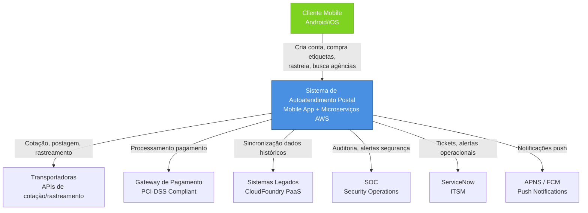
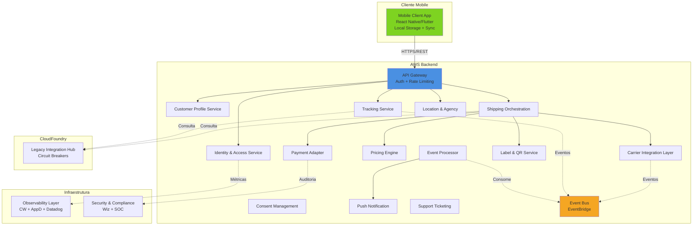
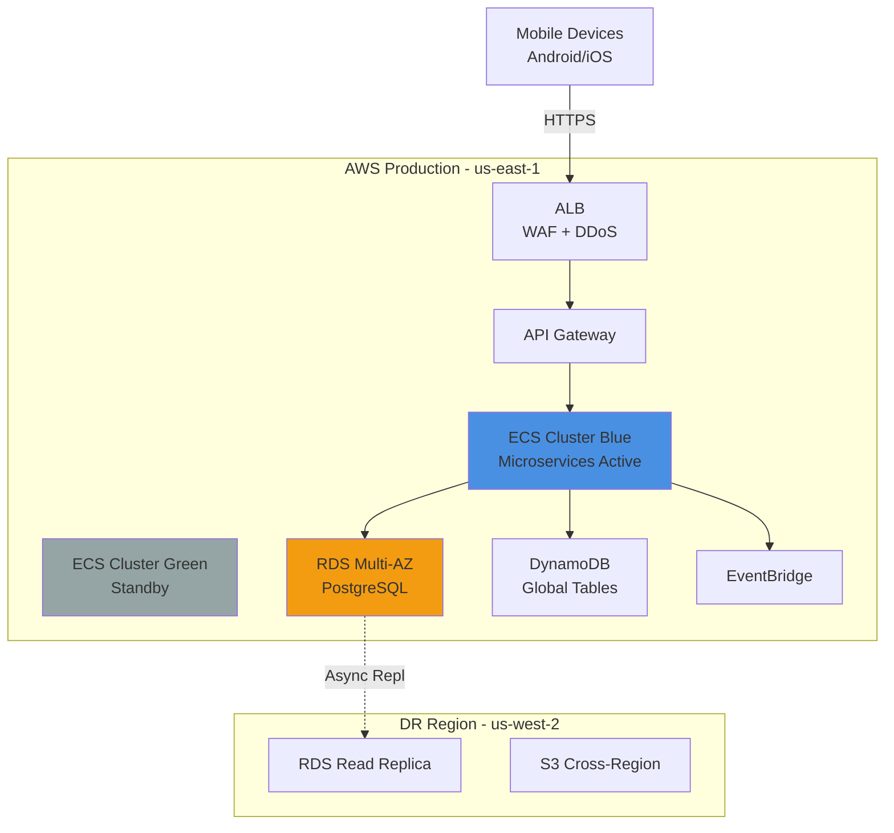
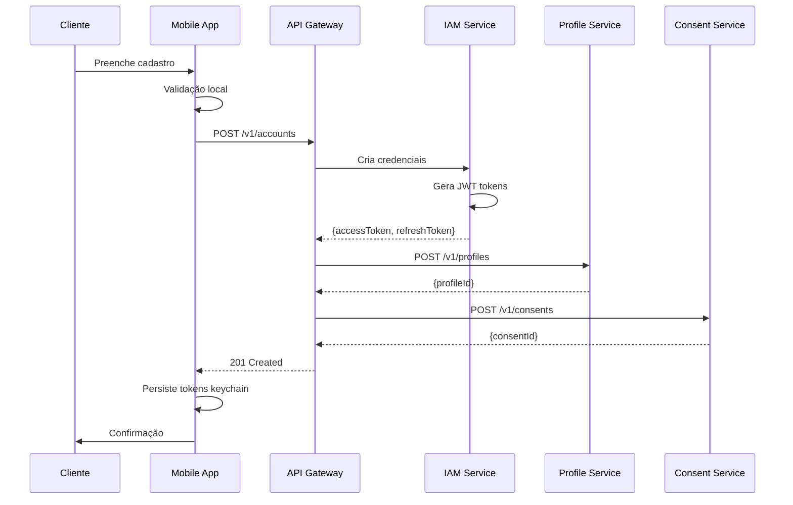
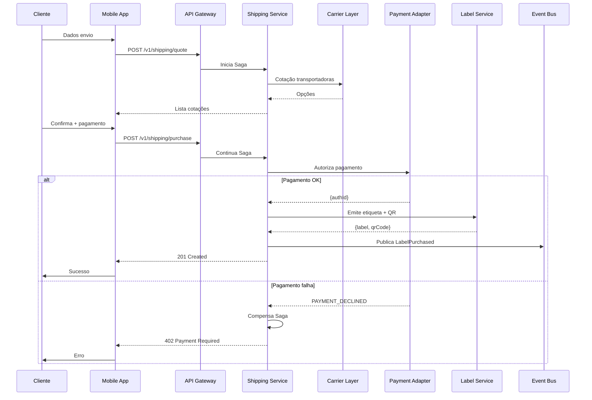
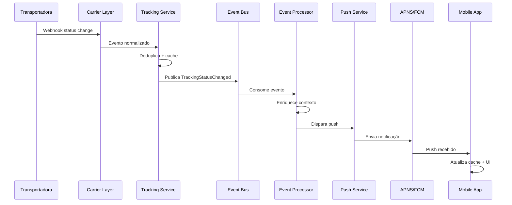
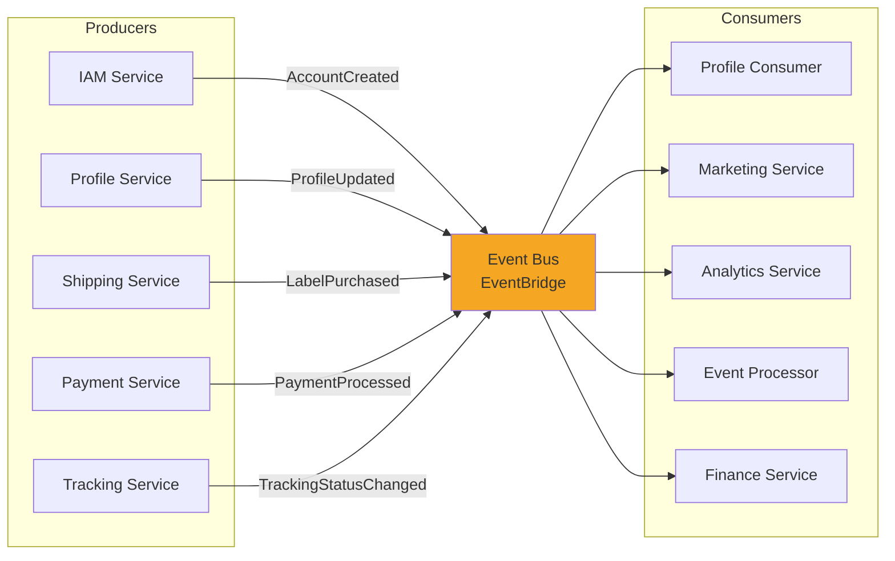

# Documentação Arquitetural – Solução Mobile de Autoatendimento Postal

## Sumário

1. [Visão Geral da Arquitetura](#1-visão-geral-da-arquitetura)
2. [Diagramas C4](#2-diagramas-c4)
3. [Diagramas de Comportamento](#3-diagramas-de-comportamento)
4. [Decisões Arquiteturais (ADRs)](#4-decisões-arquiteturais-adrs)
5. [Requisitos Não Funcionais Derivados](#5-requisitos-não-funcionais-derivados)
6. [Análise Técnica e Decisão de Stack](#6-análise-técnica-e-decisão-de-stack)
7. [Categorias Tecnológicas e Recomendações](#7-categorias-tecnológicas-e-recomendações)
8. [Roadmap de Evolução Arquitetural](#8-roadmap-de-evolução-arquitetural)
9. [Conformidade e Governança](#9-conformidade-e-governança)
10. [Anexos](#anexos)

---

## 1. Visão Geral da Arquitetura

### 1.1. Resumo Executivo

A solução proposta é uma plataforma mobile nativa (Android e iOS) que moderniza a experiência de autoatendimento postal, permitindo que clientes realizem operações críticas de forma autônoma, resiliente e segura. A arquitetura foi projetada para operar em modo **offline-first**, garantindo funcionalidade básica mesmo em cenários de conectividade intermitente ou ausente, sincronizando automaticamente quando a conectividade é restabelecida.

O backend é estruturado como arquitetura de **microsserviços hospedada na AWS**, enquanto integrações com sistemas legados são mediadas por uma camada de abstração hospedada em **CloudFoundry PaaS**. A observabilidade end-to-end, segurança em profundidade e conformidade regulatória (LGPD, GDPR, PCI-DSS) são transversais a todos os incrementos.

**Capacidades Principais:**
- Criação de conta e gestão de perfil (INC01)
- Compra de etiquetas com QR Code (INC02)
- Rastreamento near-real-time (INC03)
- Localização de agências e suporte (INC04)

### 1.2. Drivers Arquiteturais

| Driver | Descrição | Impacto Arquitetural |
|--------|-----------|----------------------|
| **Offline-First Mandatório** | Funcionamento básico sem conectividade | Local Storage Layer, Synchronization Engine, autenticação JWT local, cache estratégico |
| **Segurança Multi-Regulatória** | LGPD, GDPR, PCI-DSS | Isolamento Payment Adapter, criptografia end-to-end, auditoria SOC, gestão de consentimentos |
| **Integrações Heterogêneas** | Múltiplas transportadoras + legados | Carrier Integration Layer (Adapter), Legacy Integration Hub (Circuit Breaker) |
| **Near-Real-Time Tracking** | Rastreamento com baixa latência | Event Stream Processor, Push Notifications, arquitetura híbrida (webhooks + polling) |
| **Escalabilidade Granular** | Capacidade de escalar componentes independentemente | Microserviços em AWS ECS, decomposição funcional, API Gateway |
| **Disponibilidade 99.9%** | Tolerância a falhas e DR | Replicação cross-region, circuit breakers, fallbacks, DR automatizado |
| **Observabilidade End-to-End** | Detecção proativa de problemas | CloudWatch + AppDynamics + Datadog, distributed tracing, integração SOC/ServiceNow |

### 1.3. Restrições Organizacionais Mandatórias

**Infraestrutura:**
- AWS como cloud provider para microserviços
- CloudFoundry PaaS para mediação com sistemas legados
- GitHub Actions para CI/CD
- AWS CodeArtifact para gestão de dependências

**Observabilidade e Segurança:**
- CloudWatch (infraestrutura AWS)
- AppDynamics (APM)
- Datadog (métricas de negócio)
- Wiz (análise de segurança)
- Integração obrigatória com SOC e ServiceNow

**Conformidade:**
- LGPD (Brasil), GDPR (Europa), PCI-DSS (pagamentos)
- Auditoria anual PCI-DSS via QSA externo
- Documentação de HLD/LLD conforme padrões corporativos

### 1.4. Estilo Arquitetural

A arquitetura adota **estilo híbrido**:
- **Microserviços** no backend (AWS ECS Fargate)
- **Event-Driven Architecture** para rastreamento e notificações
- **Offline-First** no cliente mobile
- **API Gateway Pattern** como ponto de entrada unificado
- **Adapter Pattern** para integrações externas
- **Saga Pattern** para transações distribuídas

---

## 2. Diagramas C4

### 2.1. C4 – Contexto

O sistema de autoatendimento postal interage com clientes móveis e múltiplos sistemas externos para prover funcionalidades completas de postagem e rastreamento.



---

### 2.2. C4 – Containers

Decomposição lógica dos principais containers da solução, diferenciando mobile client, microserviços AWS, integração legados e infraestrutura transversal.



**Legenda:**
- Linhas sólidas: Comunicação síncrona (HTTP/REST)
- Linhas tracejadas: Comunicação assíncrona (eventos, telemetria)

---

### 2.3. C4 – Componentes Principais

#### Mobile Client Application

| Componente | Responsabilidade | Incrementos |
|------------|------------------|-------------|
| UI Layer | Renderização, navegação, acessibilidade WCAG 2.1 | INC01-04 |
| State Management | Estado global/local (Redux/MobX) | INC01-04 |
| Local Storage Adapter | SQLite/Realm + criptografia | INC01-04 |
| Synchronization Controller | Filas de sync, resolução conflitos | INC01-04 |
| Network Service | HTTP, detecção conectividade | INC01-04 |
| Authentication Module | JWT, keychain/keystore | INC01, 04 |
| QR Code Renderer | Geração visual QR Codes | INC02 |
| Geolocation Service | GPS, permissões | INC04 |
| Push Notification Handler | APNS/FCM | INC03 |

#### Shipping Orchestration Service

| Componente | Responsabilidade | Padrões |
|------------|------------------|---------|
| Saga Orchestrator | Coordenação transação distribuída | Saga Pattern |
| Request Validator | Validação business rules | Validator |
| Carrier Selector | Seleção transportadora | Strategy |
| Payment Coordinator | Interface payment gateway | Facade |
| Label Issuance Manager | Emissão etiqueta + QR Code | Coordinator |
| Event Publisher | Publicação eventos domínio | Event Sourcing |

---

### 2.4. C4 – Deployment



**Estratégia:** Blue/Green deployment com switch via ALB target groups. RTO: 1h, RPO: 15min.

---

## 3. Diagramas de Comportamento

### 3.1. Diagramas de Sequência

#### INC01: Criação de Conta e Onboarding



---

#### INC02: Compra de Etiqueta (Saga Pattern)



---

#### INC03: Rastreamento com Push Notification



---

### 3.2. Diagrama de Eventos



**Garantias:** At-least-once delivery, idempotency em consumers, DLQ para falhas.

---

## 4. Decisões Arquiteturais (ADRs)

### ADR-001: Arquitetura Offline-First com Consistência Eventual

**Status:** Aceita

**Contexto:**  
Operação offline mandatória em todos os incrementos. Usuários em regiões com conectividade intermitente. Funcionalidades críticas (autenticação, etiquetas, rastreamento) devem funcionar sem rede.

**Restrições Organizacionais:** Nenhuma (escolha técnica).

**Decisão:**  
- Local Storage Layer (SQLite/Realm) com criptografia
- Synchronization Engine baseado em filas
- Consistência eventual, last-write-wins

**Natureza:** Técnica

**Alternativas:**

| Opção | Trade-offs | Adequação |
|-------|------------|-----------|
| Online-only | Simples, mas bloqueia offline | Baixa |
| Offline-first com fila | Complexidade moderada, resiliência | **Alta** |
| Event Sourcing local | Rastreabilidade, overhead alto | Média |

**Consequências:**

*Positivas:*
- Resiliência a falhas de rede
- UX superior (sem bloqueios)
- Cache local reduz carga backend

*Negativas:*
- Complexidade sincronização
- Migrações de schema complexas
- Janelas de inconsistência

**Incrementos:** INC01-04 (foundational)

---

### ADR-002: Microserviços AWS com Decomposição Funcional

**Status:** Aceita

**Contexto:**  
Escalabilidade independente, deployment sem downtime, isolamento de falhas. Expertise corporativa em AWS.

**Restrições Organizacionais:**  
- **AWS mandatório** para microserviços
- **GitHub Actions** para CI/CD
- **CloudWatch, AppDynamics** para observabilidade

**Decisão:**  
Microserviços em AWS ECS Fargate, datastores dedicados (RDS/DynamoDB), deployment independente via CI/CD.

**Natureza:** Híbrida (AWS=organizacional, arquitetura=técnica)

**Alternativas:**

| Opção | Trade-offs | Adequação |
|-------|------------|-----------|
| Monolito modular | Simples, deployment acoplado | Baixa |
| Microserviços ECS Fargate | Serverless containers, integração AWS | **Alta** |
| Kubernetes (EKS) | Controle, overhead operacional | Média |

**Consequências:**

*Positivas:*
- Escalabilidade granular
- Deployment independente
- Isolamento de falhas
- Integração nativa AWS

*Negativas:*
- Complexidade operacional
- Overhead comunicação
- Transações distribuídas (Saga)

**Incrementos:** INC01-04 (foundational)

**Conformidade:** Stack AWS mandatório

**Trade-offs aceitos:** Conformidade AWS vs. portabilidade multi-cloud

---

### ADR-003: Carrier Integration Layer com Adapter Pattern

**Status:** Aceita

**Contexto:**  
Múltiplas transportadoras com APIs heterogêneas, SLAs variáveis, mudanças frequentes.

**Decisão:**  
Adapter Pattern para normalização, circuit breakers, cache de cotações (TTL 15min), fallbacks.

**Natureza:** Técnica

**Consequências:**

*Positivas:*
- Isolamento falhas transportadoras
- Facilidade adicionar provedores
- Cache reduz latência/custo

*Negativas:*
- Overhead transformação (~50-100ms)
- Manutenção múltiplos adapters
- Divergência preços (cache)

**Incrementos:** INC02 (cotação), INC03 (rastreamento)

---

### ADR-004: Payment Adapter com Isolamento PCI-DSS

**Status:** Aceita

**Contexto:**  
Conformidade PCI-DSS obrigatória. Certificação Nível 1 custosa (~$200k/ano).

**Restrições Organizacionais:** PCI-DSS mandatório, auditoria anual QSA.

**Decisão:**  
Payment Gateway Adapter dedicado, tokenização externa, nunca armazenar PAN/CVV, scope reduzido (SAQ A-EP).

**Natureza:** Híbrida (PCI=organizacional, isolamento=técnica)

**Alternativas:**

| Opção | Trade-offs | Adequação |
|-------|------------|-----------|
| Processamento interno | Controle, custo $200k/ano | Baixa |
| Gateway externo + tokenização | Scope mínimo, MDR 2.5-3.5% | **Alta** |
| Iframe checkout | Scope zero, UX fragmentada | Média |

**Consequências:**

*Positivas:*
- Scope PCI-DSS mínimo (SAQ A-EP)
- Segurança delegada a especialista
- Conformidade facilitada

*Negativas:*
- Dependência crítica gateway
- Custo MDR por transação
- Limitações customização UX

**Incrementos:** INC02 (bloqueador)

**Conformidade:** PCI-DSS SAQ A-EP

---

### ADR-005: Rastreamento Híbrido (Webhooks + Polling)

**Status:** Aceita

**Contexto:**  
Near-real-time tracking, SLAs heterogêneos de transportadoras, custo de polling.

**Decisão:**  
Webhooks quando disponíveis, polling inteligente (backoff) para demais, cache (TTL 5min), deduplicação.

**Natureza:** Técnica

**Consequências:**

*Positivas:*
- Latência <30s (webhooks)
- Cobertura universal
- Cache economiza ~70% chamadas

*Negativas:*
- Complexidade orquestração
- Custo infra eventos
- Polling ainda ~2-5min latência

**Incrementos:** INC03 (crítico)

---

### ADR-006: JWT com Refresh Tokens Longa Duração

**Status:** Aceita

**Contexto:**  
Autenticação offline, tokens curtos exigem renovação frequente, tokens longos aumentam janela de risco.

**Decisão:**  
Access tokens (15min) + refresh tokens (30d), validação local RSA, renovação oportunística, keychain/keystore.

**Natureza:** Técnica

**Consequências:**

*Positivas:*
- Autenticação offline
- Renovação transparente
- Armazenamento seguro nativo

*Negativas:*
- Janela risco 15min (revogação eventual)
- Gestão refresh tokens
- Tokens expirados offline bloqueiam

**Incrementos:** INC01 (foundational), INC04

---

### ADR-007: QR Code Assinado Criptograficamente

**Status:** Aceita

**Contexto:**  
QR Code offline anti-fraude, validação no balcão.

**Decisão:**  
Assinatura RSA, time-bound (48h), one-time-use, pré-geração backend, blacklist Redis.

**Natureza:** Técnica

**Consequências:**

*Positivas:*
- Prevenção fraude (RSA)
- Disponibilidade offline
- Rastreabilidade postagens

*Negativas:*
- Infraestrutura validação agências
- Sincronização blacklist
- Gestão chaves RSA

**Incrementos:** INC02 (crítico)

---

### ADR-008: Legacy Hub com Circuit Breakers

**Status:** Aceita

**Contexto:**  
Legados via CloudFoundry, latências 500ms-2s, timeouts 5-10%.

**Restrições Organizacionais:** CloudFoundry mandatório.

**Decisão:**  
Circuit breakers, timeouts (2s read/5s write), cache (TTL 30min), retry (3x backoff), fallbacks.

**Natureza:** Híbrida (CF=organizacional, patterns=técnica)

**Consequências:**

*Positivas:*
- Isolamento falhas legados
- Cache reduz latência
- Degradação graciosa

*Negativas:*
- Gestão cache (invalidação)
- Fallbacks = dados desatualizados
- Timeouts agressivos = falsos positivos

**Incrementos:** INC02 (postagem), INC03 (rastreamento)

**Conformidade:** CloudFoundry mandatório

---

### ADR-009: Observabilidade CloudWatch + AppDynamics + Datadog

**Status:** Aceita

**Contexto:**  
Observabilidade end-to-end, integração SOC/ServiceNow.

**Restrições Organizacionais:**  
- **CloudWatch** (infra AWS) - mandatório
- **AppDynamics** (APM) - mandatório
- **Datadog** (negócio) - recomendado
- **Wiz** (segurança)
- **Integração SOC + ServiceNow** - obrigatória

**Decisão:**  
CloudWatch (logs/infra), AppDynamics (tracing), Datadog (métricas negócio), Wiz (vulnerabilidades), integração SIEM/ServiceNow.

**Natureza:** Híbrida (stack=organizacional, correlação=técnica)

**Alternativas:**

| Opção | Trade-offs | Adequação |
|-------|------------|-----------|
| Apenas CloudWatch | Custo baixo, APM limitado | Média |
| Datadog unificado | UX superior, não é stack corporativo | Baixa |
| CW + AppD + Datadog | Integração processos, custo 3 ferramentas | **Alta** |

**Consequências:**

*Positivas:*
- Distributed tracing completo
- Integração processos existentes
- Métricas negócio real-time
- Compliance SOC

*Negativas:*
- Custo 3 plataformas (~$70k/ano)
- Complexidade correlação (tags)
- Volume dados (~500GB/dia)

**Incrementos:** INC01-04 (transversal)

**Conformidade:** Stack mandatório, integração SOC

**Trade-offs aceitos:** Conformidade vs. ferramenta unificada

---

### ADR-010: CI/CD GitHub Actions + AWS CodeArtifact

**Status:** Aceita

**Contexto:**  
CI/CD automatizado, rastreabilidade, rollback rápido.

**Restrições Organizacionais:**  
- **GitHub Actions** - mandatório
- **AWS CodeArtifact** - mandatório

**Decisão:**  
Pipeline end-to-end, testes multicamada (unit/integration/E2E/PEN), gates qualidade (80% coverage), blue/green, rollback automático.

**Natureza:** Híbrida (stack=organizacional, pipeline=técnica)

**Consequências:**

*Positivas:*
- Deployment frequente (5x/semana)
- Lead time 2h (vs. 2d manual)
- Rollback automático
- Rastreabilidade GitHub

*Negativas:*
- Setup inicial ~4 semanas
- Orquestração multi-service
- Flaky tests
- Custo staging ~$5k/mês

**Incrementos:** INC01-04 (foundational)

**Conformidade:** GitHub + CodeArtifact mandatórios

---

## 5. Requisitos Não Funcionais Derivados

### 5.1. Performance e Escalabilidade

| Requisito | Descrição | Target | Prioridade |
|-----------|-----------|--------|------------|
| Throughput API | Requisições/segundo por endpoint | 1000 req/s (INC02 compra), 5000 req/s (INC03 rastreamento) | Alta |
| Latência p95 | Percentil 95 de latência end-to-end | <500ms (síncronas), <30s (notificações) | Alta |
| Escalabilidade Horizontal | Auto-scaling baseado em CPU/memória | ECS tasks: 2-50 por serviço | Alta |
| Cache Hit Rate | Taxa de acerto de cache | >70% (cotações), >90% (agências) | Média |

### 5.2. Disponibilidade e Resiliência

| Requisito | Descrição | Target | Prioridade |
|-----------|-----------|--------|------------|
| SLA Disponibilidade | Uptime anual | 99.9% (43.8min downtime/mês) | Alta |
| RTO (Recovery Time Objective) | Tempo máximo recuperação | 1 hora (cross-region failover) | Alta |
| RPO (Recovery Point Objective) | Perda máxima de dados | 15 minutos (replicação async) | Alta |
| Circuit Breaker Threshold | Abertura de circuit breaker | 50% falhas em janela 10s | Alta |
| Fallback Coverage | Cobertura de fallbacks | 100% integrações externas críticas | Alta |

**DR Strategy:**
- Replicação RDS cross-region (us-east-1 → us-west-2)
- S3 cross-region replication (async)
- DynamoDB Global Tables
- Game Day trimestral para validação

### 5.3. Segurança e Conformidade

| Requisito | Descrição | Implementação | Restrição Organizacional |
|-----------|-----------|---------------|--------------------------|
| Autenticação | Mecanismo de autenticação | JWT (RS256), refresh tokens 30d | Não |
| Criptografia Trânsito | TLS/SSL | TLS 1.3, certificados AWS ACM | Não |
| Criptografia Repouso | Dados sensíveis | AES-256 (RDS, S3, keychain/keystore) | Não |
| PCI-DSS | Processamento pagamentos | SAQ A-EP, tokenização externa | **Sim - mandatório** |
| LGPD/GDPR | Dados pessoais | Consent Management, auditoria, direito esquecimento | **Sim - mandatório** |
| Auditoria SOC | Integração Security Operations | Logs segurança → SIEM, alertas ServiceNow | **Sim - mandatório** |
| Pen Testing | Testes de segurança | OWASP ZAP (CI/CD), auditor externo trimestral | **Sim - mandatório** |
| Gestão Segredos | Armazenamento credenciais | AWS Secrets Manager, rotação automática | Não |
| Vulnerabilidades | Scanning contêineres | Wiz (análise contínua), Snyk (deps) | **Sim - Wiz mandatório** |

### 5.4. Observabilidade

| Requisito | Descrição | Implementação | Restrição Organizacional |
|-----------|-----------|---------------|--------------------------|
| Logging Centralizado | Logs estruturados JSON | CloudWatch Logs, retenção 30d | **Sim - CloudWatch mandatório** |
| APM | Application Performance Monitoring | AppDynamics, distributed tracing | **Sim - AppDynamics mandatório** |
| Métricas Negócio | KPIs customizados | Datadog dashboards (conversão, tempo compra) | **Sim - Datadog recomendado** |
| Alertas | Notificações proativas | CloudWatch Alarms → ServiceNow | **Sim - ServiceNow mandatório** |
| SLIs/SLOs | Service Level Indicators/Objectives | Latência p95 <500ms, error rate <1% | Não |
| Distributed Tracing | Rastreamento end-to-end | AppDynamics, trace-id propagation | **Sim - AppDynamics mandatório** |

### 5.5. Manutenibilidade e Operabilidade

| Requisito | Descrição | Implementação | Restrição Organizacional |
|-----------|-----------|---------------|--------------------------|
| Versionamento APIs | Backward compatibility | Semantic versioning, deprecation notices 6 meses | Não |
| CI/CD | Pipeline automatizado | GitHub Actions, testes multicamada, blue/green | **Sim - GitHub Actions mandatório** |
| Gestão Dependências | Artifact repository | AWS CodeArtifact, caching npm/Maven/PyPI | **Sim - CodeArtifact mandatório** |
| IaC | Infrastructure as Code | Terraform (AWS resources), versionamento Git | Não |
| Testes Automatizados | Cobertura de testes | Unit (Jest/JUnit), Integration (Testcontainers), E2E (Detox/Cypress) | Não |
| Cobertura de Código | Target mínimo | >80% (gate de qualidade CI/CD) | Não |
| Rollback | Reversão de deploys | Blue/green switch, max 5min | Não |
| Feature Flags | Entrega paralela | LaunchDarkly ou similar (considerar releases futuras) | Não |

### 5.6. Governança e Transição

#### Estrutura de Governança

| Fórum | Frequência | Participantes | Decisões |
|-------|------------|---------------|----------|
| SteerCo | Mensal | Sponsors, Tech Leads, Arquitetos | Aprovações estratégicas, budget, roadmap |
| Design Forum | Quinzenal | Arquitetos, Developers, Security | Decisões técnicas (ADRs), padrões arquiteturais |
| Release Board | Pré-release | Release Manager, QA Lead, Security, Ops | Aprovação go/no-go produção |

#### Documentação Corporativa

| Documento | Propósito | Responsável | Entrega |
|-----------|-----------|-------------|---------|
| HLD (High Level Design) | Visão arquitetural macro | Arquiteto Soluções | INC01 (antes dev) |
| LLD (Low Level Design) | Especificações detalhadas por serviço | Tech Leads | Por incremento |
| API Specifications | Contratos OpenAPI 3.0 | Backend Developers | Por incremento |
| DR Plan | Procedimentos Disaster Recovery | Ops Lead + Arquiteto | INC01 |
| Runbooks | Procedimentos operacionais | Ops Team | Transição BAU |

#### Transição para BAU

**Modelo RACI:**

| Atividade | Responsible | Accountable | Consulted | Informed |
|-----------|-------------|-------------|-----------|----------|
| Monitoramento 24/7 | Ops L1 | Ops Manager | DevOps Team | Tech Lead |
| Troubleshooting P1/P2 | Ops L2 | Tech Lead | Arquiteto | Ops Manager |
| Mudanças arquiteturais | Arquiteto | Tech Lead | Security, Ops | SteerCo |
| Releases produção | DevOps Team | Release Manager | QA, Security | Ops Manager |
| Game Day (DR) | Ops L2/L3 | Ops Manager | Arquiteto, Security | Tech Lead |

**Treinamento:**
- Ops L1/L2: Runbooks, dashboards, procedimentos escalação (2 semanas)
- Ops L3: Arquitetura detalhada, troubleshooting avançado (1 mês)
- Usuários: Tutoriais in-app, FAQs, vídeos (contínuo)

**Game Day Scenarios:**
- DR cross-region failover (trimestral)
- Falha de payment gateway (semestral)
- Circuit breaker em produção (anual)
- Ataque DDoS simulado (anual)

**Handover:**
- Semana 1-2: Shadowing (time dev acompanha ops)
- Semana 3-4: Reverse shadowing (ops acompanha dev)
- Semana 5+: Ops autônomo, dev on-call reduzido

---

## 6. Análise Técnica e Decisão de Stack

### 6.1. Derivação de Requisitos Técnicos

| Requisito Técnico | Origem (Driver/INC) | Impacto Arquitetural | Prioridade |
|------------------|---------------------|----------------------|------------|
| Armazenamento Local Offline | Offline-first (todos INC) | Local Storage Layer, SQLite/Realm | Alta |
| Sincronização Bidirecional | Offline-first (todos INC) | Synchronization Engine, filas | Alta |
| Comunicação Síncrona | Compra etiqueta, autenticação | REST APIs, API Gateway | Alta |
| Event Streaming | Rastreamento (INC03) | Event Bus, Event Processor | Alta |
| Push Notifications | Notificações proativas (INC03) | Push Service, APNS/FCM | Alta |
| Processamento Pagamentos | Compra etiqueta (INC02) | Payment Adapter, tokenização | Alta |
| Circuit Breakers | Integrações externas (INC02/03) | Carrier Layer, Legacy Hub | Alta |
| Criptografia End-to-End | Segurança (todos INC) | TLS 1.3, AES-256, keychain | Alta |
| Geolocalização | Busca agências (INC04) | GPS, geospatial index | Média |
| Distributed Tracing | Observabilidade (todos INC) | AppDynamics, trace propagation | Alta |

### 6.2. Mapa de Categorias Tecnológicas

| Categoria | Responsabilidade | Componentes Relacionados | Incrementos |
|-----------|------------------|--------------------------|-------------|
| **Mobile Frontend** | UI/UX nativo, armazenamento local, sincronização | Mobile Client App | INC01-04 |
| **API Gateway** | Roteamento, autenticação, rate limiting | API Gateway | INC01-04 |
| **Backend Microservices** | Lógica de negócio, persistência | IAM, Profile, Shipping, Tracking, etc. | INC01-04 |
| **Event Streaming** | Processamento assíncrono eventos | Event Bus, Event Processor | INC03 |
| **Database (Relational)** | Dados transacionais estruturados | Profile, Shipping, Tracking | INC01-04 |
| **Database (NoSQL)** | Cache, sessões, dados não-estruturados | Cache Layer | INC01-04 |
| **Message Broker** | Filas, pub/sub | Event Bus | INC03 |
| **Push Notifications** | Notificações push mobile | Push Service | INC03 |
| **Payment Gateway** | Processamento pagamentos | Payment Adapter | INC02 |
| **CI/CD** | Automação build/test/deploy | Pipeline | INC01-04 |
| **Observabilidade (Infra)** | Logs, métricas AWS | CloudWatch | INC01-04 |
| **Observabilidade (APM)** | Distributed tracing | AppDynamics | INC01-04 |
| **Observabilidade (Negócio)** | Métricas customizadas | Datadog | INC01-04 |
| **Security Scanning** | Vulnerabilidades | Wiz | INC01-04 |
| **Secret Management** | Gestão credenciais | Secrets Manager | INC01-04 |
| **ITSM** | Gestão tickets, alertas | ServiceNow | INC01-04 |

### 6.3. Alternativas de Stack por Categoria

#### Mobile Frontend

| Alternativa | Maturidade | Aderência Drivers | Restrição Organizacional |
|-------------|------------|-------------------|--------------------------|
| React Native | Consolidado | Alta (offline, multiplataforma) | Não |
| Flutter | Estável | Alta (performance, multiplataforma) | Não |
| Nativo (Kotlin+Swift) | Consolidado | Média (duplicação código) | Não |

**Recomendação:** React Native ou Flutter (escolha técnica, ambas adequadas).

#### API Gateway

| Alternativa | Maturidade | Aderência Drivers | Restrição Organizacional |
|-------------|------------|-------------------|--------------------------|
| AWS API Gateway | Consolidado | Alta (integração AWS nativa) | **Sim - AWS mandatório** |
| Kong | Consolidado | Alta (features avançadas) | Não |
| Apigee | Consolidado | Média (custo elevado) | Não |

**Recomendação:** **AWS API Gateway** (mandatório AWS, integração nativa).

#### Backend Microservices

| Alternativa | Maturidade | Aderência Drivers | Restrição Organizacional |
|-------------|------------|-------------------|--------------------------|
| Node.js (Express) | Consolidado | Alta (async, ecosystem) | Não |
| Java (Spring Boot) | Consolidado | Alta (enterprise, JVM) | Não |
| Python (FastAPI) | Estável | Média (performance moderada) | Não |
| Go | Estável | Alta (performance, concorrência) | Não |

**Recomendação:** Node.js ou Java (escolha por expertise time, ambos adequados).

#### Event Streaming

| Alternativa | Maturidade | Aderência Drivers | Restrição Organizacional |
|-------------|------------|-------------------|--------------------------|
| Amazon EventBridge | Consolidado | Alta (serverless, integração AWS) | **Sim - AWS recomendado** |
| Apache Kafka | Consolidado | Alta (throughput, durabilidade) | Não |
| Amazon MSK (Kafka gerenciado) | Estável | Alta (Kafka sem overhead) | **Sim - AWS recomendado** |

**Recomendação:** **EventBridge** para eventos baixo volume, **MSK** se escalar para milhões eventos/dia.

#### Database Relacional

| Alternativa | Maturidade | Aderência Drivers | Restrição Organizacional |
|-------------|------------|-------------------|--------------------------|
| Amazon RDS PostgreSQL | Consolidado | Alta (gerenciado, ACID) | **Sim - AWS recomendado** |
| Amazon Aurora PostgreSQL | Consolidado | Alta (performance, HA) | **Sim - AWS recomendado** |
| MySQL | Consolidado | Média (menos features) | Não |

**Recomendação:** **RDS PostgreSQL** (custo-benefício) ou **Aurora** (workloads críticos).

#### Database NoSQL

| Alternativa | Maturidade | Aderência Drivers | Restrição Organizacional |
|-------------|------------|-------------------|--------------------------|
| Amazon DynamoDB | Consolidado | Alta (serverless, baixa latência) | **Sim - AWS recomendado** |
| Redis (ElastiCache) | Consolidado | Alta (cache, sessões) | **Sim - AWS recomendado** |
| MongoDB | Consolidado | Média (overhead gerenciamento) | Não |

**Recomendação:** **DynamoDB** (sessões, cache estruturado), **ElastiCache Redis** (cache hot data).

#### CI/CD

| Alternativa | Maturidade | Aderência Drivers | Restrição Organizacional |
|-------------|------------|-------------------|--------------------------|
| GitHub Actions | Consolidado | Alta (integração GitHub) | **Sim - mandatório** |
| GitLab CI/CD | Consolidado | Alta (alternativa robusta) | Não |
| AWS CodePipeline | Consolidado | Média (limitações) | Não |

**Recomendação:** **GitHub Actions** (mandatório).

#### Observabilidade

| Alternativa | Categoria | Aderência Drivers | Restrição Organizacional |
|-------------|-----------|-------------------|--------------------------|
| CloudWatch | Infra AWS | Alta (nativo AWS) | **Sim - mandatório** |
| AppDynamics | APM | Alta (tracing, APM) | **Sim - mandatório** |
| Datadog | Negócio | Alta (dashboards, correlação) | **Sim - recomendado** |
| Wiz | Security | Alta (vulnerabilidades) | **Sim - mandatório** |

**Recomendação:** Stack mandatório (CloudWatch + AppDynamics + Datadog + Wiz).

---

### 6.4. Análise de Trade-offs (Exemplos Principais)

#### React Native vs Flutter

**React Native:**
- **Fortes:** Ecossistema maduro (npm), grande comunidade, hot reload
- **Limitações:** Performance < nativo, bridge JavaScript pode ter overhead
- **Adequação:** Alta para maioria casos de uso (UI complexa ok, games não)

**Flutter:**
- **Fortes:** Performance próxima nativo, widgets customizáveis, hot reload
- **Limitações:** Ecossistema menor que RN, Dart menos popular
- **Adequação:** Alta para UIs complexas e animações

**Recomendação:** Ambos viáveis, escolha por expertise time.

---

#### EventBridge vs Kafka (MSK)

**EventBridge:**
- **Fortes:** Serverless, integração AWS nativa, custo baixo baixo volume
- **Limitações:** Throughput limitado (~10k eventos/s), latência ~1-2s
- **Adequação:** Alta para INC03 (estimado <5k eventos/s)

**Kafka (MSK):**
- **Fortes:** Throughput massivo (>1M eventos/s), latência <10ms, durabilidade
- **Limitações:** Overhead operacional, custo fixo cluster
- **Adequação:** Overkill para INC03, considerar se escalar 10x+

**Recomendação:** Iniciar com EventBridge, migrar para MSK se throughput exceder 10k eventos/s.

---

### 6.5. Recomendações Consolidadas

| Categoria | Stack Recomendada | Justificativa | Observações Futuras |
|-----------|------------------|---------------|---------------------|
| Mobile Frontend | React Native ou Flutter | Multiplataforma, offline-first libraries | Avaliar performance após INC02 |
| API Gateway | AWS API Gateway | Mandatório AWS, integração nativa | - |
| Backend | Node.js (Express) ou Java (Spring Boot) | Expertise time, ecossistema maduro | - |
| Event Bus | Amazon EventBridge | Serverless, custo-benefício INC03 | Migrar MSK se >10k eventos/s |
| DB Relacional | RDS PostgreSQL Multi-AZ | Gerenciado, ACID, HA | Aurora se criticidade aumentar |
| DB NoSQL | DynamoDB + ElastiCache Redis | DynamoDB (sessões), Redis (cache) | - |
| Push Notifications | SNS + APNS/FCM | Integração AWS, providers nativos | - |
| CI/CD | GitHub Actions | Mandatório | - |
| Artifact Repo | AWS CodeArtifact | Mandatório | - |
| Observability | CloudWatch + AppDynamics + Datadog + Wiz | Stack mandatório | Otimizar custos após 6 meses |
| Secret Management | AWS Secrets Manager | Nativo AWS, rotação automática | - |
| ITSM | ServiceNow | Mandatório | - |

---

## 7. Categorias Tecnológicas e Recomendações Detalhadas

### 7.1. Cloud Provider

**Propósito:** Hospedagem de microserviços, datastores, infraestrutura.

**Restrições Organizacionais:**
- **AWS mandatório** como cloud provider principal

**Requisitos Técnicos:**
- Compute serverless (containers)
- Managed databases (relacional + NoSQL)
- Event streaming
- Object storage
- Cross-region replication para DR

**Recomendação:**
- **AWS** conforme mandatório
- **Serviços específicos:**
  - **ECS Fargate:** Compute serverless para microserviços
  - **RDS PostgreSQL Multi-AZ:** Dados transacionais
  - **DynamoDB Global Tables:** Cache, sessões (replicação cross-region)
  - **S3 Cross-Region Replication:** Object storage (etiquetas, QR Codes)
  - **EventBridge:** Event bus
  - **API Gateway:** Entrada unificada
  - **ElastiCache Redis:** Hot cache

**Integração Stack Corporativo:**
- CloudWatch (logs/métricas infra nativo)
- CodeArtifact (registry privado AWS)
- Secrets Manager (gestão credenciais AWS)

---

### 7.2. PaaS para Legados

**Propósito:** Mediação com sistemas legados corporativos.

**Restrições Organizacionais:**
- **CloudFoundry PaaS mandatório** para integração legados

**Recomendação:**
- **CloudFoundry** conforme mandatório
- **Padrões aplicados:**
  - Circuit breakers (Hystrix/Resilience4j)
  - Cache (Redis)
  - Retry com backoff
  - Fallbacks

**Observações:** Isolar complexidade legados via Legacy Integration Hub, facilitando migração futura.

---

### 7.3. CI/CD e Gestão de Dependências

**Propósito:** Automação build/test/deploy, gestão artefatos.

**Restrições Organizacionais:**
- **GitHub Actions** mandatório para CI/CD
- **AWS CodeArtifact** mandatório para gestão dependências

**Recomendação:**
- **GitHub Actions** para workflows
- **AWS CodeArtifact** para caching npm/Maven/PyPI
- **Padrões aplicados:**
  - Testes multicamada (unit/integration/E2E)
  - Gates qualidade (coverage >80%, SAST, DAST)
  - Blue/green deployment
  - Rollback automático (health checks)

---

### 7.4. Observabilidade

**Propósito:** Logs, métricas, tracing, alertas.

**Restrições Organizacionais:**
- **CloudWatch** (infra AWS) - mandatório
- **AppDynamics** (APM) - mandatório
- **Datadog** (métricas negócio) - recomendado
- **Wiz** (segurança) - mandatório

**Recomendação:**
- **CloudWatch:** Logs estruturados, métricas infra, alarmes
- **AppDynamics:** Distributed tracing, APM transações críticas
- **Datadog:** Dashboards negócio (conversão, tempo médio compra)
- **Wiz:** Scanning vulnerabilidades containers

**Integração:**
- Tags padronizadas (userId, traceId, shippingId) para correlação
- Alertas → ServiceNow
- Eventos segurança → SOC (SIEM)

**Custo estimado:** ~$70k/ano (AppDynamics $40k, Datadog $30k)

---

## 8. Roadmap de Evolução Arquitetural

### 8.1. Limitações Atuais

| Limitação | Impacto | Mitigação Atual | Evolução Futura |
|-----------|---------|-----------------|-----------------|
| EventBridge throughput limitado | Bottleneck se >10k eventos/s | Throttling, backpressure | Migrar para MSK (Kafka) |
| Cache invalidação manual | Divergências dados legados | TTLs curtos (30min) | Event-driven cache invalidation |
| Sincronização offline last-write-wins | Perda de mudanças concorrentes | Versioning básico | CRDT (Conflict-free Replicated Data Types) |
| Monitoramento legados limitado | Visibilidade baixa latências | Logs + métricas básicas | Instrumentação legados via sidecar |
| Feature flags ausentes | Deployment acoplado features | Rollback via blue/green | LaunchDarkly ou similar |

### 8.2. Próximos Passos (Pós-INC04)

**Q1 2026 (Pós-lançamento):**
1. **Otimização Performance:**
   - Profiling AppDynamics para identificar hotspots
   - Otimização queries N+1
   - CDN para assets estáticos (etiquetas PDF)

2. **Expansão Observabilidade:**
   - Dashboards executivos Datadog (KPIs negócio)
   - Alertas preditivos (ML-based)

**Q2 2026:**
3. **Feature Flags:**
   - Implementação LaunchDarkly ou AWS AppConfig
   - Entrega paralela features sem coupling deploy

4. **Cache Event-Driven:**
   - Invalidação via eventos (ProfileUpdated, AgencyDataUpdated)
   - Redução TTLs agressivos

**Q3 2026:**
5. **Evolução Sincronização:**
   - CRDT para resolução conflitos automática
   - Operational Transformation para edições concorrentes

6. **Migração Event Streaming:**
   - POC Kafka (MSK) para rastreamento
   - Benchmarks throughput (target 50k eventos/s)

**Q4 2026:**
7. **Service Mesh:**
   - AWS App Mesh para observabilidade granular
   - mTLS entre microserviços
   - Circuit breaking nativo

8. **Chaos Engineering:**
   - Chaos Monkey (falhas aleatórias produção)
   - Game Days mensais (vs. trimestrais)

### 8.3. Critérios de Sucesso Evolução

| Evolução | Métrica Sucesso | Target |
|-----------|-----------------|--------|
| Kafka (MSK) | Throughput eventos | >50k eventos/s, latência p95 <10ms |
| Feature Flags | Deployment sem downtime | 100% releases via flags |
| CRDT Sync | Conflitos resolvidos | 0 intervenções manuais |
| Service Mesh | Visibilidade | Traces 100% serviços |
| Chaos Engineering | Resiliência | MTTR <15min incidentes P1 |

---

## 9. Conformidade e Governança

### 9.1. Requisitos Regulatórios

#### PCI-DSS (Payment Card Industry)

**Nível:** SAQ A-EP (escopo reduzido)

**Controles Implementados:**
- Tokenização cartões via gateway externo
- Nunca armazenar PAN, CVV, trilha magnética
- TLS 1.3 para transmissão
- Logs auditáveis (CloudWatch, 90d retenção)
- Pen testing trimestral (OWASP ZAP + auditor externo)

**Auditoria:** QSA externo anual, relatório SAQ A-EP

---

#### LGPD (Lei Geral de Proteção de Dados - Brasil)

**Controles Implementados:**
- **Consent Management Service:** Opt-in/opt-out auditável
- **Direito ao Esquecimento:** API DELETE /v1/profiles/{userId} (anonimização)
- **Portabilidade:** API GET /v1/profiles/{userId}/export (JSON)
- **Auditoria:** Logs imutáveis alterações dados pessoais (CloudWatch)
- **Criptografia:** AES-256 repouso, TLS 1.3 trânsito
- **DPO:** Data Protection Officer designado

---

#### GDPR (General Data Protection Regulation - Europa)

**Controles Implementados:**
- Mesmos controles LGPD (superset)
- **Privacy by Design:** Criptografia padrão, minimização coleta
- **Data Residency:** Replicação cross-region respeitando residência (us-east-1 para BR, eu-west-1 para EU)
- **Breach Notification:** Alertas SOC → notificação <72h

---

### 9.2. Estrutura de Governança

#### Fóruns de Decisão

| Fórum | Frequência | Participantes | Outputs |
|-------|------------|---------------|---------|
| **SteerCo** | Mensal | Sponsors, Diretores, Arquiteto Chefe | Aprovação budget, roadmap, pivots estratégicos |
| **Design Forum** | Quinzenal | Arquitetos, Tech Leads, Security Lead | ADRs, padrões técnicos, revisões arquitetura |
| **Release Board** | Pré-release (ad-hoc) | Release Manager, QA Lead, Security, Ops Manager | Go/No-Go produção, aprovação releases |
| **Game Day** | Trimestral | Ops, Arquiteto, Security, DevOps | Validação DR, lessons learned |

#### Rastreabilidade

**Requisitos → Código → Testes → Deploy:**

```
Jira Story (INC02-42) → 
   GitHub PR #123 → 
      Unit Tests (Jest, 85% coverage) → 
         Integration Tests (Testcontainers) → 
            E2E Tests (Detox) → 
               Pen Test (OWASP ZAP) → 
                  Deploy Staging (GitHub Actions) → 
                     Approval (Release Board) → 
                        Deploy Prod (Blue/Green)
```

**Ferramentas:**
- Jira: Backlog, stories, epics
- GitHub: PRs, code reviews, CI/CD triggers
- CodeArtifact: Versionamento artefatos
- CloudWatch: Logs deployment
- ServiceNow: Tickets release, incidents

---

### 9.3. Documentação Corporativa

#### HLD (High Level Design)

**Conteúdo:**
- Visão geral solução
- Diagramas C4 (Contexto, Containers)
- Drivers arquiteturais
- ADRs principais (≥5)
- Requisitos não funcionais

**Responsável:** Arquiteto Soluções

**Entrega:** Antes início desenvolvimento INC01

**Aprovação:** Design Forum

---

#### LLD (Low Level Design)

**Conteúdo:**
- Diagramas C4 Componentes
- Schemas database (DDL)
- Diagramas sequência detalhados
- Especificações algoritmos complexos
- Configurações infraestrutura (Terraform)

**Responsável:** Tech Leads por microserviço

**Entrega:** Por incremento, antes dev

**Aprovação:** Tech Lead + Arquiteto

---

#### DR Plan (Disaster Recovery Plan)

**Conteúdo:**
- Procedimentos failover cross-region
- RTO/RPO por componente
- Checklists validação pós-recovery
- Contatos escalação
- Runbooks automatizados

**Responsável:** Ops Lead + Arquiteto

**Entrega:** INC01 (antes produção)

**Validação:** Game Day trimestral

---

### 9.4. Transição para BAU

#### Modelo RACI Operacional

| Atividade | Responsible | Accountable | Consulted | Informed |
|-----------|-------------|-------------|-----------|----------|
| Monitoramento 24/7 | Ops L1 | Ops Manager | - | Tech Lead |
| Troubleshooting P1/P2 | Ops L2 | Tech Lead | Arquiteto | Ops Manager |
| Troubleshooting P3 | Ops L1 | Ops L2 | - | Tech Lead |
| Releases Produção | DevOps | Release Manager | QA, Security | Ops Manager |
| Mudanças Arquiteturais | Arquiteto | Tech Lead | Security, Ops | SteerCo |
| Game Day (DR) | Ops L2/L3 | Ops Manager | Arquiteto, Security | Tech Lead |
| Patches Segurança | Ops L2 | Security Lead | - | Ops Manager |

#### Treinamento

**Ops L1 (2 semanas):**
- Dashboards CloudWatch/AppDynamics
- Runbooks procedimentos comuns
- Escalação P1/P2 (fluxo ServiceNow)

**Ops L2 (1 mês):**
- Arquitetura detalhada (microsserviços, integrações)
- Troubleshooting avançado (logs, traces)
- Deployment manual (rollback emergencial)

**Ops L3 (2 meses):**
- Decisões técnicas menores
- Tuning performance
- Análise root cause

**Usuários:**
- Tutoriais in-app (onboarding)
- FAQs (Centro de Ajuda)
- Vídeos YouTube (casos de uso)

#### Handover

**Semana 1-2:** Shadowing (Dev acompanha Ops em plantões)

**Semana 3-4:** Reverse Shadowing (Ops lidera, Dev apoia)

**Semana 5+:** Ops autônomo, Dev on-call reduzido (apenas P1 crítico)

---

## Anexos

### A. Glossário

| Termo | Definição |
|-------|-----------|
| **ADR** | Architecture Decision Record - registro formal de decisão arquitetural |
| **APM** | Application Performance Monitoring - monitoramento performance aplicações |
| **BAU** | Business as Usual - operação normal pós-lançamento |
| **CRDT** | Conflict-free Replicated Data Types - estruturas dados resolução automática conflitos |
| **DLQ** | Dead Letter Queue - fila para mensagens falhadas |
| **GDPR** | General Data Protection Regulation - regulação privacidade UE |
| **JWT** | JSON Web Token - padrão tokens autenticação |
| **LGPD** | Lei Geral de Proteção de Dados - regulação privacidade Brasil |
| **MDR** | Merchant Discount Rate - taxa transação pagamento |
| **MTTR** | Mean Time To Repair - tempo médio reparo incidentes |
| **PCI-DSS** | Payment Card Industry Data Security Standard - padrão segurança pagamentos |
| **QSA** | Qualified Security Assessor - auditor certificado PCI-DSS |
| **RACI** | Responsible, Accountable, Consulted, Informed - matriz responsabilidades |
| **RPO** | Recovery Point Objective - perda máxima dados tolerável |
| **RTO** | Recovery Time Objective - tempo máximo recuperação tolerável |
| **SAQ** | Self-Assessment Questionnaire - questionário autoavaliação PCI-DSS |
| **SLA** | Service Level Agreement - acordo nível serviço |
| **SLI** | Service Level Indicator - indicador nível serviço |
| **SLO** | Service Level Objective - objetivo nível serviço |
| **SOC** | Security Operations Center - centro operações segurança |
| **TTL** | Time To Live - tempo vida cache |
| **WCAG** | Web Content Accessibility Guidelines - diretrizes acessibilidade |

---

### B. Referências

**Padrões Arquiteturais:**
- [C4 Model](https://c4model.com/)
- [Microservices Patterns (Chris Richardson)](https://microservices.io/patterns/)
- [Architecture Decision Records (Joel Parker Henderson)](https://github.com/joelparkerhenderson/architecture-decision-record)

**AWS:**
- [AWS Well-Architected Framework](https://aws.amazon.com/architecture/well-architected/)
- [ECS Best Practices](https://docs.aws.amazon.com/AmazonECS/latest/bestpracticesguide/)

**Segurança:**
- [OWASP Top 10](https://owasp.org/www-project-top-ten/)
- [PCI-DSS v4.0](https://www.pcisecuritystandards.org/)

**Observabilidade:**
- [Google SRE Book (SLIs/SLOs)](https://sre.google/books/)
- [AppDynamics Documentation](https://docs.appdynamics.com/)

---

### C. Matriz RACI Completa

| Atividade | Dev Team | Tech Lead | Arquiteto | QA | Security | Ops | Release Mgr |
|-----------|----------|-----------|-----------|-----|----------|-----|-------------|
| Design Arquitetura | C | C | **A/R** | I | C | C | I |
| Desenvolvimento Features | **R** | **A** | C | I | I | I | I |
| Code Review | **R** | **A** | C | I | C | I | I |
| Testes Unitários | **R** | **A** | I | C | I | I | I |
| Testes Integração | **R** | **A** | I | **R** | I | I | I |
| Testes E2E | C | C | I | **A/R** | I | I | I |
| Pen Testing | C | C | C | C | **A/R** | I | I |
| Deployment Staging | **R** | **A** | I | I | I | C | C |
| Deployment Produção | C | C | C | C | C | **R** | **A** |
| Monitoramento 24/7 | I | I | I | I | I | **A/R** | I |
| Troubleshooting P1 | C | **A** | C | I | I | **R** | I |
| Game Day (DR) | C | C | C | I | C | **A/R** | I |
| Documentação HLD/LLD | C | C | **A/R** | I | I | I | I |

**Legenda:**
- **R** = Responsible (executa)
- **A** = Accountable (aprova)
- **C** = Consulted (consultado)
- **I** = Informed (informado)

---

## Controle de Versão

| Versão | Data | Autor | Mudanças |
|--------|------|-------|----------|
| 1.0 | 05/02/2026 | Claudecir Miranda | Versão inicial aprovada |

---
